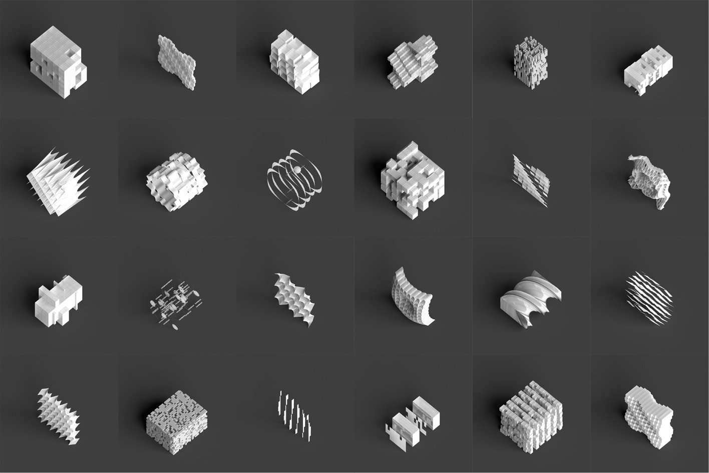

# Generalist Generative Agent

**Open-ended design exploration with large language models**



Anton Savov, Angela Yoo, CheWei Lin, Benjamin Dillenburger  
[Digital Building Technologies](https://dbt.arch.ethz.ch/), ETH Zurich  
[Design++](https://designplusplus.ethz.ch/), ETH Zurich

> **Paper:** Savov, A., Yoo, A., Lin, C., & Dillenburger, B. (2025). Generalist Generative Agent: Open-ended design exploration with large language models. *Proceedings of the 30th CAADRIA Conference*, Vol. 1, 193–202. [DOI: 10.52842/conf.caadria.2025.1.193](https://doi.org/10.52842/conf.caadria.2025.1.193)

---

## Overview

Architects often navigate ambiguity in early-stage design by using metaphors and conceptual models to transform abstract ideas into architectural forms. However, current computational tools struggle with such exploratory processes due to narrowly defined design spaces.

This repository presents an **Agentic AI framework** in which LLM agents interpret metaphors, formulate design tasks, and generate procedural 3D concept models. Using this framework, we produced **1,000 procedural designs** and **4,000 rendered images** based on **20 metaphors**, demonstrating the emergent capabilities of LLMs for creating architecturally relevant conceptual models.


---

## Framework

The framework consists of four LLM-powered agents arranged in a sequential pipeline:

```
Metaphor Agent ➜ Interpretation Agent ➜ Modelling Agent ➜ Evaluation Agent
```

For full end-to-end reproduction, insert the Blender render step between
modelling and evaluation so the OBJ outputs become PNGs for scoring.

| Agent | Role |
|---|---|
| **Metaphor** | Generates novel architectural metaphors (e.g., *"rippled grid"*, *"cantilevering corners"*) as design drivers with formal and spatial qualities. |
| **Interpretation** | Translates a metaphor into concrete design implications and a succinct design task for an architectural concept model. |
| **Modelling** | Generates procedural Python code for Rhino/Grasshopper that produces parametric 3D concept models, with iterative error-correction and multiple parameter variations. |
| **Evaluation** | Uses a Vision Transformer (GPT-4o) to score rendered models on metaphor alignment, conceptual strength, geometric complexity, and design-task adherence. |

---

## Repository Structure

```
├── run_step1_metaphor_agent.py    # Generate architectural metaphors
├── run_step2_interpretation_agent.py # Derive design tasks from metaphors
├── run_step3_gh_code_agent.py     # Generate Grasshopper/RhinoCommon code
├── run_step3a_render.py           # Render GH OBJ outputs in Blender 3.6
├── run_step4_eval_agent.py        # Evaluate rendered concept models
│
├── ria/                           # Core library
│   ├── agents/                    # Agent implementations
│   │   ├── metaphor.py
│   │   ├── interpretation.py
│   │   ├── gh_code_agent.py
│   │   └── evaluation.py
│   ├── prompts/                   # System prompts for each agent
│   ├── utils/                     # File I/O and text utilities
│   └── visualization/             # Blender rendering & batch processing
│
├── rhino-gh-environment/          # Grasshopper definition & helper components
│   ├── geometric_environment.gh
│   └── gh_components/             # UDP listener, background tasks, OBJ export
│
├── output/                        # Generated experiment data
│   └── experiment_data/
│       ├── 00_metaphors_list/
│       ├── 01_metaphors_expanded/
│       ├── 02_interpretations/
│       ├── 03_designs_H_gpt-4o/           # History mode
│       ├── 03_designs_gpt-4o_design_task/ # Design-task mode
│       └── 03_designs_gpt-4o_metaphor/    # Metaphor-only mode
│
├── pyproject.toml                 # uv project metadata and dependencies
├── uv.lock                        # Checked-in uv lockfile for reproducible environments
└── LICENSE                        # MIT
```

---

## Prerequisites

- **uv** for Python version and environment management
- **Python 3.11** for the local orchestration environment
- **Rhino 8** with **Grasshopper** for the Modelling Agent
- **Blender 3.6** for rendering OBJ outputs before evaluation
- **OpenAI API key** for all four agents

## Environment Setup

### 1. Install `uv`

Use the official `uv` installer or package manager instructions from the
[uv installation guide](https://docs.astral.sh/uv/getting-started/installation/).


### 2. Clone the repository

```bash
git clone https://github.com/<your-username>/generalist-generative-agent.git
cd generalist-generative-agent
```

### 3. Sync the environment

This repository is pinned to **Python 3.11** via `.python-version` and
`pyproject.toml`.

```bash
uv sync --locked
```

`uv sync --locked` creates `.venv/` and installs the dependencies declared in
`pyproject.toml` using the checked-in `uv.lock`.

If you intentionally need to refresh the lockfile after dependency changes:

```bash
uv lock
uv sync
```

### 4. Save your OpenAI API key in `.env`

Create a `.env` file in the repository root:

```dotenv
OPENAI_API_KEY=sk-...
```

The agent scripts load `.env` automatically, so no extra shell export step is required.

### 5. Run commands through `uv`

Use `uv run` so commands execute inside the project environment without manually
activating `.venv`:

```bash
uv run --locked python run_step1_metaphor_agent.py
uv run --locked python run_step2_interpretation_agent.py
uv run --locked python run_step3_gh_code_agent.py
uv run --locked python run_step3a_render.py
uv run --locked python run_step4_eval_agent.py
```

If your editor needs the environment activated directly:

```bash
source .venv/bin/activate
```

On Windows PowerShell:

```powershell
.venv\Scripts\activate
```

### 6. Rhino 8 Setup

The Modelling Agent depends on **Rhino 8** and the checked-in Grasshopper
definition in `rhino-gh-environment/geometric_environment.gh`.

1. Install **Rhino 8**.
2. Open Rhino 8, launch Grasshopper, and open `rhino-gh-environment/geometric_environment.gh`.
3. In the Grasshopper file, first set `Toggle Listener` to `True`.
4. Then press `Reset Listener` once.
5. Confirm the listener component shows `Listening for incoming UDP messages...`.
6. If it shows `[Errno 48] Address already in use`, restart Rhino and repeat from step 2.
7. Keep Rhino and Grasshopper running while executing `run_step3_gh_code_agent.py`.

The modelling stage sends generated Grasshopper Python code to Rhino over UDP,
executes it inside the open Grasshopper environment, and expects exported OBJ
files in response.

### 7. Blender 3.6 Setup

The Evaluation Agent scores rendered PNGs, not OBJ files directly, so
**Blender 3.6 is required for a full end-to-end run of all four agents**.

1. Install **Blender 3.6**.
2. The default render launcher uses `ria/visualization/230125_render_enviroment.blend`.
3. `run_step3a_render.py` automatically prefers Blender 3.6 in the standard install location.
4. If Blender 3.6 is installed somewhere else, set `BLENDER_BIN` or pass `--blender-bin`.
5. Ensure the Blender scene contains:
   `SCENE` for the camera and lights,
   `HIDDEN` for helper objects that should not render,
   and a mesh named `placeholderbox` that defines the target scale for imported OBJ models.
6. Optional: a Grease Pencil object with a modifier can be present for outline effects.
7. `run_step3a_render.py` reuses `render_material` and `wire_material` if they already exist in the scene.

The checked-in evaluation workflow assumes the render output names follow the
existing dataset convention such as `*_GHOSTED_1280x1280.png`.

---

## Run a Test

`output/test-runs/` is git-ignored, so the following smoke-test outputs stay out
of the repository.

### 1. Test the Metaphor Agent

```bash
uv run --locked python run_step1_metaphor_agent.py \
  --output-dir output/test-runs/demo/01_metaphors_expanded \
  --expand "Shifted grid"
```

### 2. Test the Interpretation Agent

```bash
uv run --locked python run_step2_interpretation_agent.py \
  --metaphors-dir output/test-runs/demo/01_metaphors_expanded \
  --output-dir output/test-runs/demo/02_interpretations \
  --filename 0001_shifted_grid.json \
  --versions 1
```

### 3. Test the Modelling Agent

Run one smoke test for each GH mode. All three commands use the same
interpretation input, but each mode changes what is sent to the LLM:

- `metaphor` uses only the metaphor text.
- `design-task` uses the full interpretation JSON.
- `history` uses the full interpretation JSON plus prior GH runs from
  `output/experiment_data/03_designs_H_gpt-4o/` as few-shot history.

Metaphor-only mode:

```bash
uv run --locked python run_step3_gh_code_agent.py \
  --mode metaphor \
  --filename 0001_0001_shifted_grid.json \
  --interpretations-dir output/test-runs/demo/02_interpretations \
  --output-dir output/test-runs/demo/03_designs_gpt-4o_metaphor \
  --designs-per-interpretation 1
```

Design-task mode:

```bash
uv run --locked python run_step3_gh_code_agent.py \
  --mode design-task \
  --filename 0001_0001_shifted_grid.json \
  --interpretations-dir output/test-runs/demo/02_interpretations \
  --output-dir output/test-runs/demo/03_designs_gpt-4o_design_task \
  --designs-per-interpretation 1
```

History mode:

```bash
uv run --locked python run_step3_gh_code_agent.py \
  --mode history \
  --filename 0001_0001_shifted_grid.json \
  --interpretations-dir output/test-runs/demo/02_interpretations \
  --skills-dir output/experiment_data/03_designs_H_gpt-4o \
  --output-dir output/test-runs/demo/03_designs_H_gpt-4o \
  --designs-per-interpretation 1
```

### 4. Test the Render Step

```bash
uv run --locked python run_step3a_render.py \
  --input-dir output/test-runs/demo/03_designs_H_gpt-4o \
  --limit 1 \
  --resolution-x 256 \
  --resolution-y 256 \
  --samples 8
```

Replace the input directory with `03_designs_gpt-4o_metaphor/` or
`03_designs_gpt-4o_design_task/` if you want to render those GH test outputs
instead.

### 5. Test the Evaluation Agent

```bash
uv run --locked python run_step4_eval_agent.py \
  --data-dir output/test-runs/demo/03_designs_H_gpt-4o \
  --eval-crops-dir output/test-runs/demo/evaluation_crops \
  --limit 1
```

Replace the data directory with the render folder from the GH mode you want to
score.

---

## Run a Full Experiment

### 1. Expand the metaphor list

```bash
uv run --locked python run_step1_metaphor_agent.py
```

This reads the seed list from
`output/experiment_data/00_metaphors_list/metaphors_to_expand.txt` and writes
expanded metaphor JSON files to `output/experiment_data/01_metaphors_expanded/`.

### 2. Generate interpretations

```bash
uv run --locked python run_step2_interpretation_agent.py
```

This reads `output/experiment_data/01_metaphors_expanded/` and writes
interpretation JSON files to `output/experiment_data/02_interpretations/`.

### 3. Generate design folders in Rhino/Grasshopper

The GH runner supports three modes:

- `metaphor`: uses only the metaphor text and writes to `03_designs_gpt-4o_metaphor/`
- `design-task`: uses the full interpretation and writes to `03_designs_gpt-4o_design_task/`
- `history`: uses the full interpretation plus prior GH runs as few-shot history and writes to `03_designs_H_gpt-4o/`

Metaphor-only run:

```bash
uv run --locked python run_step3_gh_code_agent.py --mode metaphor
```

Design-task run:

```bash
uv run --locked python run_step3_gh_code_agent.py --mode design-task
```

History run:

```bash
uv run --locked python run_step3_gh_code_agent.py
```

The default command above is the same as `--mode history`. All three modes read
from `output/experiment_data/02_interpretations/`, but write to different
`03_*` output folders depending on the selected mode.

### 4. Render the generated OBJ files in Blender

```bash
uv run --locked python run_step3a_render.py
```

This opens `ria/visualization/230125_render_enviroment.blend`, scans
`output/experiment_data/03_designs_H_gpt-4o/` for OBJ outputs, and writes the
rendered PNGs next to the OBJ files.

For the two ablation modes, point `--input-dir` at
`output/experiment_data/03_designs_gpt-4o_metaphor/` or
`output/experiment_data/03_designs_gpt-4o_design_task/`.

### 5. Evaluate the rendered images

```bash
uv run --locked python run_step4_eval_agent.py
```

This scans `output/experiment_data/03_designs_H_gpt-4o/` for rendered PNG
images, writes cropped evaluation images to `output/evaluation_crops/`, and
stores an `evaluation.csv` in each rendered design folder.

For the two ablation modes, point `--data-dir` at
`output/experiment_data/03_designs_gpt-4o_metaphor/` or
`output/experiment_data/03_designs_gpt-4o_design_task/`.

---

## Key Technologies

- [LangChain](https://github.com/langchain-ai/langchain) + [OpenAI API](https://github.com/openai/openai-python) — LLM orchestration
- [Rhino 8](https://www.rhino3d.com/) + [Grasshopper](https://www.grasshopper3d.com/) — Geometry host environment
- [Blender](https://www.blender.org/) — Rendering (axonometric projection with neutral colours)

---

## Citation

If you use this work in your research, please cite:

```bibtex
@inproceedings{savov2025generalist,
  title     = {Generalist Generative Agent: Open-ended Design Exploration with Large Language Models},
  author    = {Savov, Anton and Yoo, Angela and Lin, CheWei and Dillenburger, Benjamin},
  booktitle = {Proceedings of the 30th International Conference of the Association for Computer-Aided Architectural Design Research in Asia (CAADRIA)},
  volume    = {1},
  pages     = {193--202},
  year      = {2025},
  doi       = {10.52842/conf.caadria.2025.1.193}
}
```

---

## License

This project is licensed under the [MIT License](LICENSE).

---

## Acknowledgements

This research is supported by an ETH Career Seed Award, a Hasler Stiftung Project Grant, and a [Swiss National Science Foundation (SNSF) Spark grant (No. 228564)](https://data.snf.ch/grants/grant/228564) for the project *"RIA: Novel Framework for Generative Architectural Design using AI-Agents"*. It is affiliated to the [Center for Augmented Computational Design in Architecture, Engineering, and Construction (Design++)](https://designplusplus.ethz.ch/), ETH Zurich.
