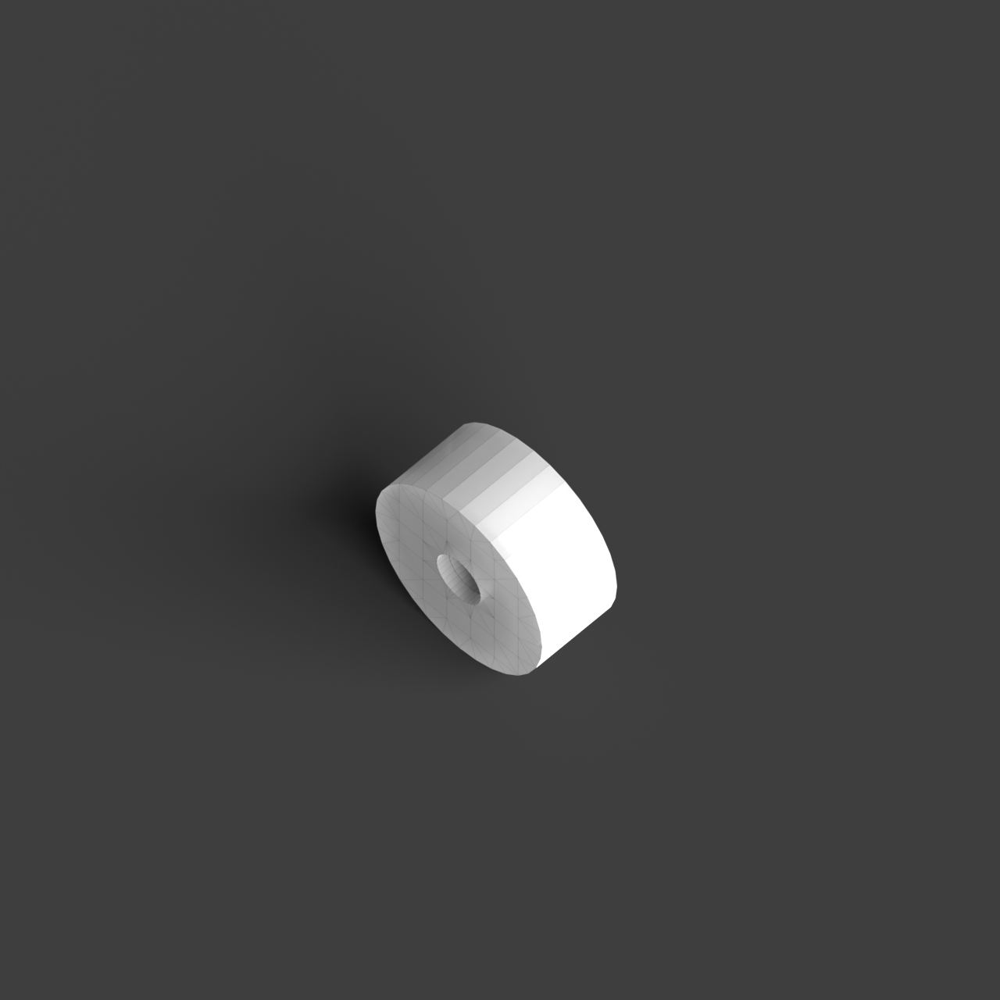
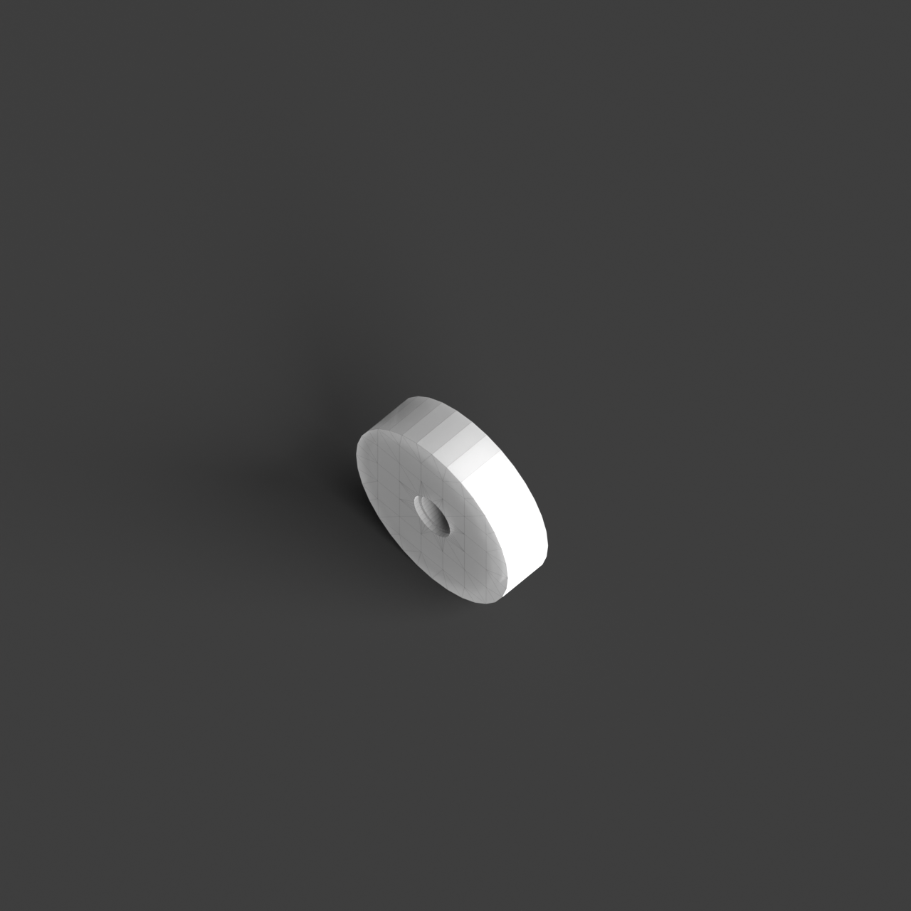

# 0001_0004_0003_house_within_a_house  
         
## Interpretation  
  
### Implications_form :  
The &#x27;House within a house&#x27; metaphor suggests a design where the building&#x27;s massing is articulated through a composition of concentric or overlapping layers, evoking a sense of nesting and protection. The outer layers act as a shielding envelope, while the inner core serves as a secluded sanctuary, creating an interplay between exposure and seclusion. The silhouette may resemble a series of cascading or interwoven forms, each representing a distinct spatial function or level of intimacy. Spatial relationships are crafted to facilitate a journey through nested spaces, encouraging a gradual transition from public to private realms, with a focus on the experiential quality of moving deeper into the building&#x27;s core.  
### Metaphor :  
House within a house  
### Key_traits :  
This metaphor suggests a layered spatial hierarchy, where one spatial entity is encapsulated within another. It implies a design approach focused on nesting, protection, and privacy, with the potential for creating complex interior-exterior relationships. The concept is about creating an internal sanctuary or core, surrounded by another volume, allowing for varied spatial experiences and a sense of retreat or enclosure.  
### Design_task :  
To embody the &#x27;House within a house&#x27; metaphor in an Architectural Concept Model, design a composition of concentric or interwoven layers that illustrate a sense of nesting and protection. Utilize a variety of materials and textures to differentiate the layers, emphasizing the transition from the outer envelope to the inner sanctuary. Explore the use of modular or fractal geometries that interlock, creating visual and spatial continuity between the layers. Integrate elements such as light wells or atriums to enhance the dialogue between the layers, promoting natural light penetration and visual connections. The model should evoke the concept of a layered spatial hierarchy, highlighting the dynamic progression from public to private spaces and the experiential journey through the protective and enclosing qualities of the design.  
## Agent summary :  
The provided function generates an architectural concept model based on the &#x27;House within a house&#x27; metaphor by creating a series of concentric, overlapping layers. Each layer represents distinct spatial functions, transitioning from public to private realms, thus embodying the principles of nesting and protection. The model incorporates varying heights and radii to create a cascading effect, enhancing visual and spatial continuity. Openings simulate light wells, promoting natural light penetration and connection between layers. Ultimately, this approach fosters an experiential journey through the layered spaces, reflecting the dynamic interplay of exposure and seclusion inherent in the metaphor.