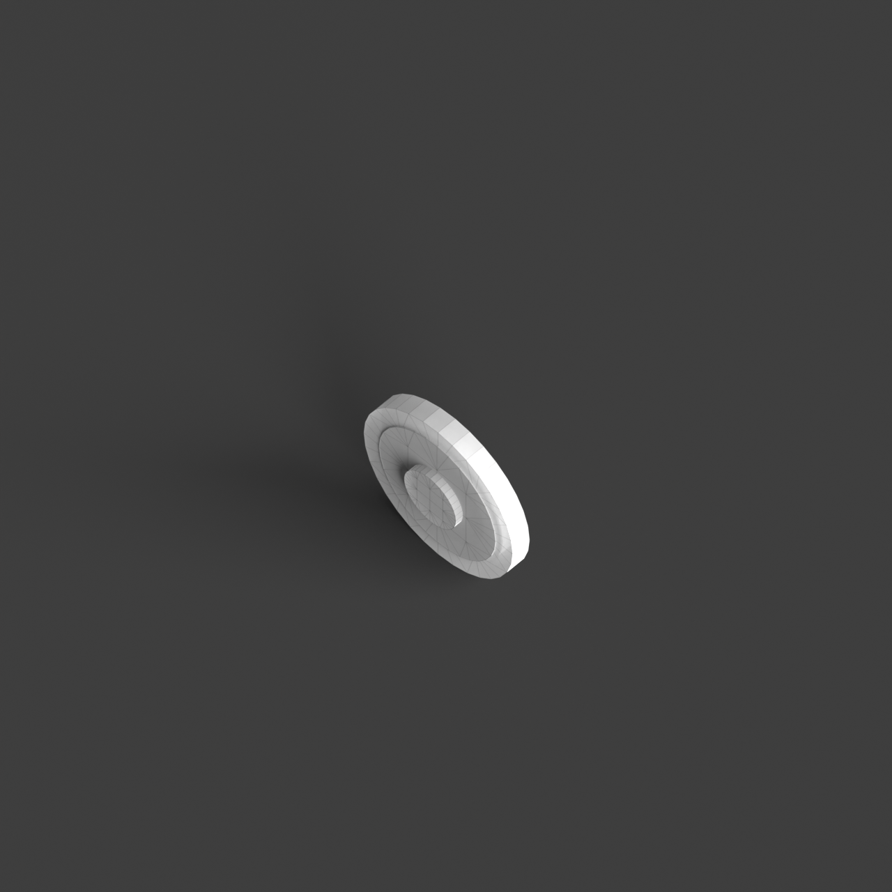
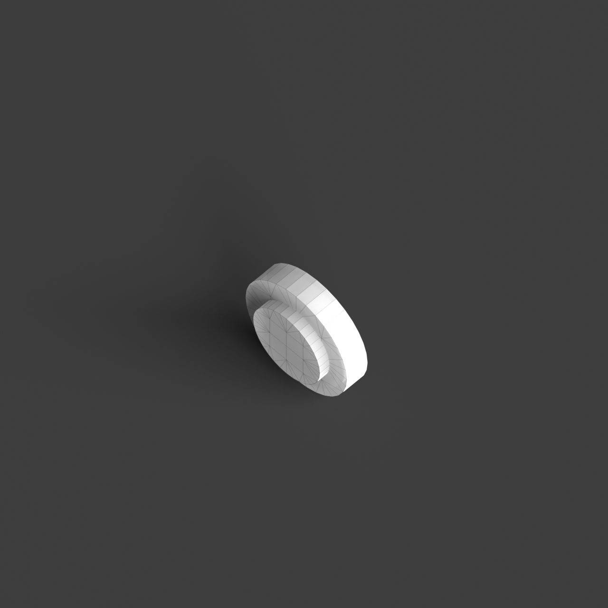

# 0001_0005_0005_house_within_a_house  
         
## Interpretation  
  
### Implications_form :  
The &#x27;House within a house&#x27; metaphor implies a design where the building&#x27;s massing is articulated through a series of nested envelopes, creating a hierarchy of spaces that offer varying degrees of enclosure and intimacy. The silhouette may suggest a layered composition with an interplay of solid and void, allowing glimpses of the inner sanctuary from the exterior. Geometrically, the design could feature a core central volume surrounded by concentric layers or shells that gradually reveal the internal spaces as one moves deeper into the structure. Spatial relationships are orchestrated to foster a sense of discovery, with each layer serving as a threshold that marks a transition in function and privacy, reinforcing the metaphor of retreat and encapsulation.  
### Metaphor :  
House within a house  
### Key_traits :  
This metaphor suggests a layered spatial hierarchy, where one spatial entity is encapsulated within another. It implies a design approach focused on nesting, protection, and privacy, with the potential for creating complex interior-exterior relationships. The concept is about creating an internal sanctuary or core, surrounded by another volume, allowing for varied spatial experiences and a sense of retreat or enclosure.  
### Design_task :  
To embody the &#x27;House within a house&#x27; metaphor in an Architectural Concept Model, create a series of concentric, layered volumes where each layer is articulated through a different material or transparency level, signifying the transition from the external environment to the core sanctuary. Experiment with interstitial spaces between the layers, incorporating pathways or transitional zones that guide movement and enhance the sense of journey and discovery. Use varying heights and forms for each layer to create a dynamic interplay between openness and enclosure. The model should clearly communicate the progression from public to private realms, highlighting the protective and encapsulating nature of the design, as well as the experiential quality of moving through a nested spatial sequence.  
## Agent summary :  
The function `create_concept_model` generates an architectural concept model inspired by the &quot;House within a house&quot; metaphor. It constructs a central core volume, symbolizing the innermost sanctuary, and surrounds it with concentric layers, each varying in height and thickness to illustrate a hierarchical transition from public to private spaces. This layering creates a dynamic interplay of enclosure and openness, enhancing the sense of spatial discovery. By incorporating different materials and thicknesses for each layer, the model visually represents the protective nature of the design while guiding movement through the nested volumes, thereby embodying the metaphor effectively.