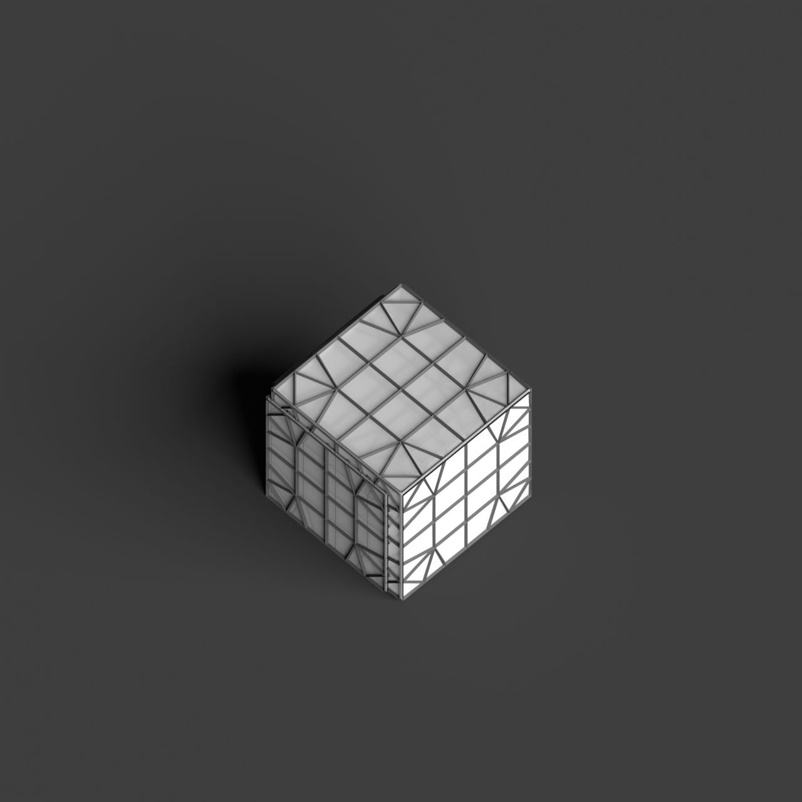
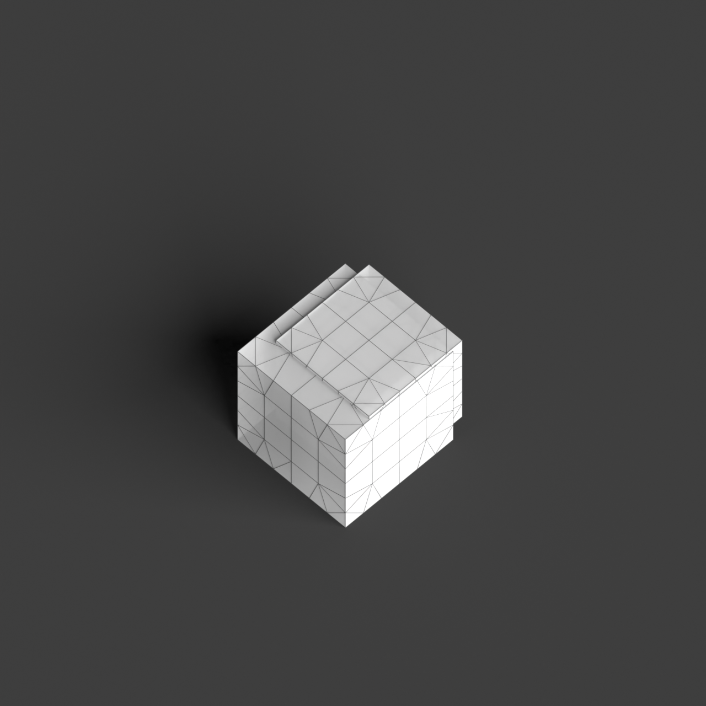
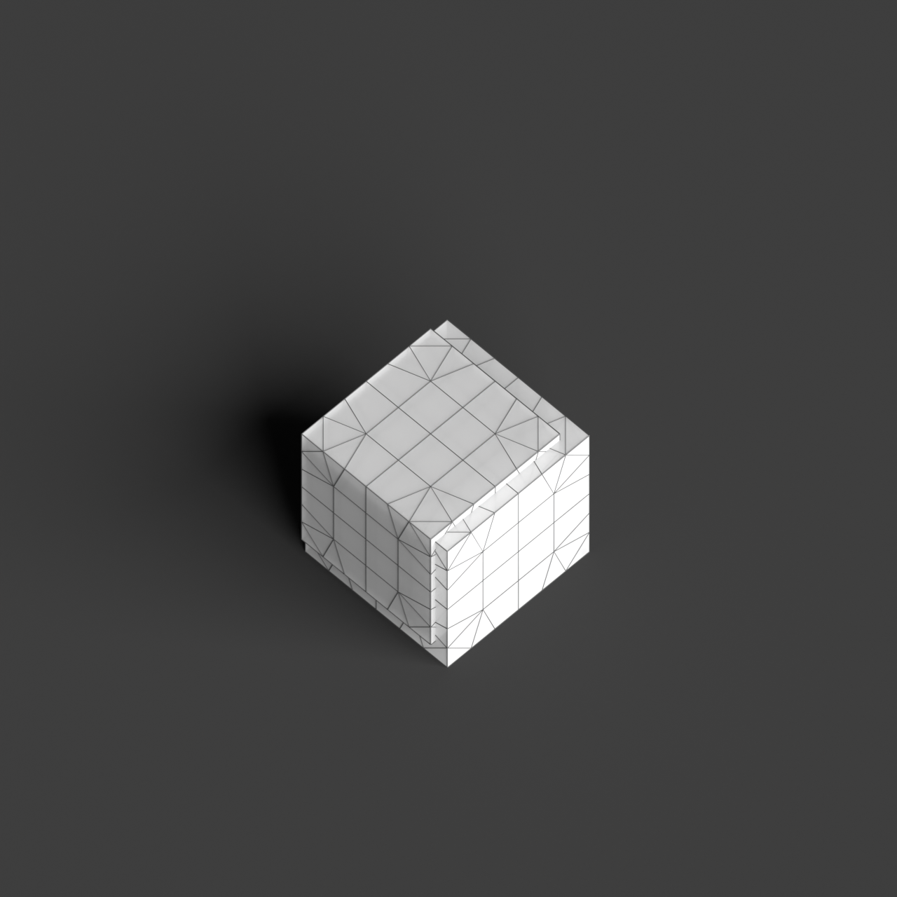

# 0002_0002_0002_cubic_nest  
         
## Interpretation  
  
### Implications_form :  
The &#x27;Cubic nest&#x27; metaphor shapes the building&#x27;s form and massing by using a composition of nested cubic volumes that create a multi-layered and intricate silhouette. The design suggests a protective and complex architecture where each cube is part of an interconnected system yet retains its individuality. Spatial relationships are characterized by the overlapping and intersecting cubes, which generate a network of protected spaces and transitional areas. This arrangement creates a sense of security and complexity, inviting exploration and interaction within the structure.  
### Metaphor :  
Cubic nest  
### Key_traits :  
The metaphor &#x27;Cubic nest&#x27; suggests a design that incorporates a series of interlocking or overlapping cubic volumes, creating a layered and protective spatial organization. This could evoke a sense of shelter, complexity, and interconnectedness, where each cubic form contributes to a cohesive whole while maintaining its own distinct identity. The interplay of solid and void within the nest-like structure allows for dynamic spatial experiences, encouraging exploration and discovery within the architectural composition.  
### Design_task :  
Develop an Architectural Concept Model focusing on a cluster of nested cubic volumes that overlap and interlock. Emphasize the protective and interwoven nature of the &#x27;nest&#x27; by varying the depth and layering of the cubes. Use different materials to represent the transition from solid to void, enhancing the perception of shelter and complexity. Experiment with the orientation of the cubes to create unexpected pathways and intersections that invite exploration. Consider integrating elements that suggest movement, such as cantilevered cubes or dynamic alignments, to reinforce the interconnectedness and layered spatial experiences.  
## Agent summary :  
The function `create_cubic_nest_model_v2` generates an architectural concept model inspired by the &quot;Cubic nest&quot; metaphor by creating a series of interlocking cubic volumes. It establishes a base cube and adds layers of cubes, each with a variable size and random offsets, enhancing the design&#x27;s complexity and interconnectedness. The overlap factor allows cubes to nest and intertwine, fostering a sense of protection and inviting exploration. By varying cube dimensions and orientations, the function embodies the metaphor&#x27;s themes of shelter and dynamic spatial relationships, resulting in a visually intricate model that reflects the essence of the design task provided.