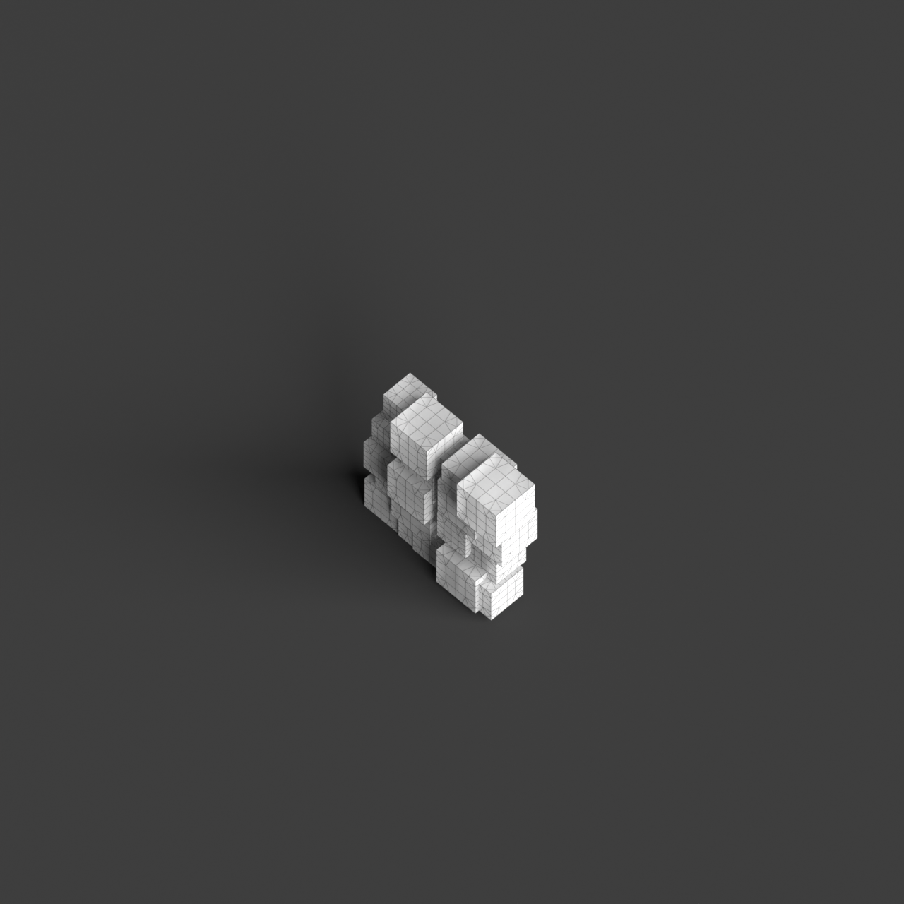
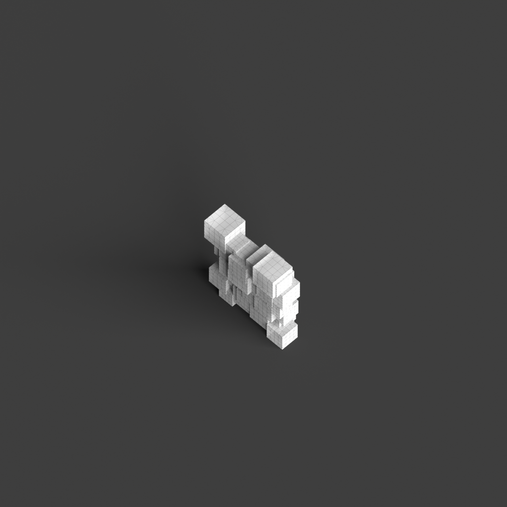
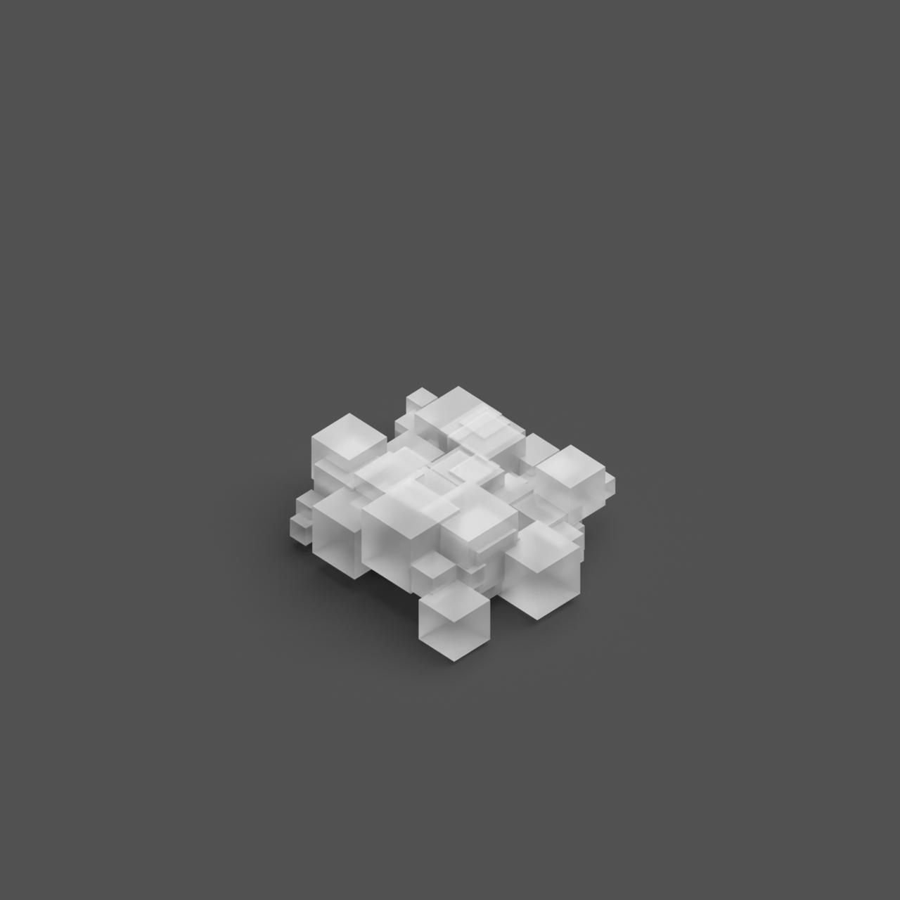

# 0002_0004_0001_cubic_nest  
         
## Interpretation  
  
### Implications_form :  
The &#x27;Cubic nest&#x27; metaphor influences the building&#x27;s form and massing by creating a layered, interwoven pattern of cubic volumes that provide a sense of shelter and interconnectedness. These cubes are organized into clusters that suggest both individuality and collective harmony. The spatial relationships are defined by a careful balance of open and enclosed areas, promoting movement and interaction within and between the cubic forms. This intricate arrangement fosters a sense of discovery as one navigates through the diverse spatial environments, each cube contributing to a dynamic and cohesive architectural composition.  
### Metaphor :  
Cubic nest  
### Key_traits :  
The metaphor &#x27;Cubic nest&#x27; suggests a design that incorporates a series of interlocking or overlapping cubic volumes, creating a layered and protective spatial organization. This could evoke a sense of shelter, complexity, and interconnectedness, where each cubic form contributes to a cohesive whole while maintaining its own distinct identity. The interplay of solid and void within the nest-like structure allows for dynamic spatial experiences, encouraging exploration and discovery within the architectural composition.  
### Design_task :  
Construct an Architectural Concept Model that utilizes a matrix-like arrangement of cubic volumes to embody the &#x27;Cubic nest&#x27; metaphor. Focus on creating a pattern of interconnected cubes that vary in size and orientation, emphasizing their protective and layered quality. Use a combination of solid, translucent, and transparent materials to articulate the interplay between light and shadow, enhancing the perception of depth and complexity. Incorporate elements such as suspended cubes or modular extensions to suggest vertical and horizontal movement, inviting exploration and interaction across the network of spaces. Ensure that each cube is distinct yet part of a unified and cohesive whole, reflecting the interconnected essence of a &#x27;nest&#x27;.  
## Agent summary :  
The provided function, `generate_cubic_nest_concept`, creates an architectural concept model inspired by the &quot;Cubic nest&quot; metaphor. It arranges cubic volumes in a matrix-like grid, varying their sizes and orientations to enhance individuality while maintaining collective harmony. Through parameters like `cube_variation` and `overlap_factor`, the function generates a layered structure that suggests shelter and interconnectedness. By using random offsets, it promotes dynamic spatial relationships, encouraging exploration. The result is a cohesive architectural composition where each cube contributes to a complex interplay of solid and void, embodying the essence of a protective and inviting &quot;nest.&quot;