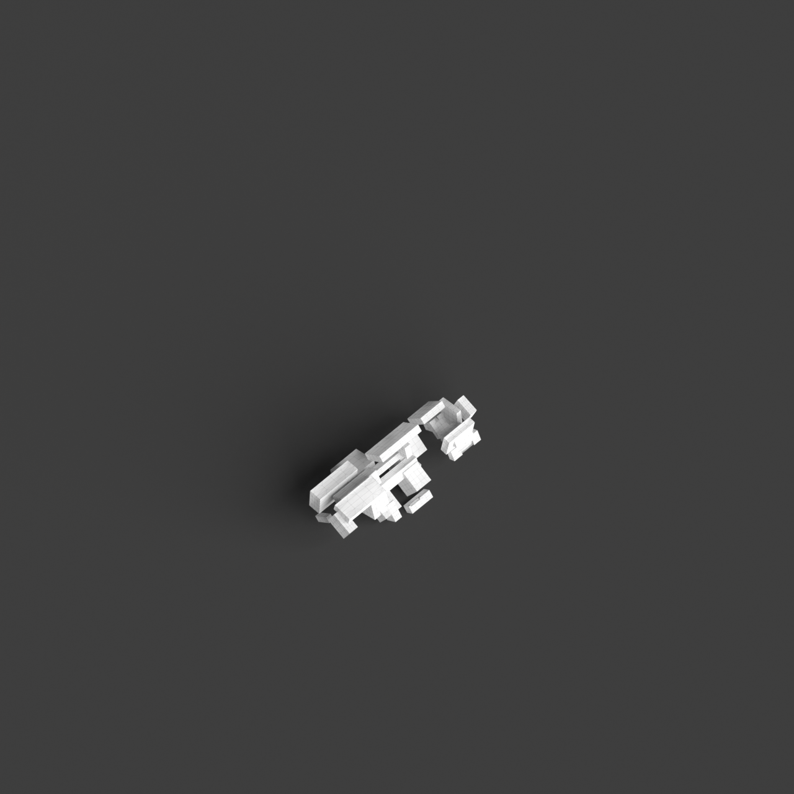
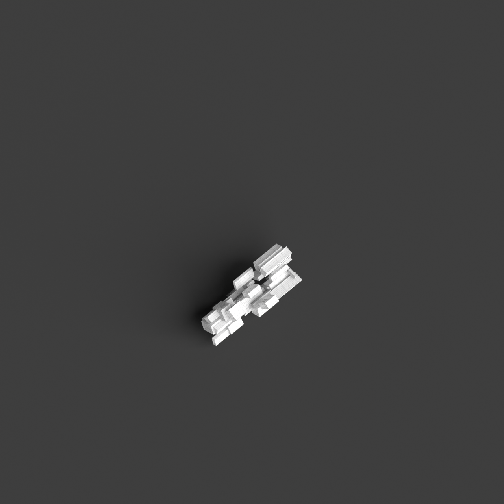
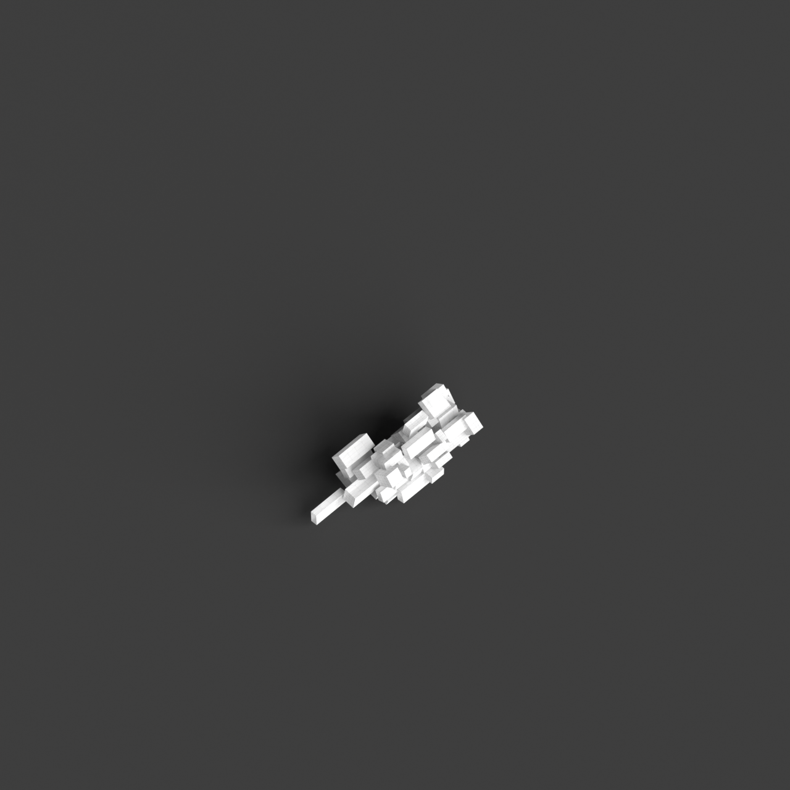
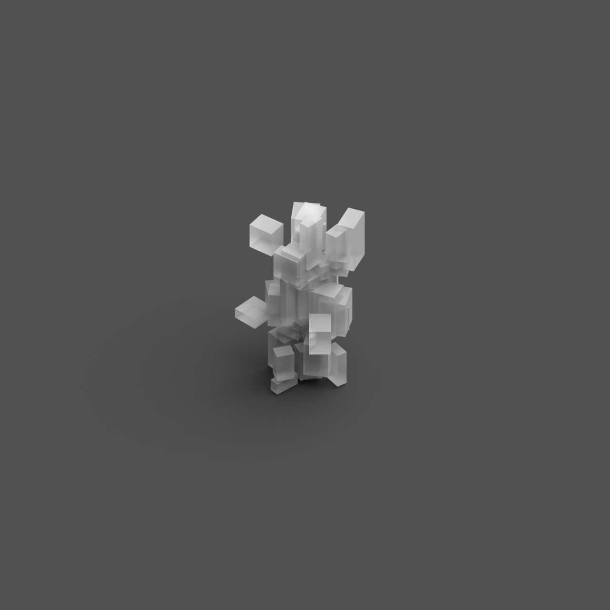
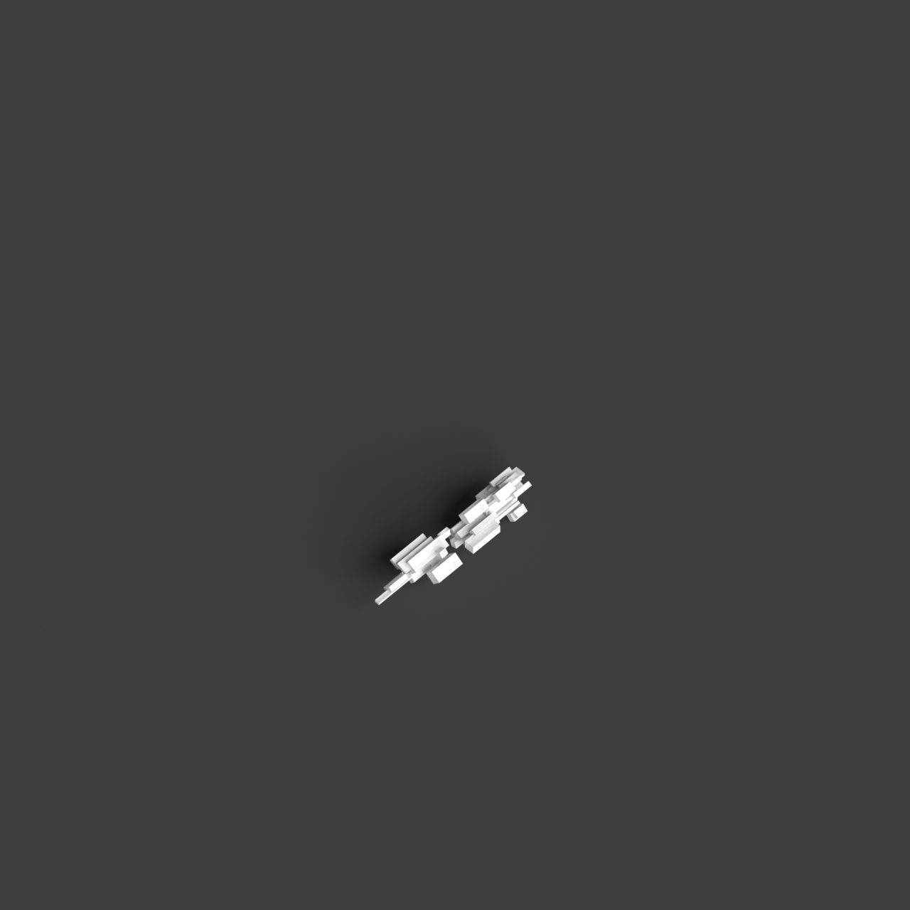

# 0003_0003_0002_a_labyrinth_of_blocks  
         
## Interpretation  
  
### Implications_form :  
The metaphor &#x27;A labyrinth of blocks&#x27; implies a building structure composed of diverse, interlocking volumes that form a complex and multi-tiered massing. The geometry of the building is characterized by a series of blocks that vary in height, orientation, and scale, creating a dynamic silhouette that is both intriguing and mysterious. The spatial configuration is intentionally designed to be puzzling, with pathways that meander and overlap, evoking a sense of exploration and adventure. This arrangement encourages users to engage with the architecture through discovery, as they navigate a sequence of spaces that unfold unexpectedly. The design emphasizes the contrast between light and shadow, with openings and voids in the blocks allowing for varied lighting conditions that change throughout the day, enhancing the feeling of mystery and curiosity.  
### Metaphor :  
A labyrinth of blocks  
### Key_traits :  
This metaphor suggests a complex and intricate spatial configuration. It implies a design that challenges navigation and orientation, creating a sense of mystery and exploration. The arrangement of blocks can vary in height, size, and orientation, introducing unexpected pathways and hidden spaces. The design prioritizes the interplay of light and shadow, varying perspectives, and dynamic circulation routes, encouraging discovery and engagement with the architecture.  
### Design_task :  
To embody the metaphor &#x27;A labyrinth of blocks&#x27; in an Architectural Concept Model, design an assemblage of blocks with varying dimensions and orientations that create a visually complex and intriguing form. Arrange the blocks in a non-linear fashion, using an irregular pattern that simulates the labyrinthine quality. Design circulation paths that are winding and layered, offering multiple routes and choices, encouraging exploration and navigation through the space. Integrate vertical elements such as terraces or elevated walkways to create multi-level experiences. Consider the impact of natural light by incorporating openings and voids in strategic locations, allowing light to filter through and create dynamic shadows that change over time. Use contrasting materials or textures for different blocks to further enhance the sense of discovery and engagement with the architecture.  
## Agent summary :  
The function `create_labyrinth_of_blocks_complexity` generates an architectural concept model that embodies the metaphor &quot;A labyrinth of blocks.&quot; It creates a complex arrangement of interlocking blocks with varied dimensions, orientations, and heights, simulating a non-linear, maze-like structure. By incorporating winding pathways and elevated elements, the design emphasizes exploration and engagement. The inclusion of voids and openings allows natural light to filter through, creating dynamic shadows that enhance the sense of mystery. This approach aligns with the design task&#x27;s focus on intricate spatial configurations, encouraging users to navigate and discover the architecture in an interactive manner.