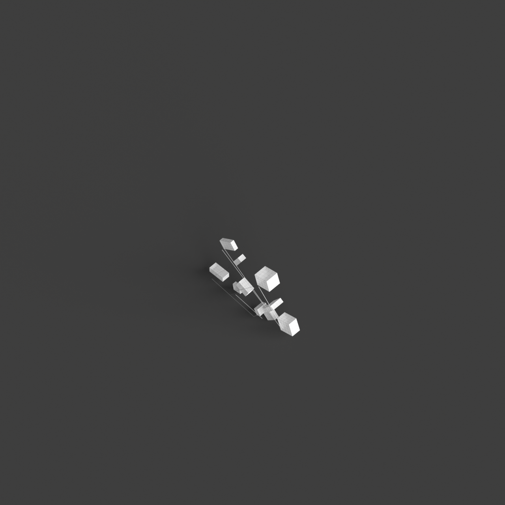
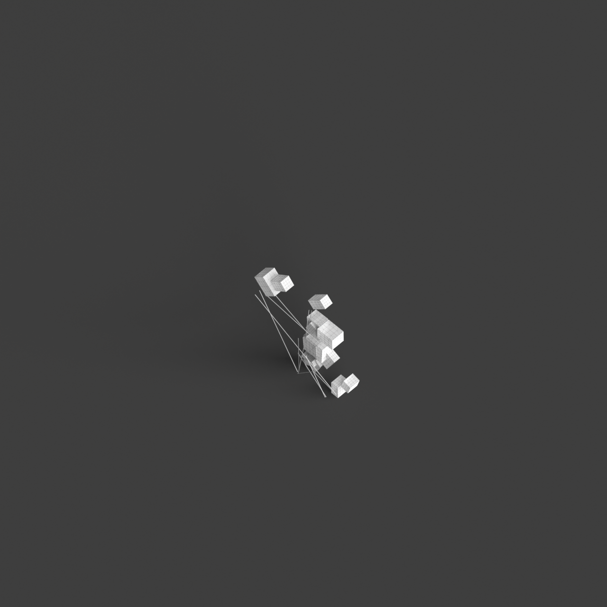
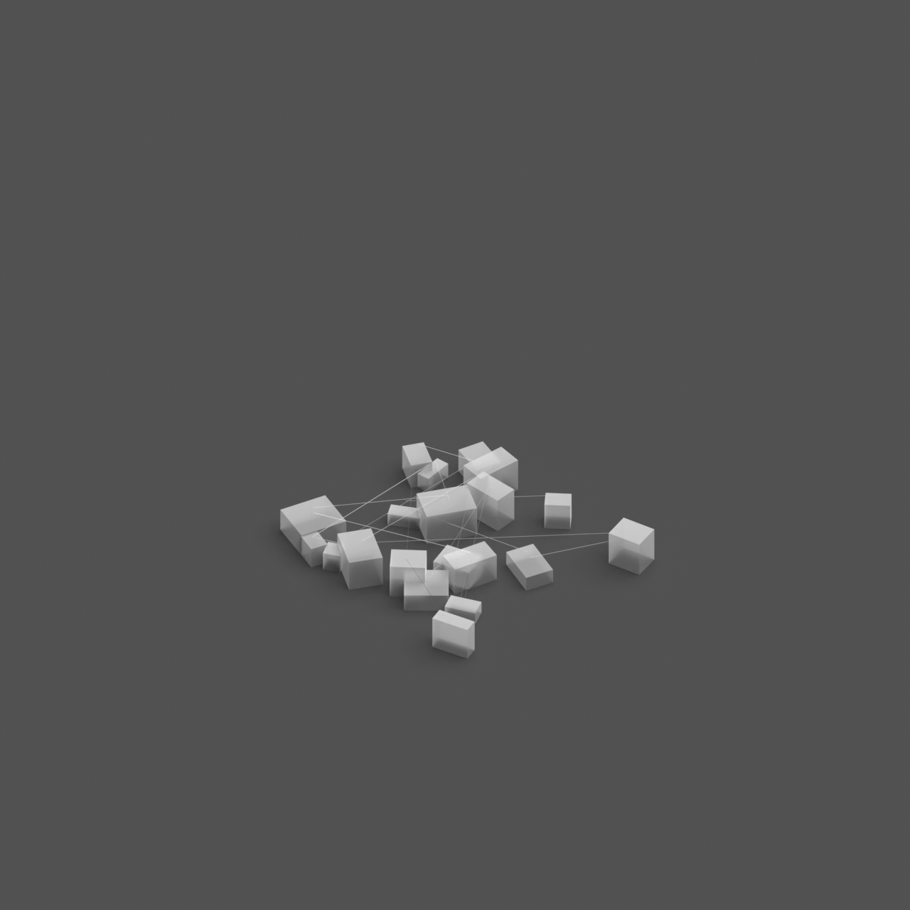
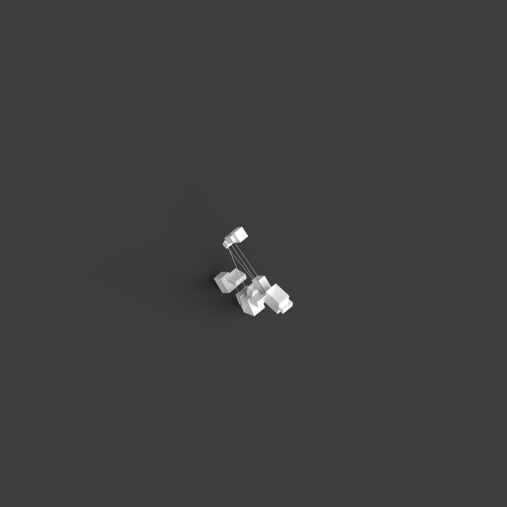
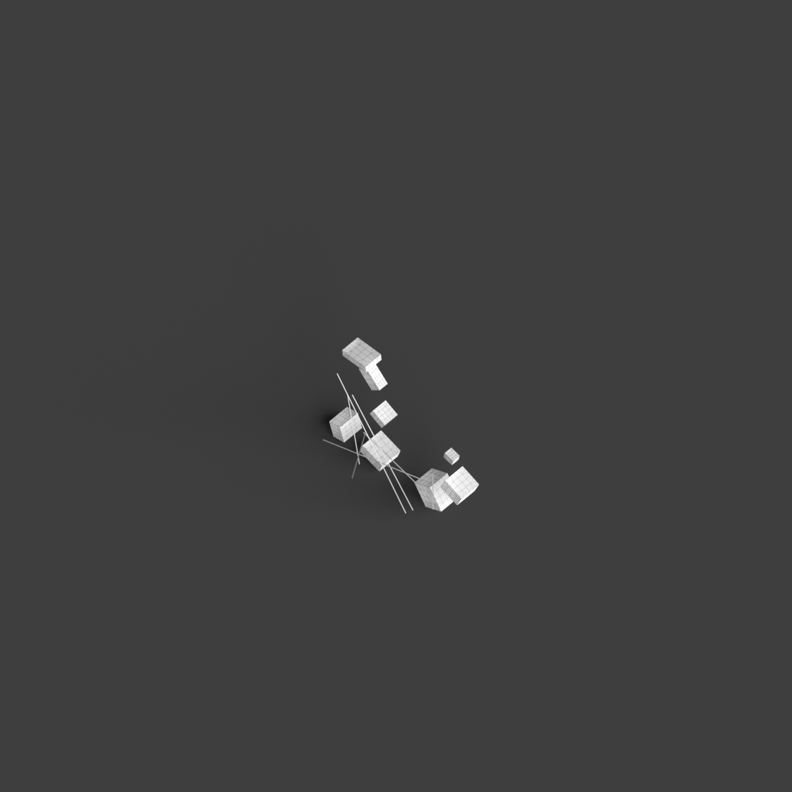

# 0003_0004_0001_a_labyrinth_of_blocks  
         
## Interpretation  
  
### Implications_form :  
The metaphor &#x27;A labyrinth of blocks&#x27; implies a building form that is composed of a tapestry of interconnected block-like structures, each with its own unique geometry and orientation. This results in a fragmented yet cohesive silhouette that invites curiosity and exploration. The spatial configuration is intentionally designed to be enigmatic, with a network of pathways that weave through the blocks in a non-linear fashion, leading to unexpected connections and secluded spaces. The design prioritizes the experiential journey through the building, with a focus on the interplay of light and shadow, varied perspectives, and dynamic circulation routes that encourage a sense of discovery and engagement.  
### Metaphor :  
A labyrinth of blocks  
### Key_traits :  
This metaphor suggests a complex and intricate spatial configuration. It implies a design that challenges navigation and orientation, creating a sense of mystery and exploration. The arrangement of blocks can vary in height, size, and orientation, introducing unexpected pathways and hidden spaces. The design prioritizes the interplay of light and shadow, varying perspectives, and dynamic circulation routes, encouraging discovery and engagement with the architecture.  
### Design_task :  
To embody the metaphor &#x27;A labyrinth of blocks&#x27; in an Architectural Concept Model, create an intricate assemblage of blocks of differing shapes and orientations that form a complex and intriguing spatial arrangement. Avoid regular patterns or grids, opting instead for a more organic configuration that mirrors the unpredictability of a labyrinth. Design circulation paths that meander through the blocks, with multiple entry and exit points, creating a sense of mystery and exploration. Incorporate vertical elements such as bridges or elevated platforms that connect different areas of the labyrinth, introducing additional layers of spatial complexity. Experiment with varying block heights to allow natural light to penetrate different areas, casting dynamic shadows and highlighting the intricate interplay of volumes. Use a mix of textures or materials to differentiate between blocks, further enhancing the sense of discovery and engagement with the architecture.  
## Agent summary :  
The function `create_labyrinth_with_elevated_paths` generates an architectural concept model inspired by the metaphor &quot;A labyrinth of blocks.&quot; It creates a collection of block-like structures with varying dimensions, orientations, and heights, forming a complex, non-linear spatial arrangement. The design intentionally avoids regular patterns, mimicking the unpredictability of a labyrinth. Elevated paths connect the blocks, enhancing exploration and mystery, while varying heights allow light to cast dynamic shadows. This interplay of geometries and circulation routes fosters a sense of discovery, aligning the architectural model with the metaphors emphasis on engagement and experience within the built environment.
