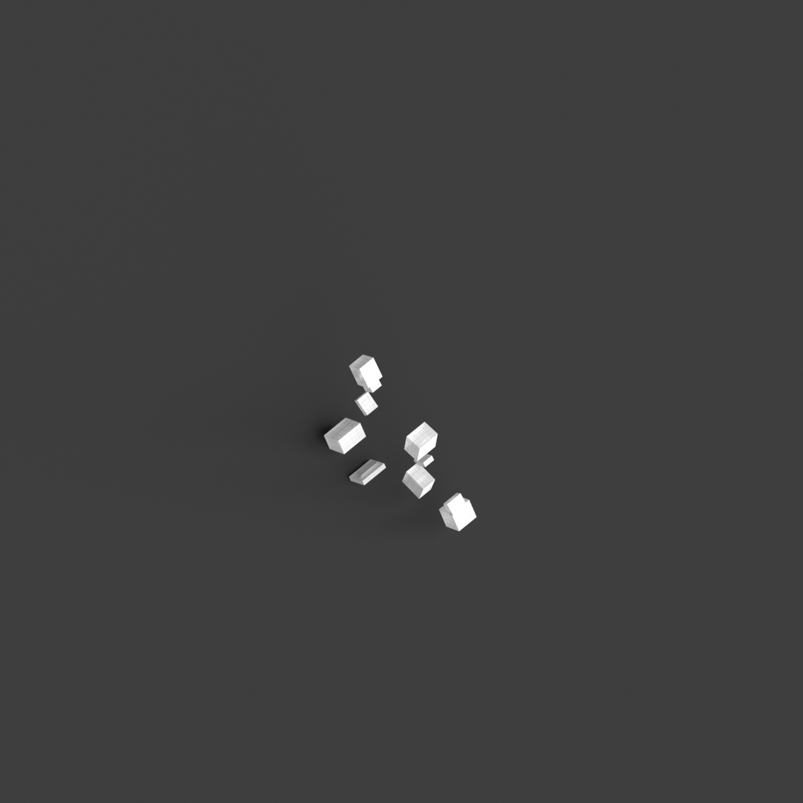
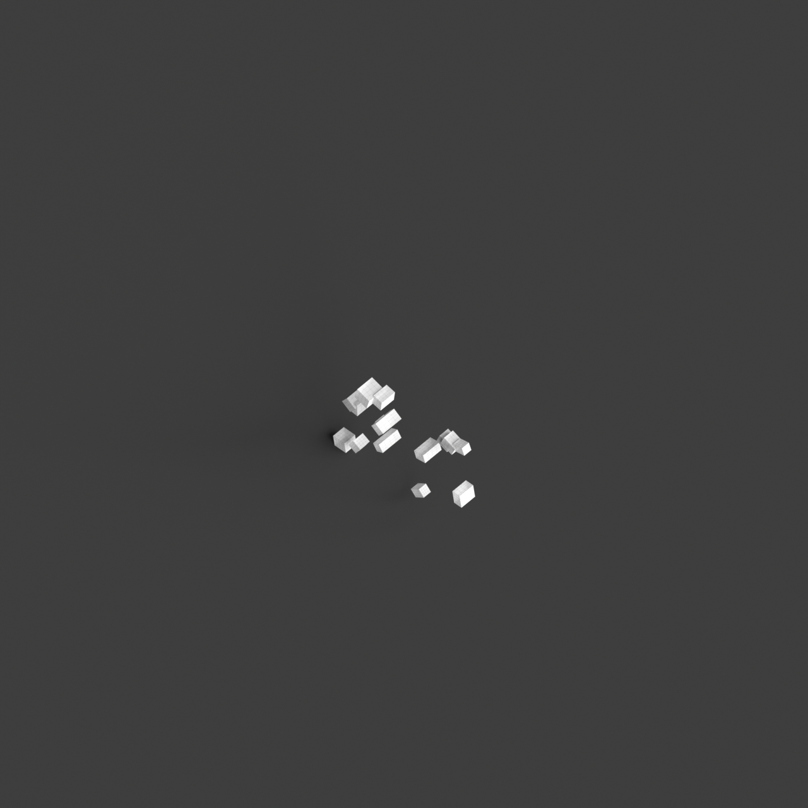
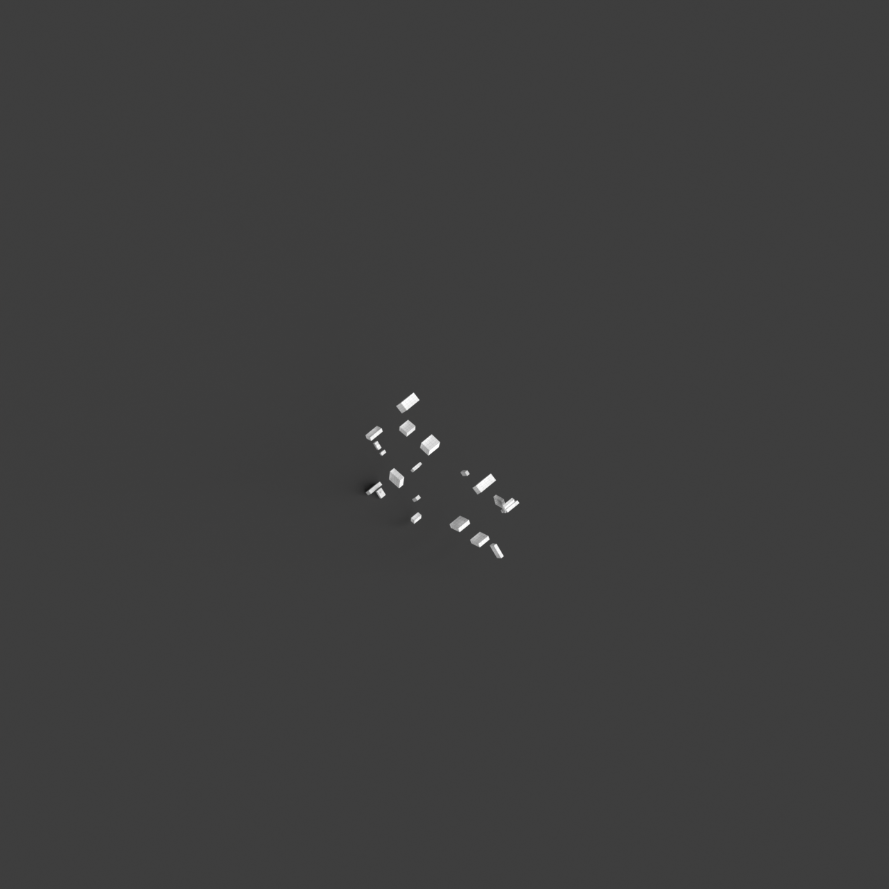
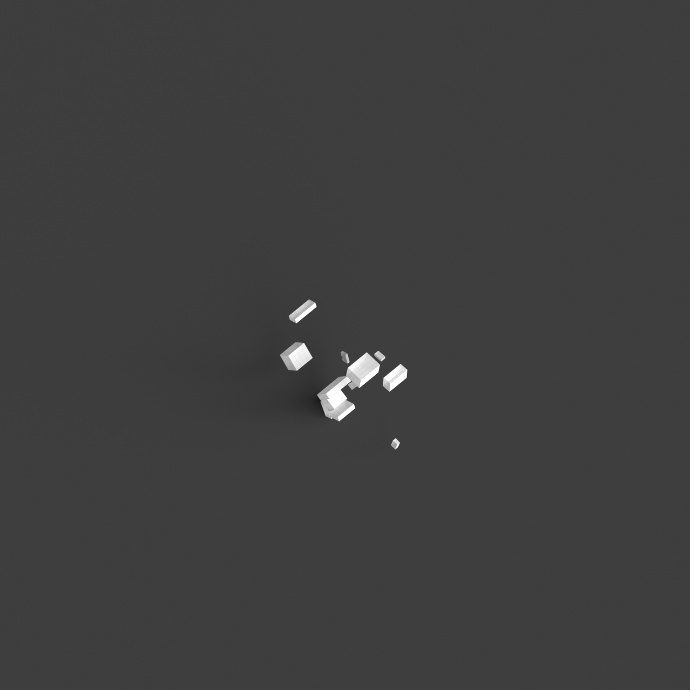
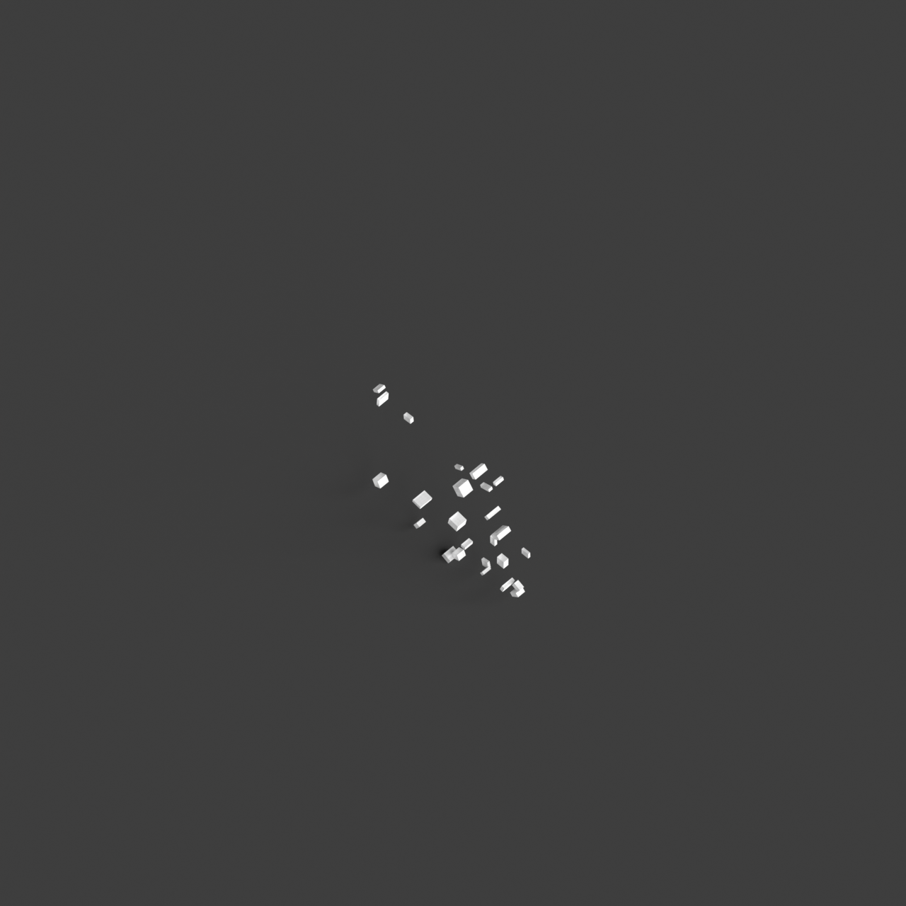

# 0003_0005_0005_a_labyrinth_of_blocks  
         
## Interpretation  
  
### Implications_form :  
The metaphor &#x27;A labyrinth of blocks&#x27; suggests a design that consists of a network of discrete yet interconnected block-like structures, each uniquely oriented and scaled to create a multifaceted and enigmatic silhouette. This massing strategy results in a series of spaces that are both individual and collective, encouraging exploration through distinct but interconnected paths. The spatial relationships are intentionally complex, with overlapping routes and hidden alcoves that invite users to discover new perspectives and experiences. The design emphasizes the role of light and shadow, utilizing the varying heights and orientations of the blocks to create a dynamic play of illumination that shifts throughout the day, enhancing the sensation of mystery and the journey through the architecture.  
### Metaphor :  
A labyrinth of blocks  
### Key_traits :  
This metaphor suggests a complex and intricate spatial configuration. It implies a design that challenges navigation and orientation, creating a sense of mystery and exploration. The arrangement of blocks can vary in height, size, and orientation, introducing unexpected pathways and hidden spaces. The design prioritizes the interplay of light and shadow, varying perspectives, and dynamic circulation routes, encouraging discovery and engagement with the architecture.  
### Design_task :  
To embody the metaphor &#x27;A labyrinth of blocks&#x27; in an Architectural Concept Model, construct a composition of discrete blocks with varying shapes and sizes, arranged in a seemingly random yet interconnected manner. Avoid a strict grid pattern; instead, aim for an irregular arrangement that allows for surprising spatial connections and pathways. Design circulation routes that are non-linear with multiple intersections, enabling diverse exploration paths and unexpected encounters. Introduce vertical variations such as split levels or sunken areas within the labyrinth to add depth and complexity. Incorporate light wells or voids strategically within the blocks to allow natural light to penetrate and create shifting patterns of light and shadow, enhancing the labyrinthine experience. Use contrasting textures or colors for different blocks to further highlight the diversity of the spaces and encourage engagement with the architecture.  
## Agent summary :  
The function `create_labyrinth_of_blocks` generates an architectural concept model inspired by the metaphor &quot;A labyrinth of blocks.&quot; It creates a series of interconnected block-like structures with varying dimensions and orientations, arranged in a non-linear manner. This design fosters complex spatial relationships, encouraging exploration and discovery through overlapping routes and hidden spaces. The function incorporates vertical variations and light wells to enhance the interplay of light and shadow, aligning with the metaphor&#x27;s emphasis on mystery. By using random sizes, orientations, and voids, the generated model reflects the intricate and engaging nature of a labyrinthine environment.