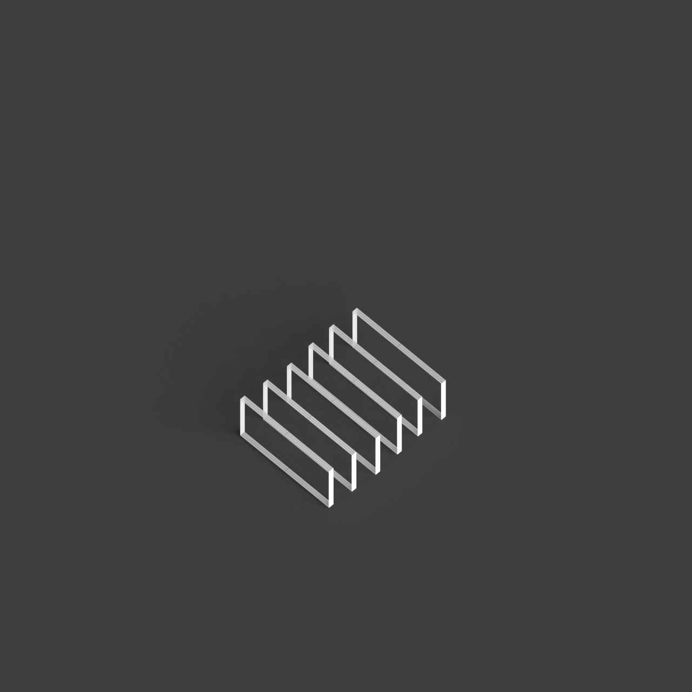
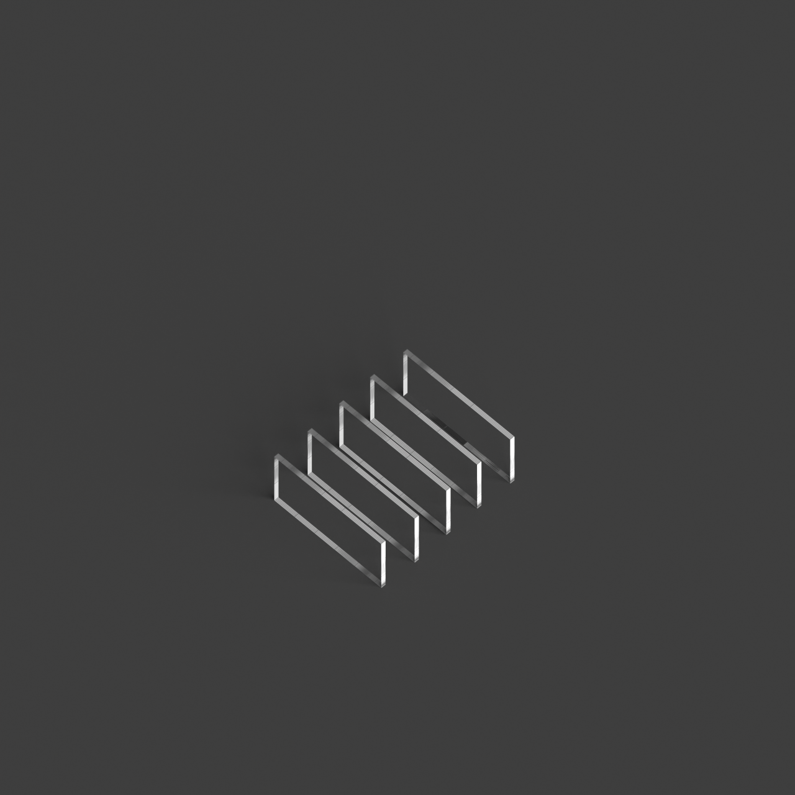
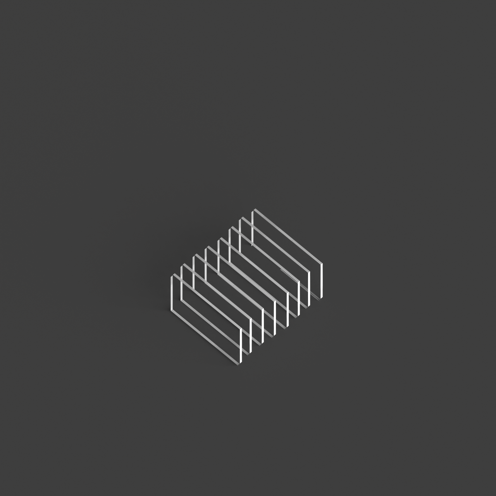
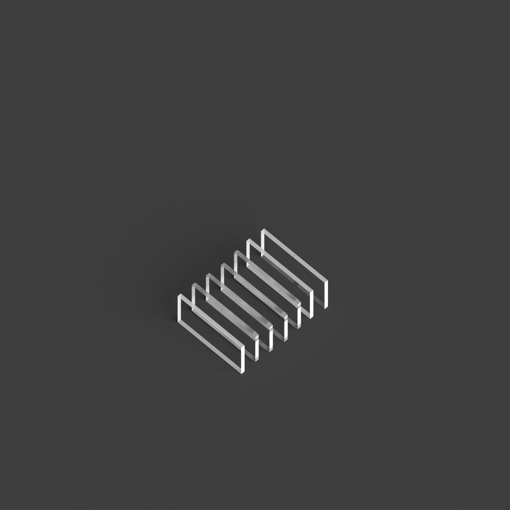
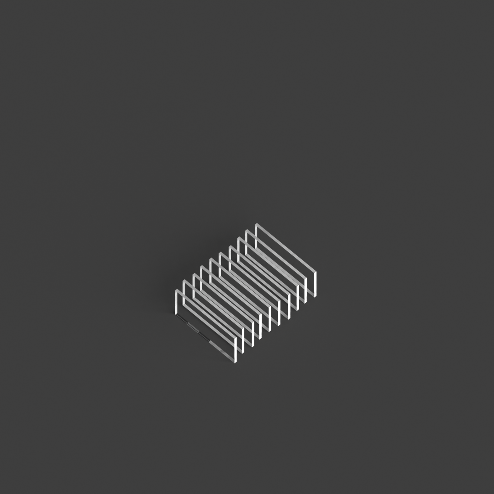

# 0004_0003_0003_interlocking_layers  
         
## Interpretation  
  
### Implications_form :  
The metaphor of &#x27;Interlocking Layers&#x27; suggests a building form where volumes or planes overlap and intertwine, creating a sense of dynamic movement and complexity. This impacts the massing by introducing a layered and textured facade, where the silhouette appears both intricate and varied as different elements intersect and diverge. Spatially, the interlocking layers imply a design where spaces are woven together, promoting interaction while allowing for distinct functional areas. This arrangement emphasizes a balance between connectivity and autonomy, with layers functioning as both separators and connectors, offering diverse spatial experiences through their interactions.  
### Metaphor :  
Interlocking Layers  
### Key_traits :  
This metaphor suggests a design characterized by overlapping and interconnected planes or volumes. The interlocking nature creates dynamic spatial relationships and visual depth, allowing for both openness and separation within the architecture. It emphasizes a structural and spatial complexity, where different layers interact to provide variety in function and experience.  
### Design_task :  
To embody the &#x27;Interlocking Layers&#x27; metaphor in an Architectural Concept Model, design a structure where volumes or planes are intricately woven and intersected. Use varying heights and depths to create a perception of layers folding over each other, emphasizing both unity and distinction. Experiment with different materials to represent the layers, using texture and transparency to highlight their interconnectedness and individuality. Focus on the creation of transitional spaces where layers intersect, demonstrating how these points can serve as interactive hubs or secluded retreats. Ensure the model captures the fluidity and complexity of the design, with the interlocking elements providing both cohesion and variation in spatial experience.  
## Agent summary :  
The function `create_interlocking_layers_model` generates an architectural concept model based on the metaphor of &quot;Interlocking Layers.&quot; It creates a series of overlapping layers, simulating dynamic movement and complexity. By defining parameters like width, depth, height, and number of layers, the function extrudes layers with varying heights and random offsets, embodying the concept of interconnection and individuality. Each layer&#x27;s thickness and gaps between them enhance the visual texture and spatial relationships, demonstrating both unity and distinction. The resulting geometries reflect the metaphor&#x27;s emphasis on interactive spaces and varied experiences, capturing the essence of layered architecture.