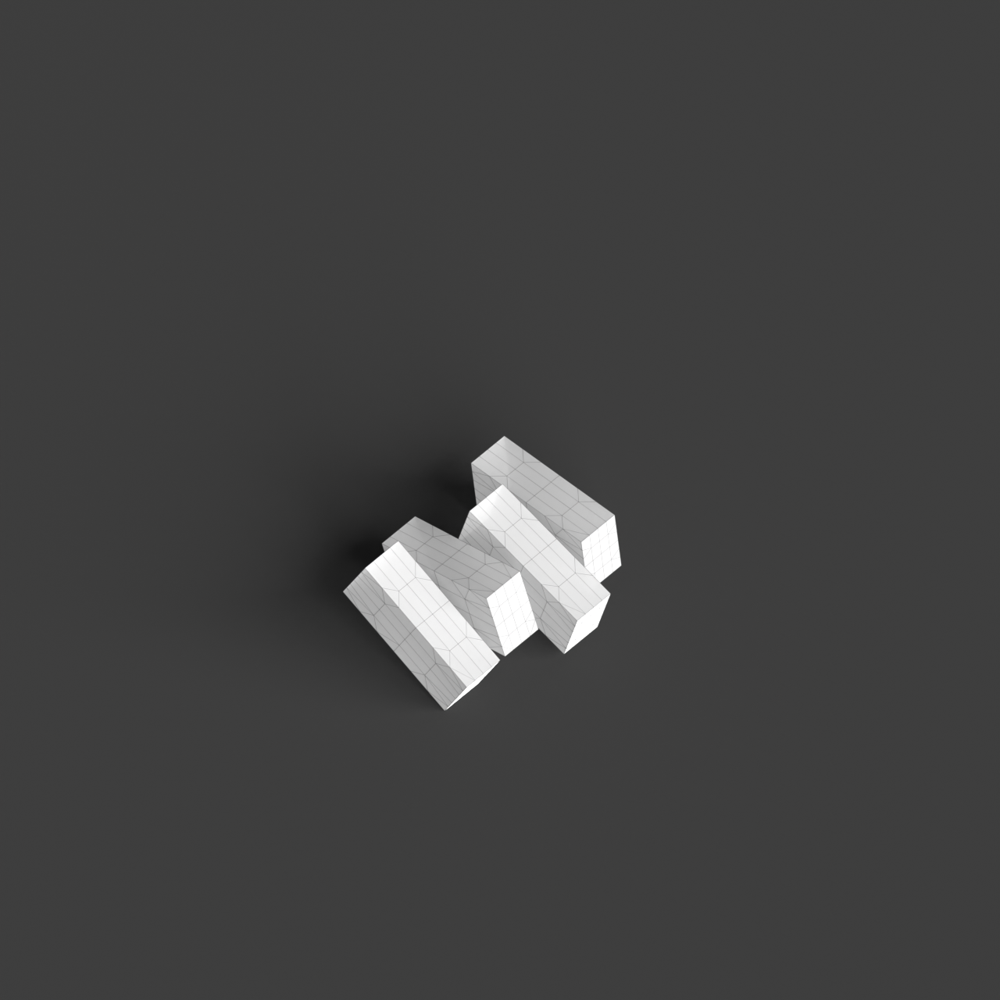
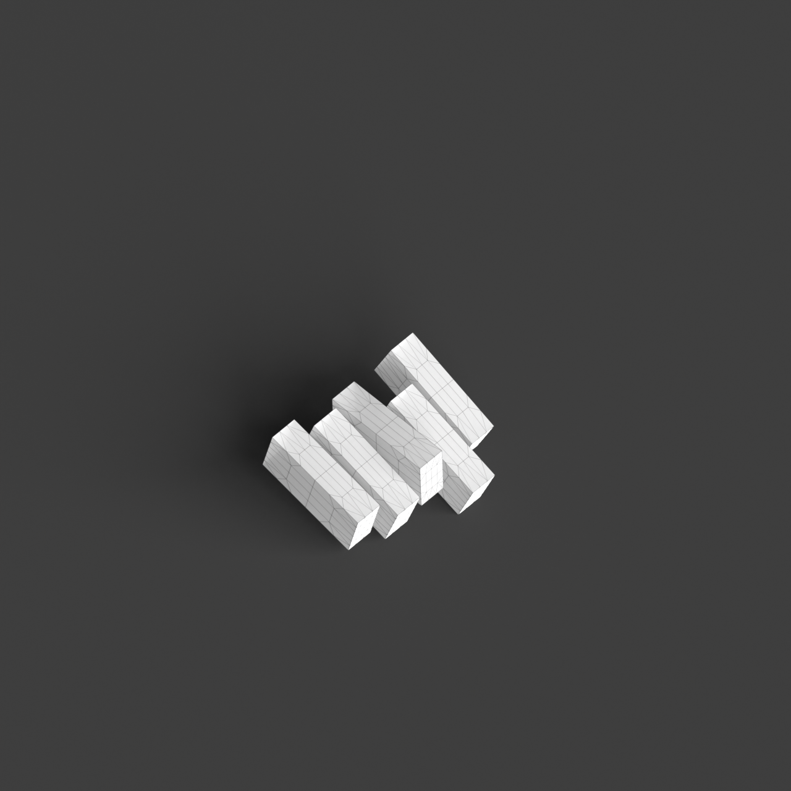
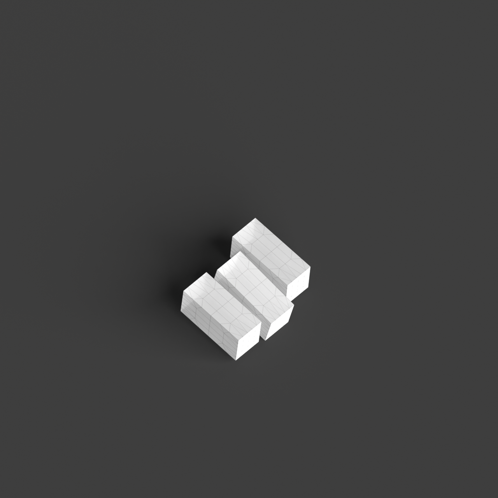
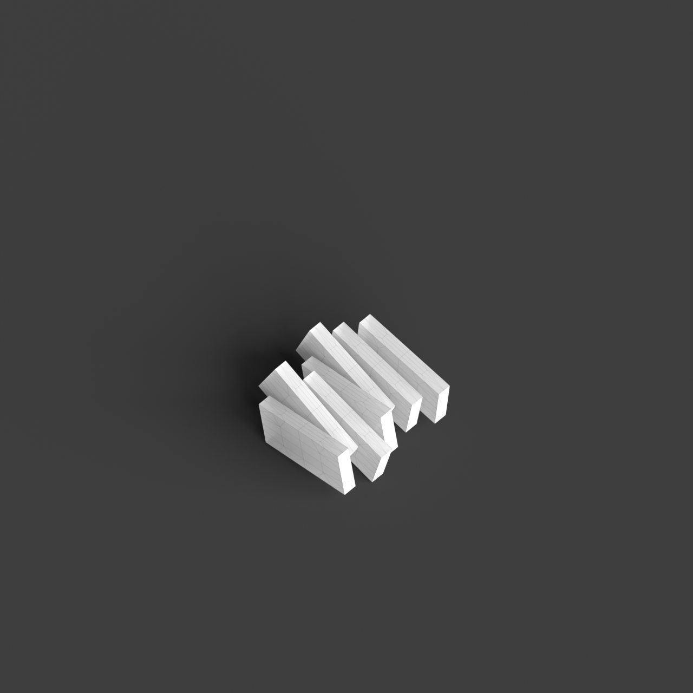

# 0004_0005_0004_interlocking_layers  
         
## Interpretation  
  
### Implications_form :  
The &#x27;Interlocking Layers&#x27; metaphor implies a building design where multiple planes or volumes intersect and overlap, creating a dynamic and multifaceted form. This influences the building&#x27;s massing by introducing a composition that is intricate and layered, with a silhouette characterized by shifting and overlapping elements. The spatial relationships are defined by the interplay of these layers, allowing for a fluid transition between spaces that are both connected and distinct. This arrangement supports a variety of interactions and experiences, with layers providing both privacy and openness. The design emphasizes a structural complexity, where each layer serves a unique function while contributing to a cohesive whole.  
### Metaphor :  
Interlocking Layers  
### Key_traits :  
This metaphor suggests a design characterized by overlapping and interconnected planes or volumes. The interlocking nature creates dynamic spatial relationships and visual depth, allowing for both openness and separation within the architecture. It emphasizes a structural and spatial complexity, where different layers interact to provide variety in function and experience.  
### Design_task :  
To express the &#x27;Interlocking Layers&#x27; metaphor in an Architectural Concept Model, create a structure composed of intersecting and overlapping planes or volumes. Utilize a mix of materials with different opacities and textures to highlight the interactions between layers. Focus on demonstrating how these layers can create diverse spatial experiences, with some areas offering openness and connectivity while others provide seclusion and intimacy. Experiment with the arrangement and orientation of layers to capture the dynamic and complex nature of the design. Ensure the model illustrates the structural interplay and variety in spatial relationships, emphasizing the balance between unity and distinction within the architecture.  
## Agent summary :  
The provided function, `generate_interlocking_layers_model`, creates an architectural concept model inspired by the &quot;Interlocking Layers&quot; metaphor. It generates multiple overlapping layers by calculating their positions, orientations, and dimensions based on specified parameters like base size, maximum height, and layer count. Each layer is randomized in position and angle, enhancing the dynamic relationship between spaces. This results in a model that visually represents complexity and variation in spatial experiences, illustrating the balance between openness and intimacy. The output consists of 3D geometries (Brep objects) that embody the intricacies of the proposed design.