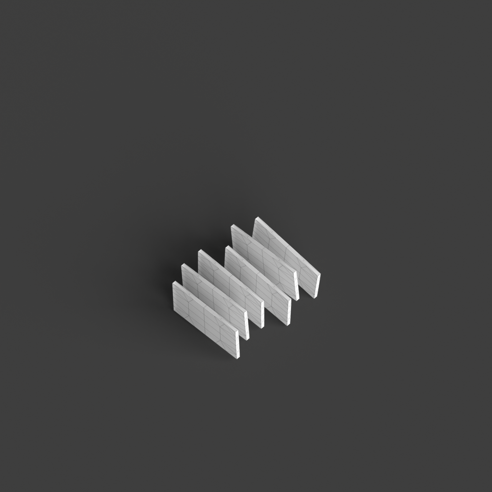
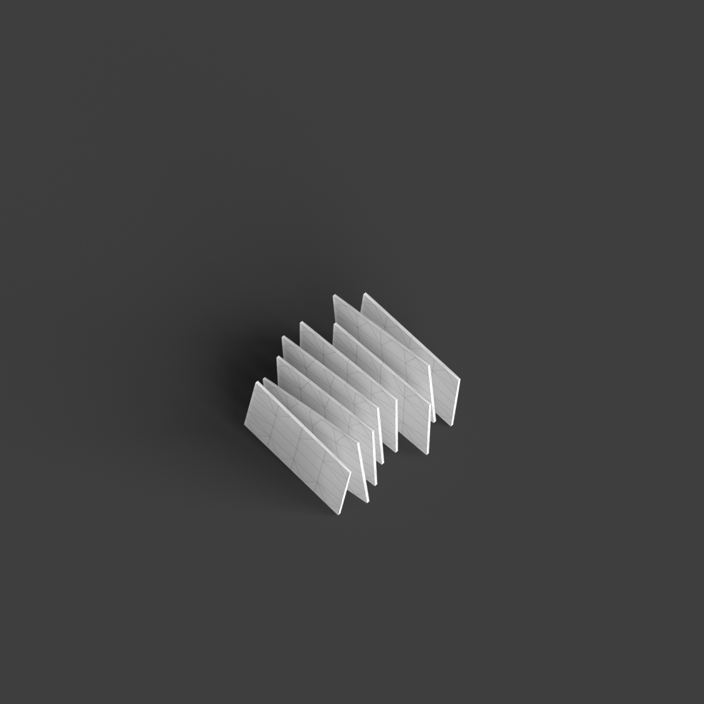
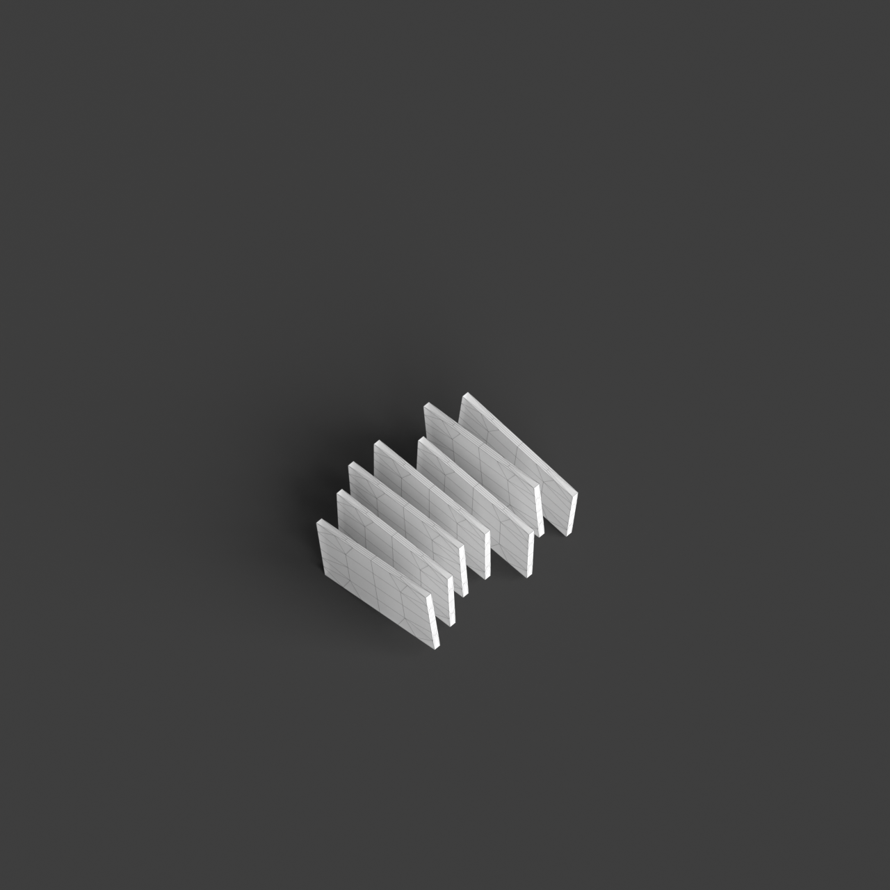
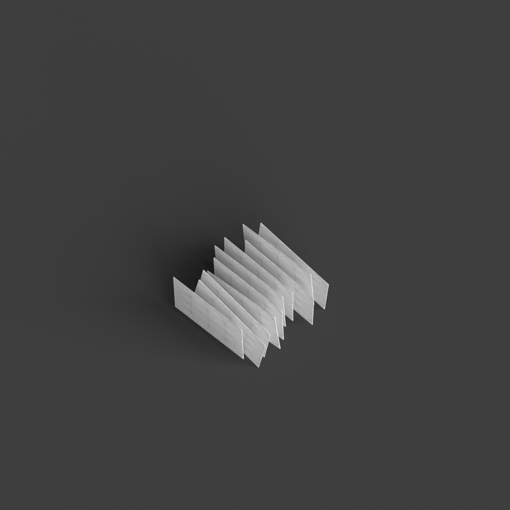

# 0004_0005_0005_interlocking_layers  
         
## Interpretation  
  
### Implications_form :  
The &#x27;Interlocking Layers&#x27; metaphor implies a building design where multiple planes or volumes intersect and overlap, creating a dynamic and multifaceted form. This influences the building&#x27;s massing by introducing a composition that is intricate and layered, with a silhouette characterized by shifting and overlapping elements. The spatial relationships are defined by the interplay of these layers, allowing for a fluid transition between spaces that are both connected and distinct. This arrangement supports a variety of interactions and experiences, with layers providing both privacy and openness. The design emphasizes a structural complexity, where each layer serves a unique function while contributing to a cohesive whole.  
### Metaphor :  
Interlocking Layers  
### Key_traits :  
This metaphor suggests a design characterized by overlapping and interconnected planes or volumes. The interlocking nature creates dynamic spatial relationships and visual depth, allowing for both openness and separation within the architecture. It emphasizes a structural and spatial complexity, where different layers interact to provide variety in function and experience.  
### Design_task :  
To express the &#x27;Interlocking Layers&#x27; metaphor in an Architectural Concept Model, create a structure composed of intersecting and overlapping planes or volumes. Utilize a mix of materials with different opacities and textures to highlight the interactions between layers. Focus on demonstrating how these layers can create diverse spatial experiences, with some areas offering openness and connectivity while others provide seclusion and intimacy. Experiment with the arrangement and orientation of layers to capture the dynamic and complex nature of the design. Ensure the model illustrates the structural interplay and variety in spatial relationships, emphasizing the balance between unity and distinction within the architecture.  
## Agent summary :  
The provided function generates an architectural concept model based on the &#x27;Interlocking Layers&#x27; metaphor by creating a series of overlapping layers represented as geometric boxes. Each layer&#x27;s position and orientation are randomized within specified parameters, resulting in a dynamic structure that reflects the metaphor&#x27;s essence. The function allows customization of base dimensions, height, number of layers, and thickness, which ensures a variety of spatial experiences. By manipulating these layers, the model illustrates complex spatial relationships and varying degrees of openness and seclusion, ultimately creating a visually intriguing representation of interconnected architectural elements.