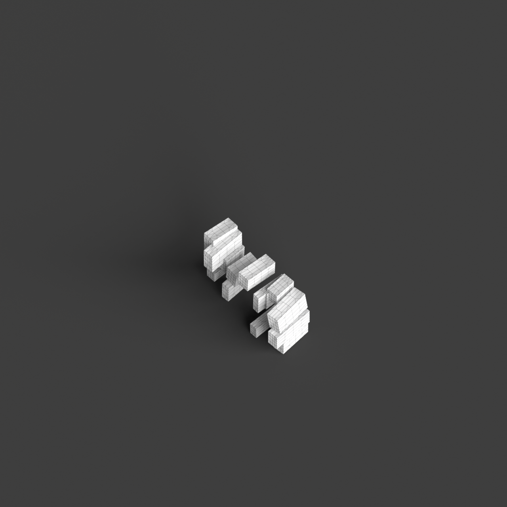
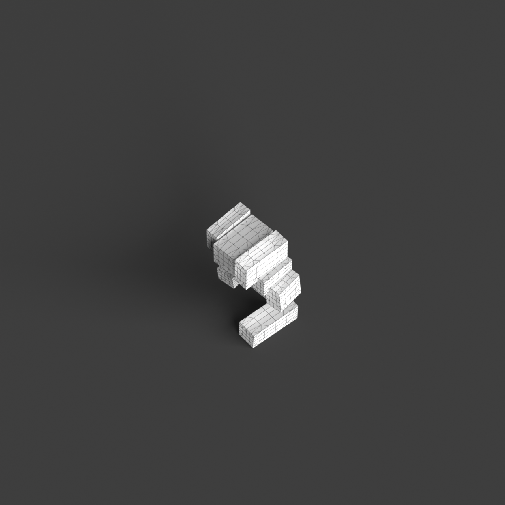
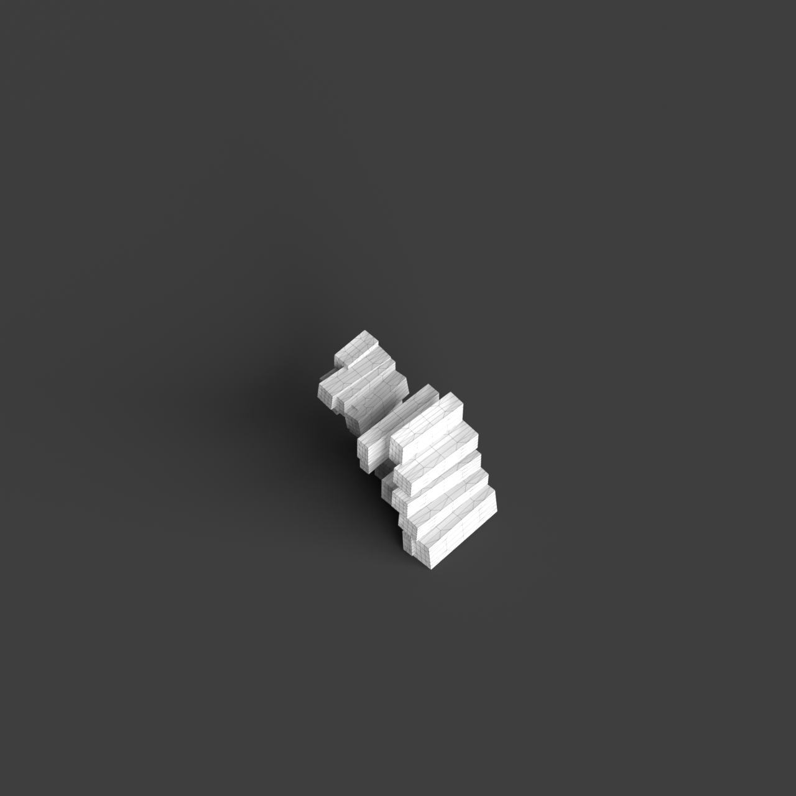
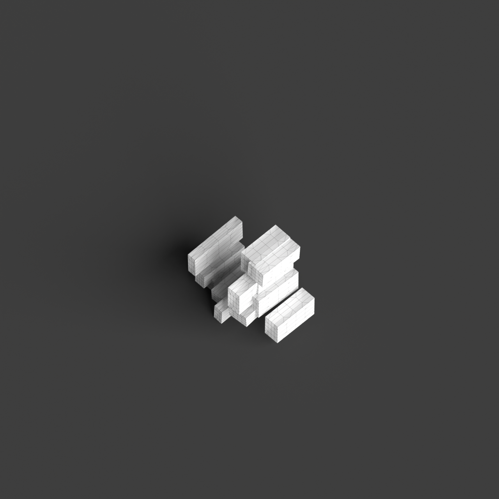
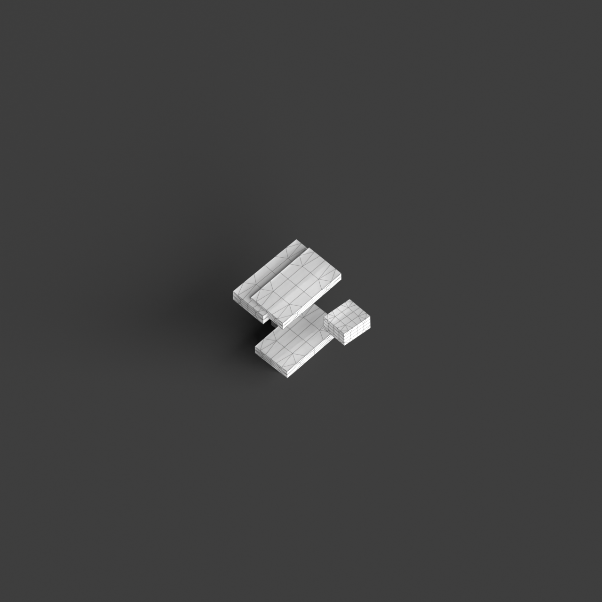

# 0005_0005_0003_distorted_puzzle  
         
## Interpretation  
  
### Implications_form :  
The &#x27;Distorted puzzle&#x27; metaphor suggests a building form where components appear as fragmented yet interconnected elements that create a dynamic play of light and shadow. The massing should use asymmetric forms and varying heights to create a silhouette that shifts perspectives as one moves around it. Spatially, the design should incorporate a network of interlocking spaces that are both discrete and part of a larger whole, allowing for varied experiences of light and enclosure. The structure should evoke a sense of tension and equilibrium, where each part contributes to a cohesive, though visually complex, whole.  
### Metaphor :  
Distorted puzzle  
### Key_traits :  
The metaphor &#x27;Distorted puzzle&#x27; implies a design characterized by a complex, interlocking arrangement of forms or spaces that appear to be slightly misaligned or irregularly shaped. This concept suggests a dynamic interplay of parts that fit together in unexpected ways, creating a sense of movement and tension. The distorted aspect brings a sense of unpredictability and visual interest, while the puzzle nature indicates coherence and interconnectedness in the overall structure.  
### Design_task :  
Develop an Architectural Concept Model for the &#x27;Distorted puzzle&#x27; metaphor by assembling an array of fragmented, interlocking volumes that vary in height and form. Focus on creating a play of light and shadow through the use of asymmetric shapes and openings. Ensure that each volume is distinct yet part of a larger interconnected system, promoting a balance between individuality and unity. The spatial arrangement should allow for varied experiences, with spaces that transition from open to enclosed, enhancing the sense of tension and discovery. The model should evoke the dynamic interplay and coherence inherent in a distorted puzzle, highlighting the visual and experiential complexity of the design.  
## Agent summary :  
The function `generate_distorted_puzzle_concept` creates an architectural concept model inspired by the &quot;Distorted Puzzle&quot; metaphor. It generates fragmented, interlocking volumes of varying heights and shapes, simulating a dynamic interplay of light and shadow. By randomly positioning and transforming these blocks, the function ensures asymmetry, reflecting the metaphor&#x27;s theme of complexity and interconnectedness. The spatial arrangement allows for individual experiences within a cohesive whole, embodying tension and equilibrium. Ultimately, the model captures the essence of a distorted puzzle, where each unique element contributes to a visually engaging and cohesive architectural expression.