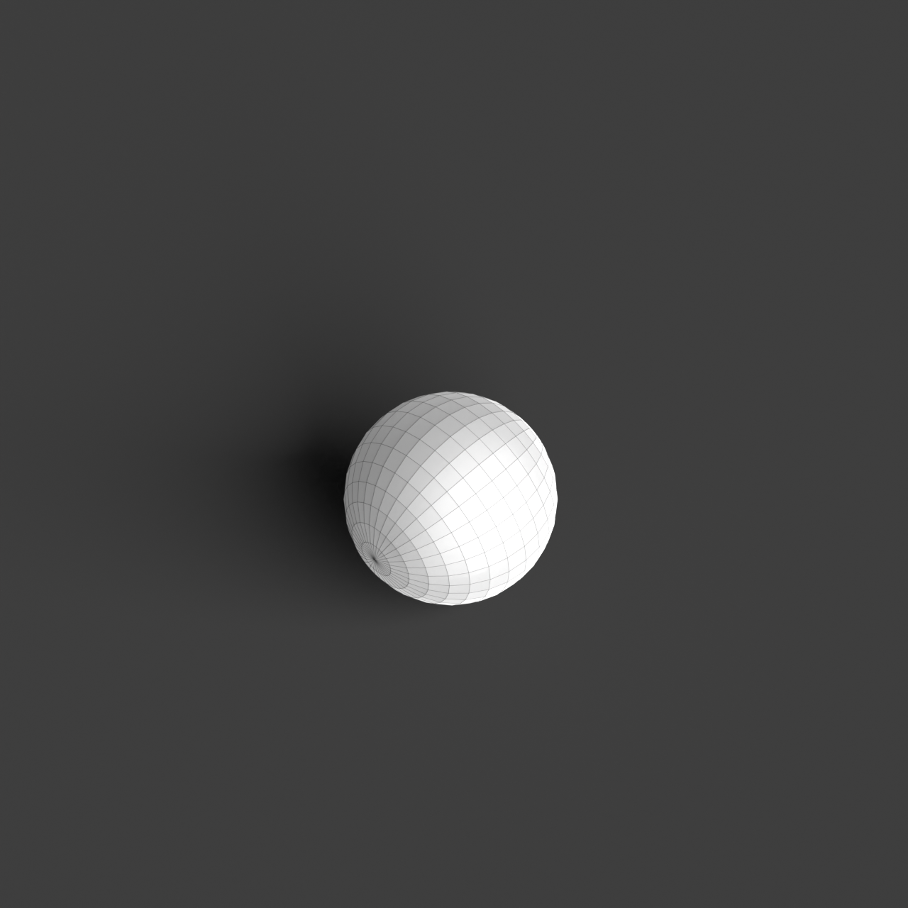

# 0006_0005_0005_box_in_a_cloud  
         
## Interpretation  
  
### Implications_form :  
The &#x27;Box in a cloud&#x27; metaphor can inspire a building design where a solid, geometric core is not only enveloped but integrated within a more dynamic, ethereal form. In terms of massing, the &#x27;box&#x27; can be a central, compact volume that anchors the building, serving as the main structural element. This core could be juxtaposed with an outer layer that acts not just as an envelope but as an interactive space, possibly utilizing kinetic elements or variable opacity materials that respond to environmental conditions. Spatially, this metaphor can suggest a gradient of experiences, where one transitions from the stability of the core to the more unpredictable, changeable nature of the surrounding &#x27;cloud&#x27;. This arrangement encourages exploration of spatial fluidity and adaptability, allowing the &#x27;cloud&#x27; to serve both as a buffer and a connector between different areas. The silhouette can emphasize a balance between the rigid lines of the core and the softly fluctuating contours of the outer layer, promoting a harmonious yet dynamic visual narrative.  
### Metaphor :  
Box in a cloud  
### Key_traits :  
This metaphor suggests a juxtaposition of solidity and ethereality, where a defined, geometric form is enveloped by a more diffuse, dynamic presence. The design could explore the interplay between robust, structured elements and lighter, more amorphous features, emphasizing contrast between opacity and translucency, weight and lightness, defined boundaries and blurred edges. It encourages a dialogue between the grounded and the ephemeral, inviting exploration of spatial layers and transitions.  
### Design_task :  
Develop an Architectural Concept Model based on the &#x27;Box in a cloud&#x27; metaphor that pushes the idea of integration and interaction between the &#x27;box&#x27; and the &#x27;cloud&#x27;. Begin by constructing the &#x27;box&#x27; as a central, defined geometric form using materials that emphasize structural integrity, such as thick cardstock or plywood. Surround and interlace this core with a &#x27;cloud&#x27; layer that is not merely an envelope but transforms into an interactive space. Use materials like flexible mesh or responsive fabric that can change form or opacity, capturing the ephemeral nature of the &#x27;cloud&#x27;. Incorporate elements that allow the &#x27;cloud&#x27; to shift or move in response to external stimuli, such as airflow or light. Focus on creating a seamless transition between the two forms, utilizing joints or overlaps that allow parts of the core to become visible under certain conditions. Experiment with lighting to emphasize the dynamic interplay of light and shadow, enhancing the perception of movement and change within the model. Highlight how the &#x27;cloud&#x27; can serve as both a protective layer and an interactive environment, blurring the boundaries between inside and outside.  
## Agent summary :  
The function `create_dynamic_box_in_cloud_model` generates a 3D architectural concept model based on the &quot;Box in a cloud&quot; metaphor. It constructs a solid geometric core, or &quot;box,&quot; defined by user-specified dimensions, representing stability and structure. Surrounding this core, multiple interactive &quot;cloud&quot; layers are created using spheres with varying radii, embodying ethereality and dynamism. The function introduces randomness to the placement of these cloud layers, enhancing the organic feel of the design. By combining these elements, the model illustrates the interplay between solidity and fluidity, encouraging exploration of spatial transitions and interactions, and fostering a dialogue between the two forms.