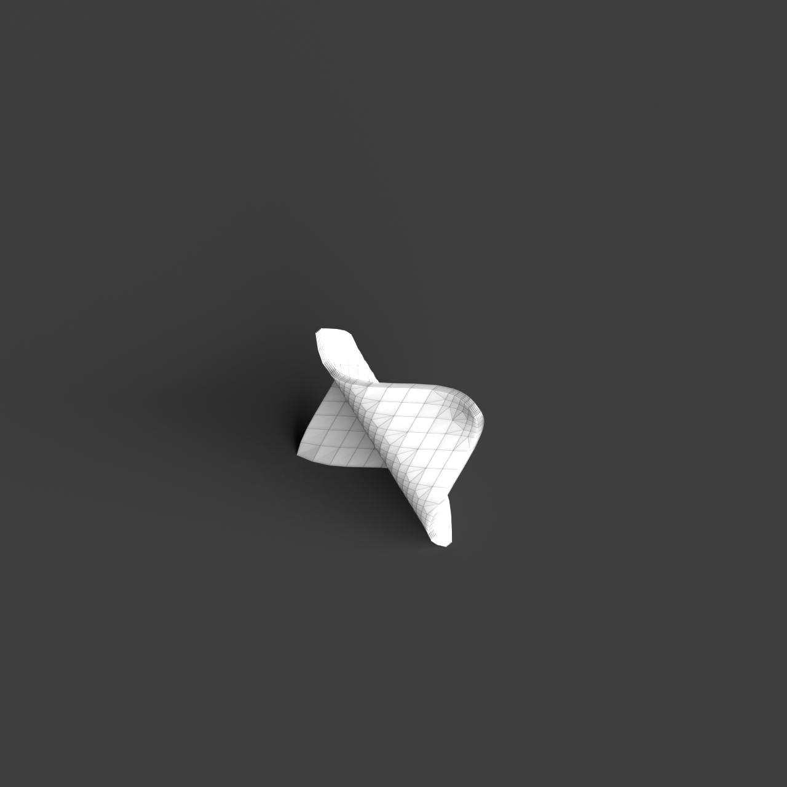
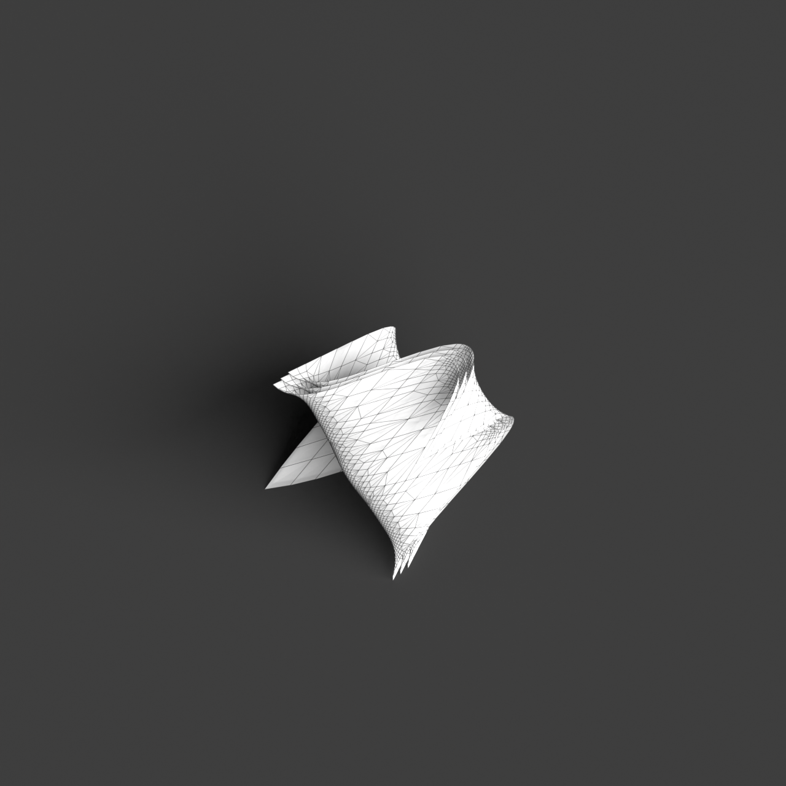
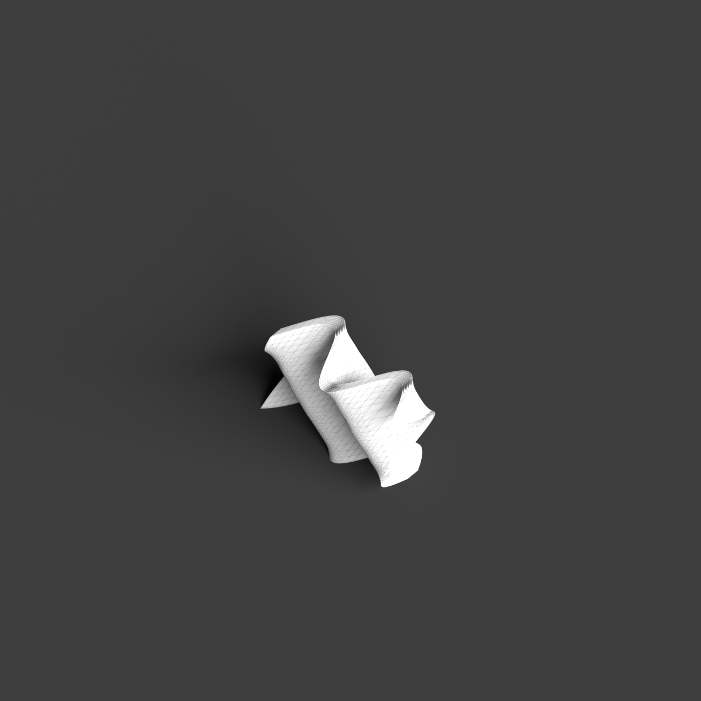

# 0007_0003_0001_rippled_grid  
         
## Interpretation  
  
### Implications_form :  
The &#x27;rippled grid&#x27; metaphor influences the building&#x27;s form and massing by introducing a dynamic undulating surface across a structured grid. This creates a rhythmic pattern where the facade or roofline appears to ripple like waves across an otherwise regular grid. Spatially, this implies an interplay between order and fluidity, where spaces might expand and contract following the rippling pattern, suggesting movement and flow through the structure. The silhouette of the building could appear as a harmonious blend of peaks and troughs, emphasizing dynamic movement while maintaining a sense of regularity and cohesion.  
### Metaphor :  
rippled grid  
### Key_traits :  
The metaphor &#x27;rippled grid&#x27; suggests a dynamic and rhythmic spatial quality. It implies a structured yet fluid pattern reminiscent of waves or ripples that propagate across a uniform grid. This can translate into architectural designs that incorporate undulating surfaces or facades, creating a sense of movement and flow while maintaining an underlying order and regularity.  
### Design_task :  
Create an Architectural Concept Model that embodies the &#x27;rippled grid&#x27; metaphor by using a series of layered planes or surfaces that undulate across a grid. Focus on capturing the rhythmic movement of the ripple effect while ensuring the underlying grid structure is visible. Use materials or techniques that emphasize the fluidity of the ripples, such as flexible or translucent materials. Arrange spaces within this framework to reflect the expansion and contraction suggested by the ripples, emphasizing transitions between areas of compression and openness. Highlight the interaction between the structured grid and the dynamic ripples to evoke both order and movement.  
## Agent summary :  
The provided function generates an architectural concept model by interpreting the &#x27;rippled grid&#x27; metaphor through a structured series of undulating surfaces. It creates a grid-based layout, applying a cosine wave to determine the height variations, thus generating ripples that reflect dynamic movement. The parameters allow for customization of grid size, spacing, ripple height, and number of layers, ensuring a visual interplay between structured order and fluidity. This design captures the metaphor&#x27;s essence by emphasizing transitions between areas of compression and openness, while maintaining an underlying grid structure that evokes a sense of rhythm and flow throughout the architectural model.