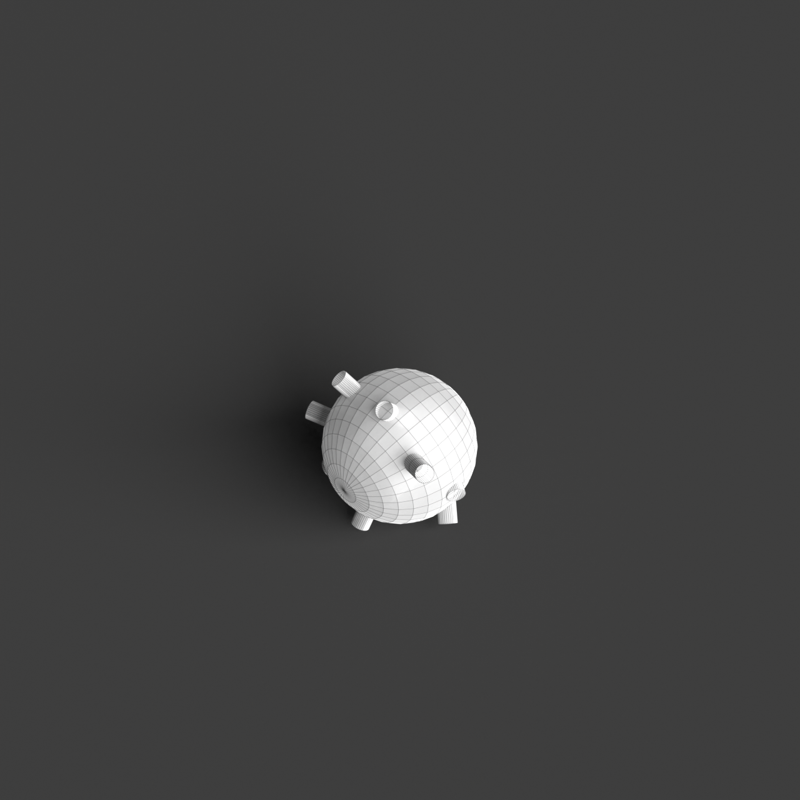

# 0008_0004_0003_branching_network_shell  
         
## Interpretation  
  
### Implications_form :  
The &#x27;branching network shell&#x27; metaphor suggests a building form that emerges organically from a foundational point, with structural elements mimicking natural branching patterns like those found in coral reefs or root systems. This creates a silhouette that is intricate and visually captivating, with an emphasis on vertical and horizontal dispersion. Spatially, the metaphor implies a design where spaces are interconnected through a series of branching corridors and nodes, promoting a sense of exploration and discovery. The shell aspect of the metaphor suggests an outer layer that is both embracing and breathable, facilitating natural light penetration and air flow, while symbolizing protection and unity with the surrounding environment.  
### Metaphor :  
Branching network shell  
### Key_traits :  
The &#x27;branching network shell&#x27; metaphor suggests a structure that is both organic and interconnected, reminiscent of a natural system. It implies a spatial organization where pathways or structural elements diverge and converge, creating a dynamic and adaptive form. The shell aspect indicates a protective and encompassing layer, which can be both open and permeable, allowing light and air to filter through. This metaphor can inspire architectural designs that emphasize fluidity, growth, and integration with the surrounding environment, promoting a sense of connection and continuity.  
### Design_task :  
Construct an Architectural Concept Model that reflects the &#x27;branching network shell&#x27; by designing a structure with vertical and horizontal branching elements that radiate from a central source. Focus on creating a complex and visually dynamic form that emphasizes exploration and connectivity within the space. The model should feature a protective yet permeable shell, using materials such as mesh or perforated surfaces, to allow interaction with light and air, enhancing the connection between interior and exterior environments. Highlight the interplay of light and shadow within the model to evoke the organic and adaptive qualities of the metaphor, ensuring a seamless integration with the landscape.  
## Agent summary :  
The function `create_branching_shell_model` generates an architectural concept model inspired by the &quot;branching network shell&quot; metaphor. It constructs a central core from which multiple branching elements radiate, simulating organic growth patterns found in nature. The model features a complex arrangement of branches that diverge and converge, promoting spatial exploration. An outer shell is created with openings to facilitate airflow and natural light, embodying the protective yet permeable qualities of the metaphor. The interplay of light and shadow within the model enhances its adaptive characteristics, ensuring harmonious integration with the surrounding environment.