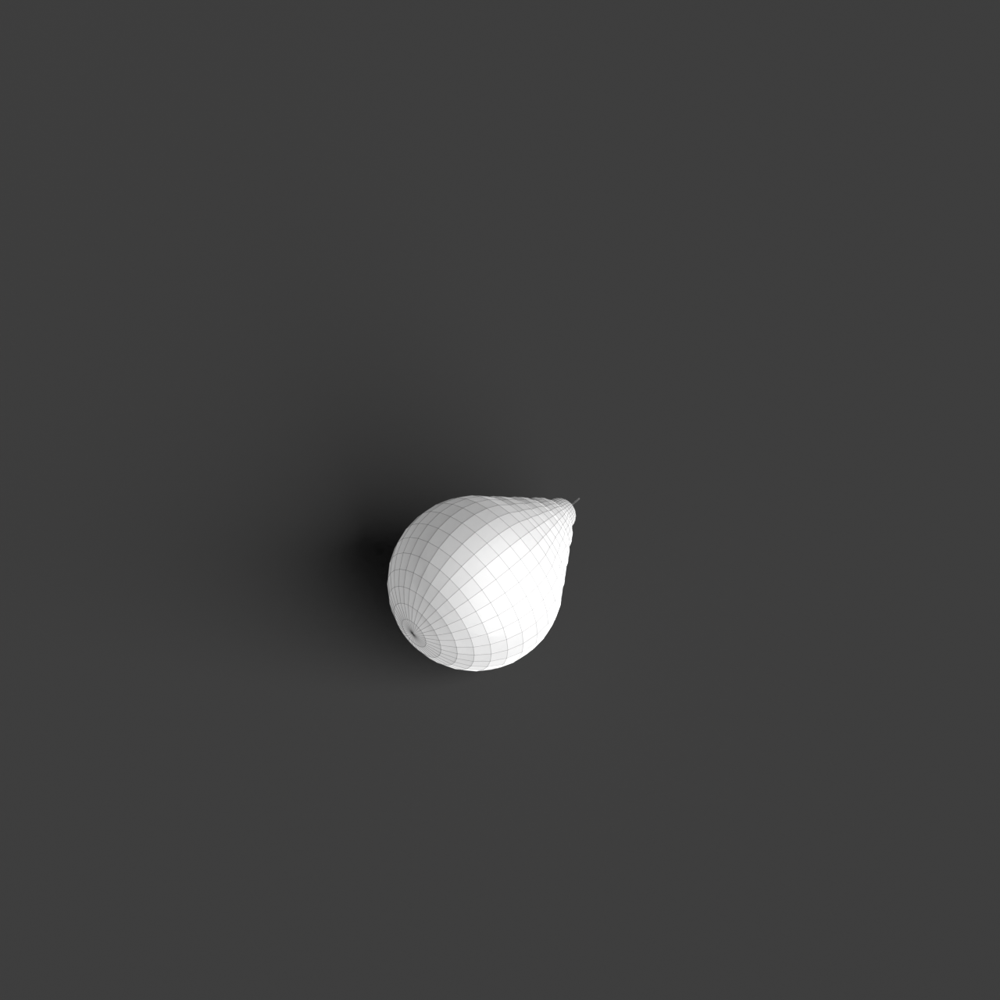
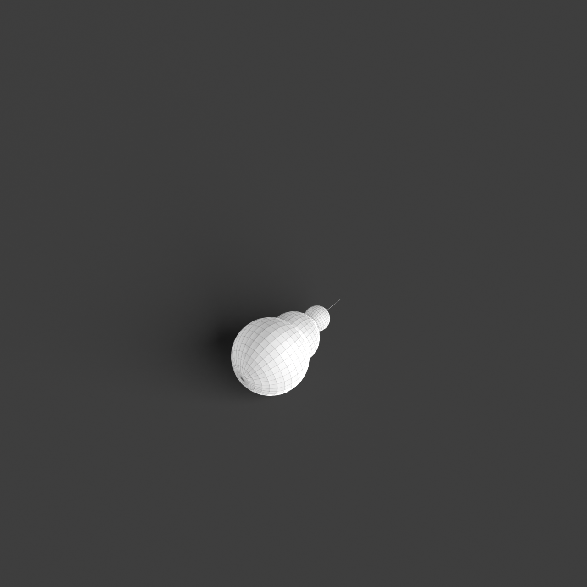
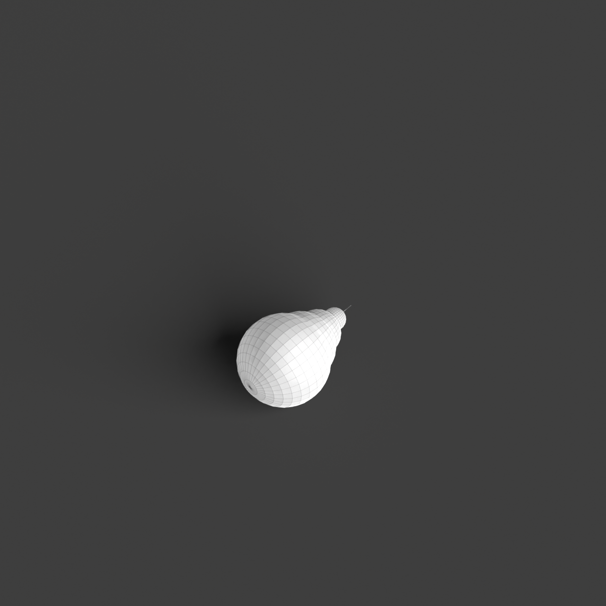
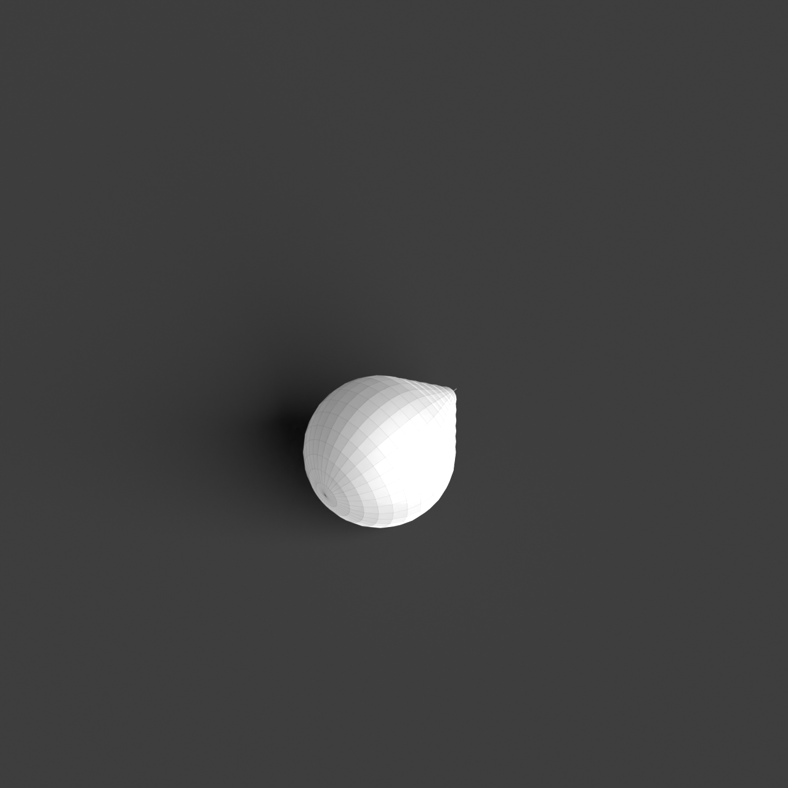

# 0008_0005_0005_branching_network_shell  
         
## Interpretation  
  
### Implications_form :  
The &#x27;branching network shell&#x27; metaphor shapes the building&#x27;s form and massing by suggesting a fractal-like pattern, where each part reflects the whole, creating a repetitive yet organic rhythm. This results in a silhouette that is both intricate and expansive, reminiscent of interconnected natural systems such as mycelium networks or river deltas. Spatially, the metaphor informs an arrangement where spaces are interwoven within a matrix of branching elements, allowing both fluid transitions and moments of pause or reflection. The shell aspect suggests a layered structure that is semi-transparent, providing a sense of protection while maintaining openness to natural elements like light and wind, fostering a dynamic interaction with the environment.  
### Metaphor :  
Branching network shell  
### Key_traits :  
The &#x27;branching network shell&#x27; metaphor suggests a structure that is both organic and interconnected, reminiscent of a natural system. It implies a spatial organization where pathways or structural elements diverge and converge, creating a dynamic and adaptive form. The shell aspect indicates a protective and encompassing layer, which can be both open and permeable, allowing light and air to filter through. This metaphor can inspire architectural designs that emphasize fluidity, growth, and integration with the surrounding environment, promoting a sense of connection and continuity.  
### Design_task :  
Design an Architectural Concept Model that embodies the &#x27;branching network shell&#x27; by developing a structure that features a fractal matrix of branching elements. Focus on creating a rhythmic and organic pattern that allows for both continuity and moments of rest within the space. The model should incorporate a layered shell that is semi-transparent, using materials such as woven textiles or layers of fine mesh, to emphasize the balance between enclosure and permeability. Highlight the interaction of light and air within the model, ensuring a dynamic relationship with the surrounding environment. Emphasize the interconnectedness and adaptability of the design, promoting a sense of growth and harmony with nature.  
## Agent summary :  
The provided function, `create_branching_network_shell`, generates an architectural concept model based on the metaphor of a &quot;branching network shell.&quot; Utilizing recursive techniques, it creates a fractal-like branching structure that reflects organic growth and interconnectedness. Parameters such as branch levels, angles, and shell thickness dictate the model&#x27;s complexity and layering. The resulting geometry features a semi-transparent shell, designed to interact dynamically with light and air, emphasizing fluid transitions and spaces for pause. This approach encapsulates the metaphor&#x27;s essence, promoting a harmonious relationship between the structure and its natural environment while highlighting adaptability and continuity.