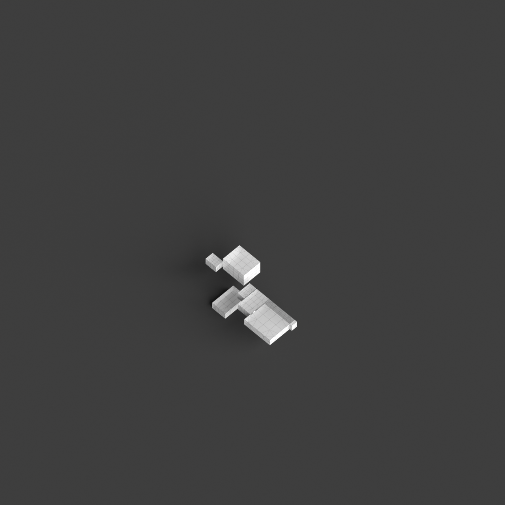
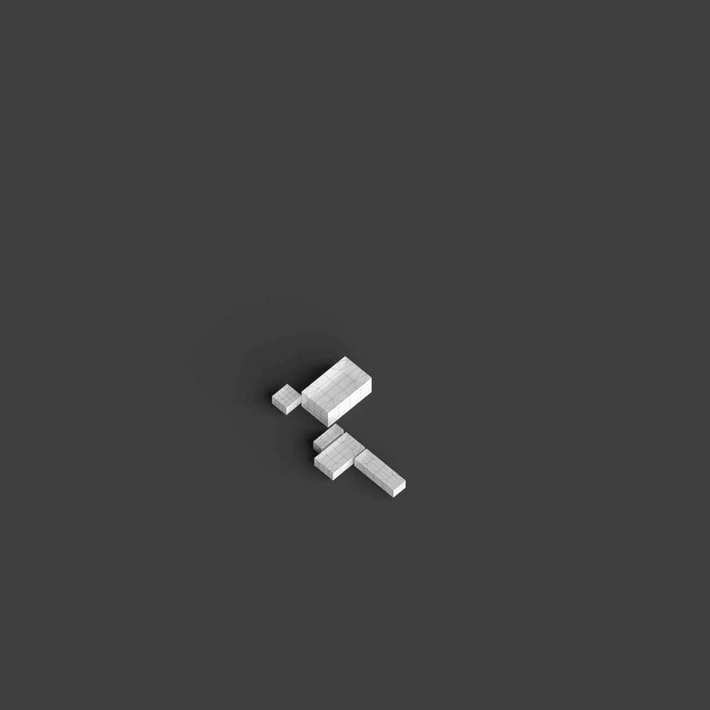
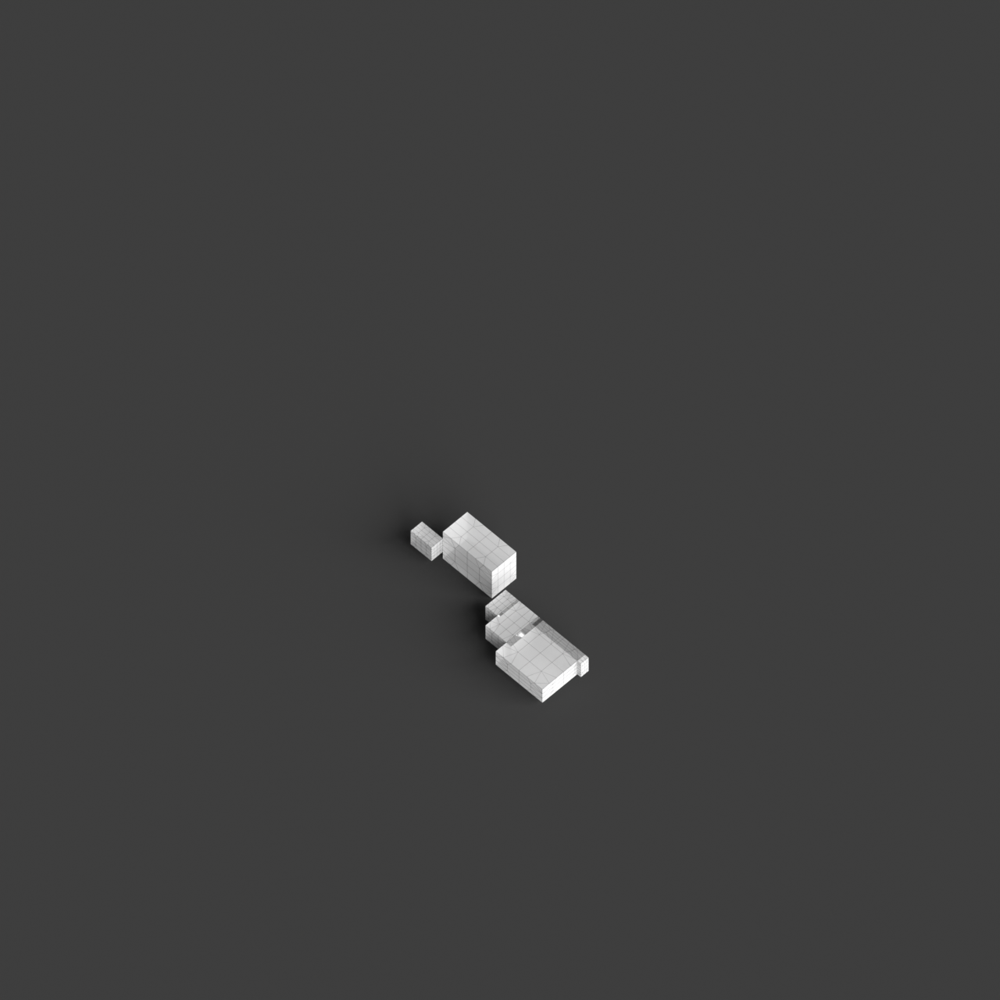
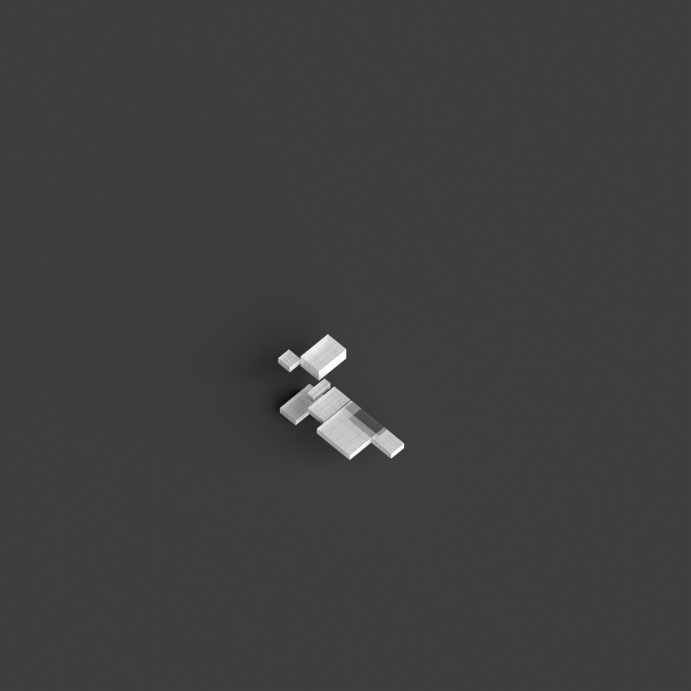
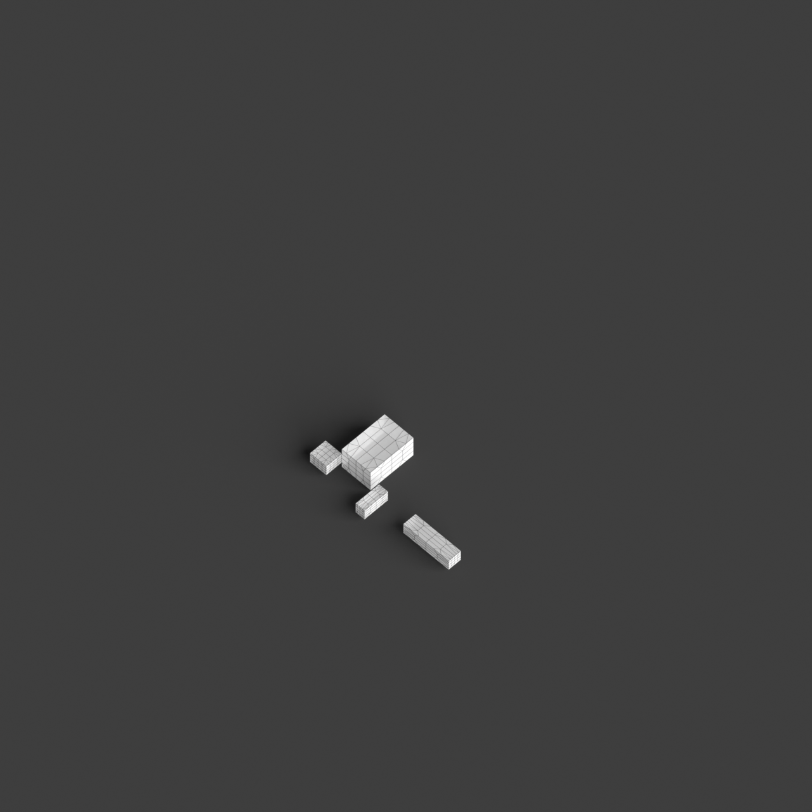

# 0009_0001_0002_cantilevering_corners  
         
## Interpretation  
  
### Implications_form :  
The metaphor of &#x27;Cantilevering corners&#x27; suggests a form where the building&#x27;s massing includes bold, projecting elements that extend outward from a stable core. These cantilevered sections create a silhouette characterized by tension and balance, with dramatic overhangs that challenge conventional notions of gravity. Spatial relationships are defined by the interplay between solid supports and the seemingly suspended spaces, creating unexpected voids and volumes that enhance the building&#x27;s dynamic interaction with its surroundings.  
### Metaphor :  
Cantilevering corners  
### Key_traits :  
The metaphor implies a dynamic interaction between stability and motion, suggesting architectural elements that project outward from a structure with a sense of tension and balance. This can manifest in a building design where certain sections boldly jut out, creating dramatic overhangs or unexpected spaces that defy conventional expectations of gravity and support.  
### Design_task :  
Create an Architectural Concept Model that emphasizes the dynamic tension of cantilevered elements. Focus on the juxtaposition of solid and void by designing a central core from which sections extend outward in varying directions and lengths. These extensions should be designed to appear as if they are in motion, defying gravity, and creating a sense of balance and instability. Use contrasting materials or textures to highlight the interaction between the grounded core and the projecting volumes, and explore how light and shadow play across these elements to enhance the perception of movement and tension.  
## Agent summary :  
The provided function generates an architectural concept model inspired by the metaphor of &quot;Cantilevering corners.&quot; By defining a central core with specified dimensions, the function creates a series of cantilevered extensions that project outward in various directions and heights. This design emphasizes the dynamic tension between solid support and void spaces, reflecting the metaphor&#x27;s theme of balance and instability. Randomization of extension properties, such as length and height, introduces variability, allowing the model to visually challenge gravity. The result is a collection of geometries that captures the interplay of light, shadow, and movement, fulfilling the design task.