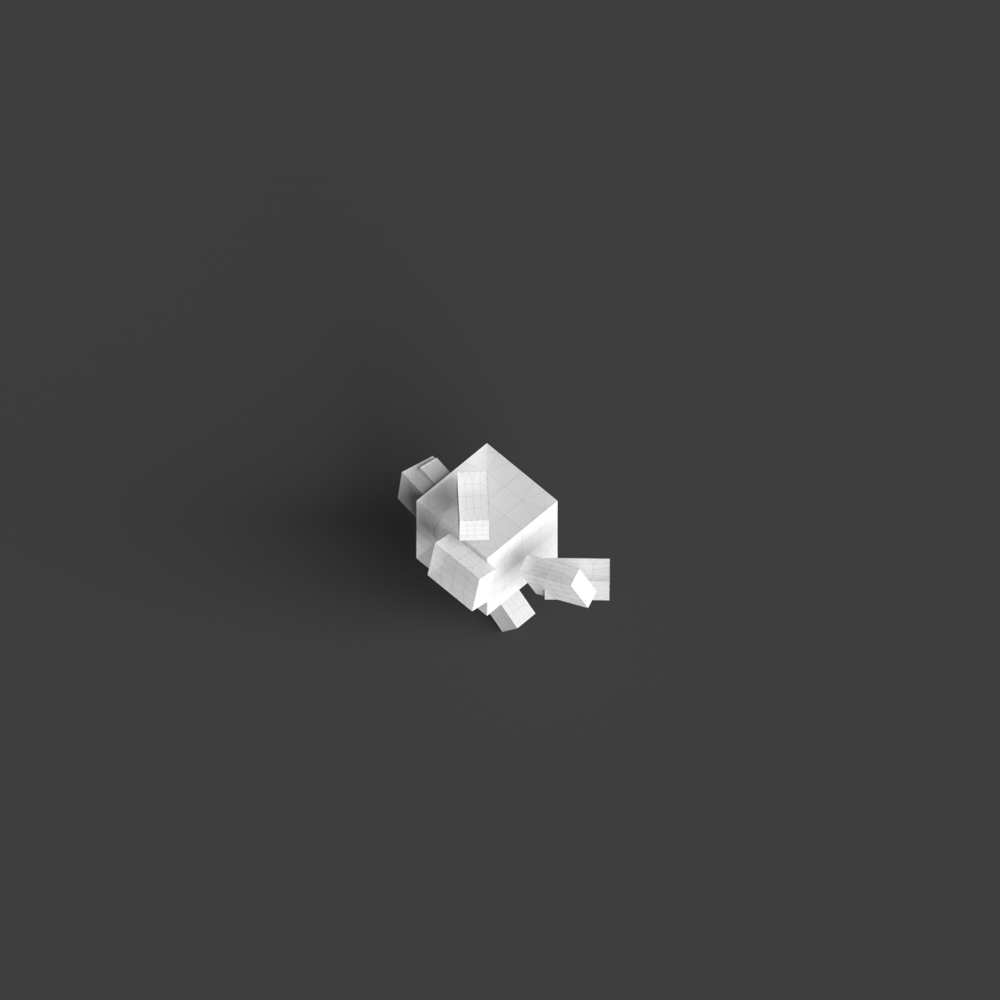
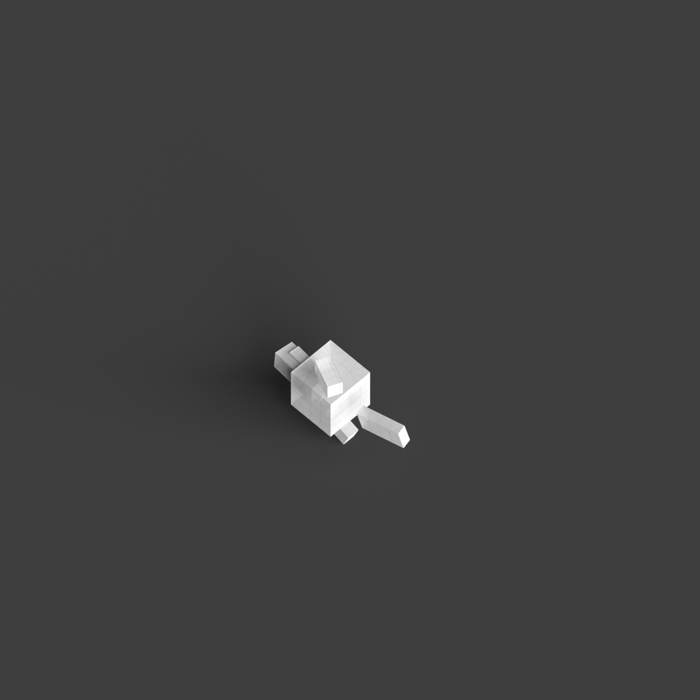
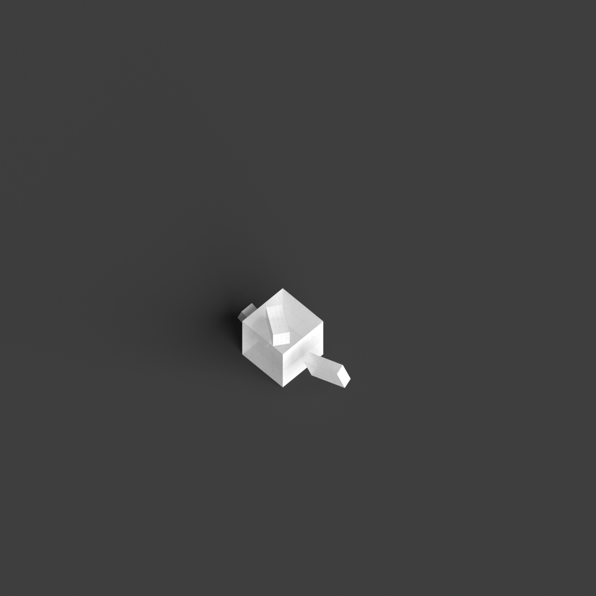

# 0009_0002_0003_cantilevering_corners  
         
## Interpretation  
  
### Implications_form :  
The metaphor of &#x27;Cantilevering corners&#x27; shapes the building&#x27;s form and massing by introducing elements that project outward from a central mass, creating a sense of dynamic equilibrium. This results in a silhouette that balances between grounded stability and daring projections. Spatially, the arrangement is informed by the contrast between anchored sections and those that extend, creating intriguing negative spaces and a sense of suspended motion. The interaction between these elements invites exploration and evokes a dialogue between the built environment and its context.  
### Metaphor :  
Cantilevering corners  
### Key_traits :  
The metaphor implies a dynamic interaction between stability and motion, suggesting architectural elements that project outward from a structure with a sense of tension and balance. This can manifest in a building design where certain sections boldly jut out, creating dramatic overhangs or unexpected spaces that defy conventional expectations of gravity and support.  
### Design_task :  
Develop an Architectural Concept Model that captures the essence of &#x27;Cantilevering corners&#x27; through a series of interconnected volumes. Each volume should be designed to extend outward at various angles and lengths, creating a play of balance and counterbalance. Emphasize the relationship between the core structure and the cantilevered elements by varying the scale and orientation of these projections. Experiment with layering and stacking techniques to create a complex interplay of volumes. Highlight the transition between the stable core and the cantilevered sections with a distinct shift in form or material, and explore how these elements interact with light, shadow, and the surrounding environment to emphasize the metaphor&#x27;s dynamic nature.  
## Agent summary :  
The provided function generates an architectural concept model inspired by the metaphor of &quot;Cantilevering corners.&quot; It constructs a central core structure and adds multiple cantilevered volumes that extend outward at varying angles and lengths. The design emphasizes the dynamic interplay between stability and motion, capturing the essence of the metaphor. By varying the scale, orientation, and attachment of each cantilevered element, the function creates a complex arrangement that fosters exploration of negative spaces and interactions with light and shadow. The resulting geometries represent a balance between anchored stability and daring projections, reflecting the architectural intent of the task.