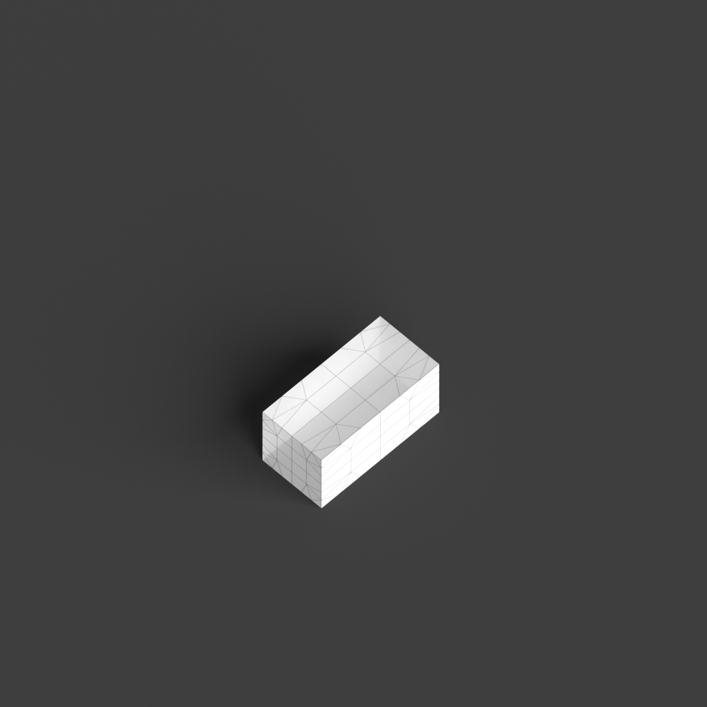
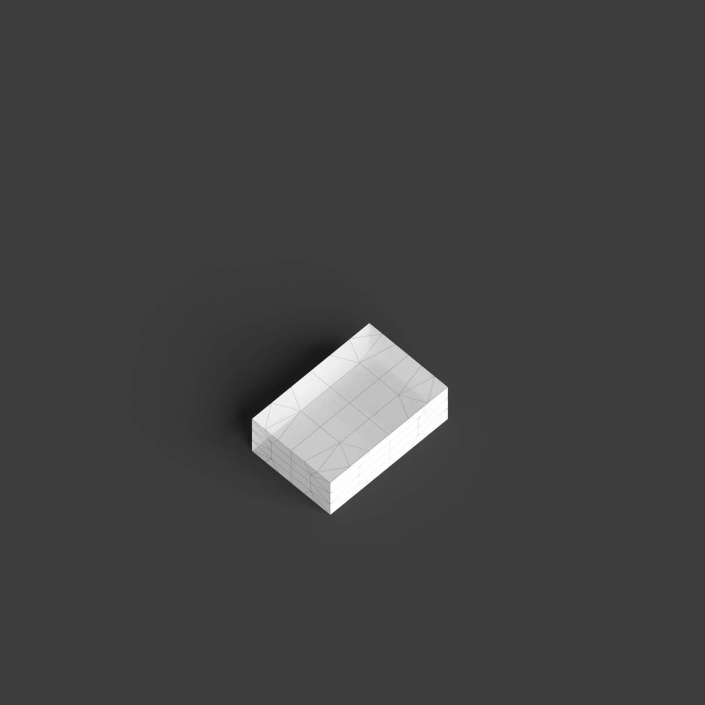
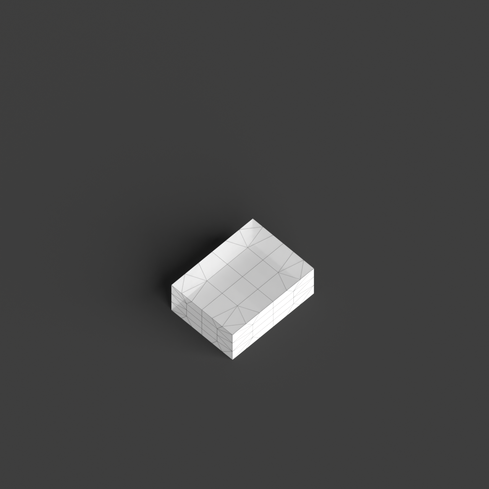
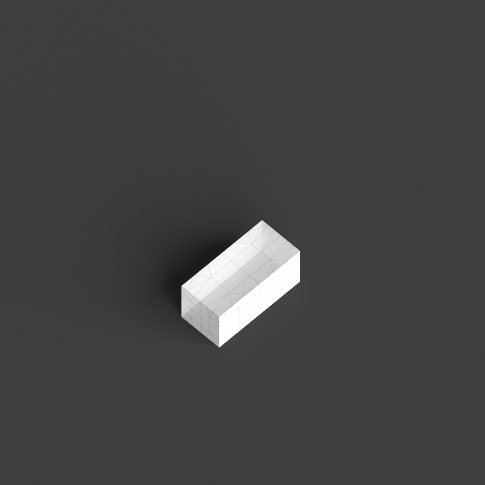
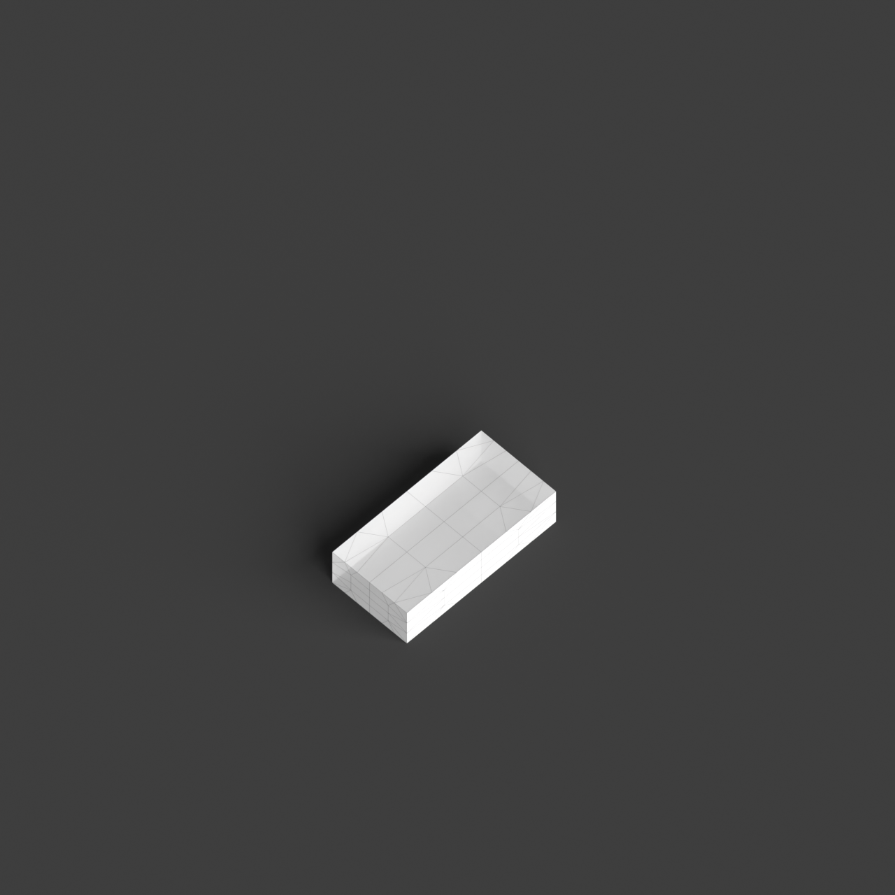

# 0009_0004_0001_cantilevering_corners  
         
## Interpretation  
  
### Implications_form :  
The metaphor of &#x27;Cantilevering corners&#x27; implies a building form where the overall massing is defined by dynamic extensions that jut out from a core structure, creating a sense of tension between stability and motion. The silhouette is characterized by bold overhangs and angular projections that challenge conventional expectations of support and gravity. Spatial relationships are informed by the interaction of grounded and suspended elements, resulting in a playful balance of solid and void. This creates opportunities for unique, unexpected spaces that invite engagement and exploration.  
### Metaphor :  
Cantilevering corners  
### Key_traits :  
The metaphor implies a dynamic interaction between stability and motion, suggesting architectural elements that project outward from a structure with a sense of tension and balance. This can manifest in a building design where certain sections boldly jut out, creating dramatic overhangs or unexpected spaces that defy conventional expectations of gravity and support.  
### Design_task :  
Construct an Architectural Concept Model that captures the essence of &#x27;Cantilevering corners&#x27; through a series of angular, interlocking volumes. Focus on creating a central structure from which sections extend asymmetrically in various directions, forming cantilevered corners that defy gravity. Emphasize the interplay between these projecting elements and the grounded core by using contrasting geometries and materials. Explore the creation of dynamic spaces beneath and around the cantilevered sections, considering how these areas can function both aesthetically and functionally. Pay attention to the impact of light and shadow across the model, enhancing the perception of movement and the delicate balance between stability and motion.  
## Agent summary :  
The provided function, `create_cantilever_corners_model`, generates an architectural concept model based on the metaphor of &quot;Cantilevering corners.&quot; It begins by establishing a central core structure from which multiple cantilevered volumes extend in various directions, embodying the dynamic interplay between stability and motion. The function uses randomized positioning for the cantilevers, allowing for diverse angular projections and dramatic overhangs that challenge traditional support concepts. By varying the dimensions and number of cantilevers, the model captures the essence of dynamic spatial relationships and the aesthetic impact of light and shadow, inviting exploration of unexpected spaces.