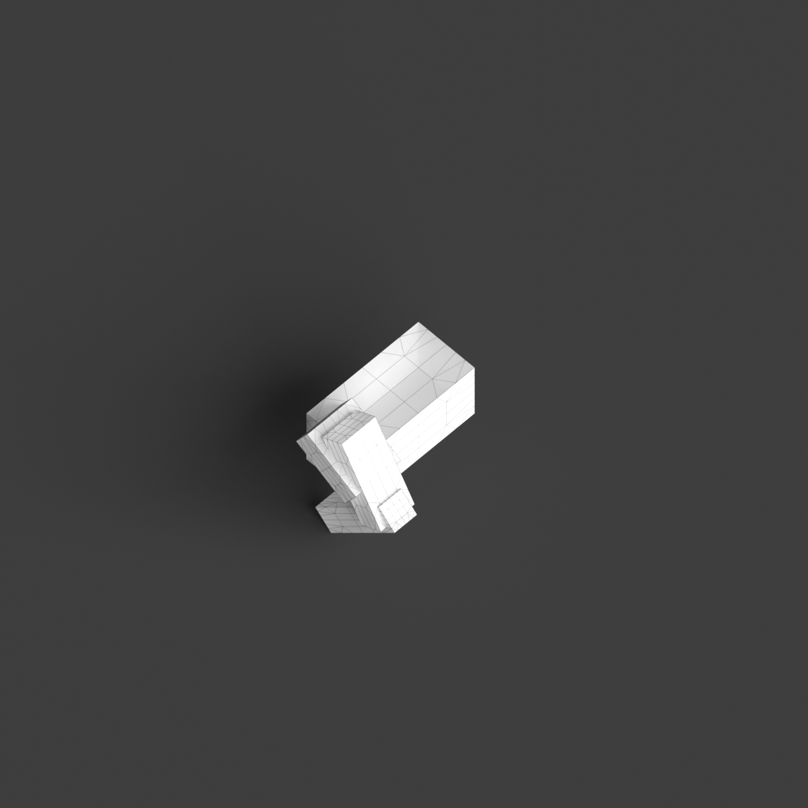
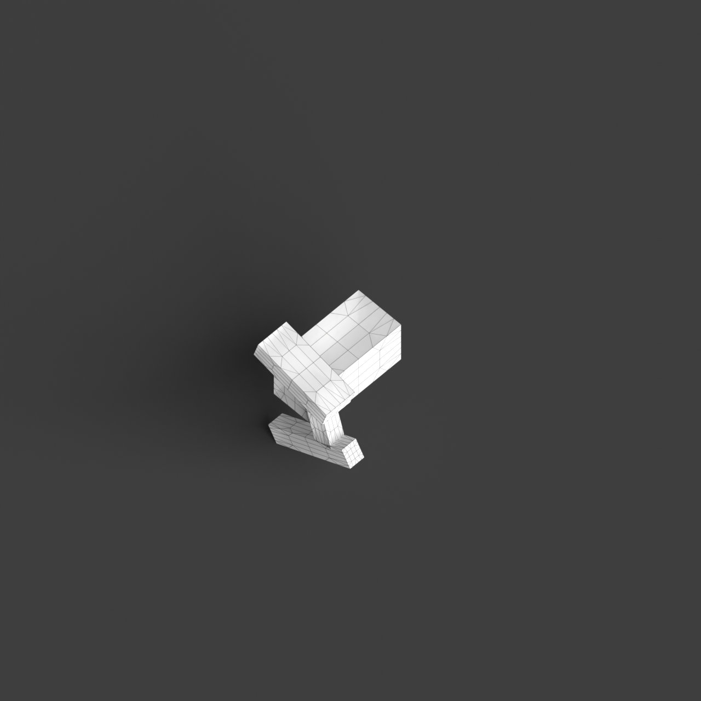
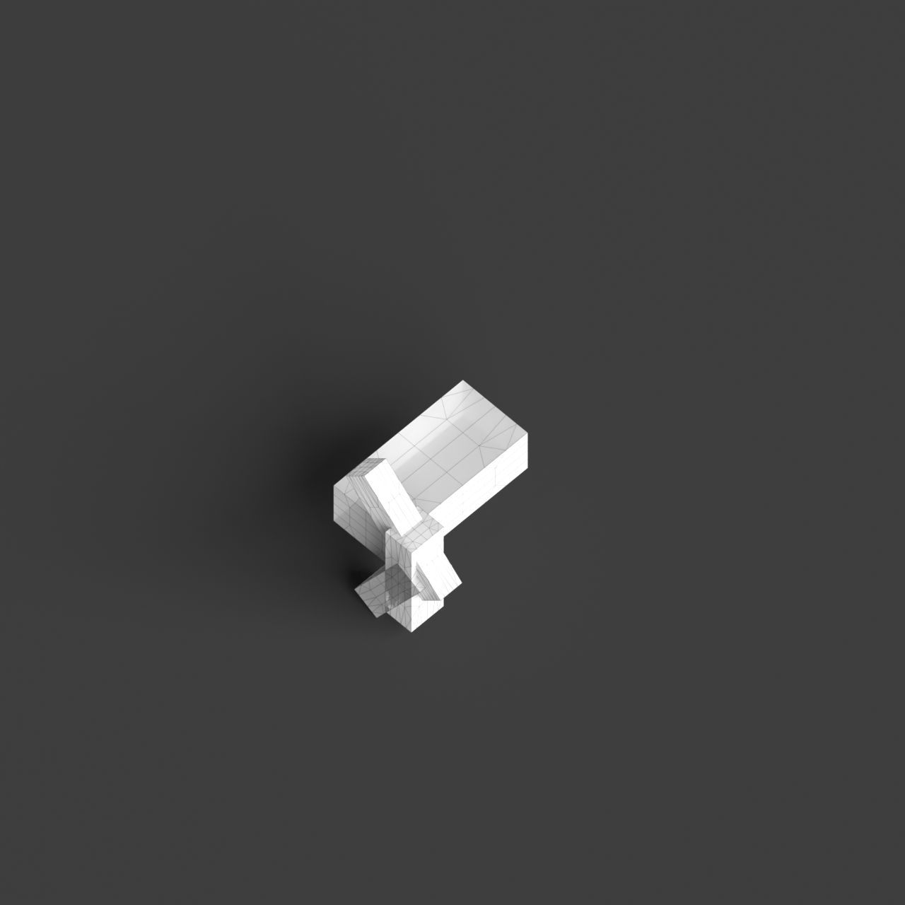
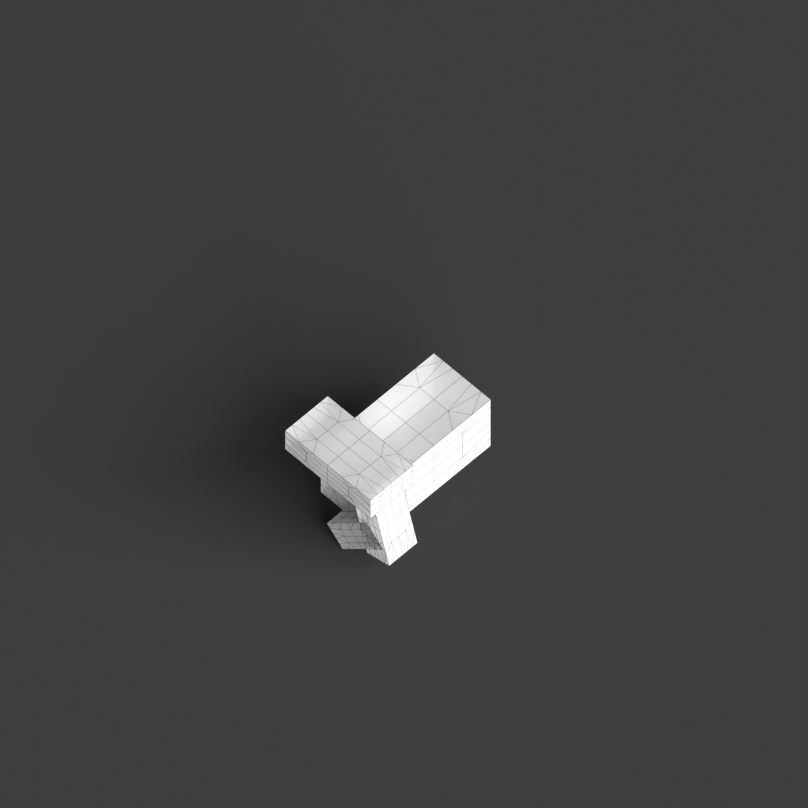
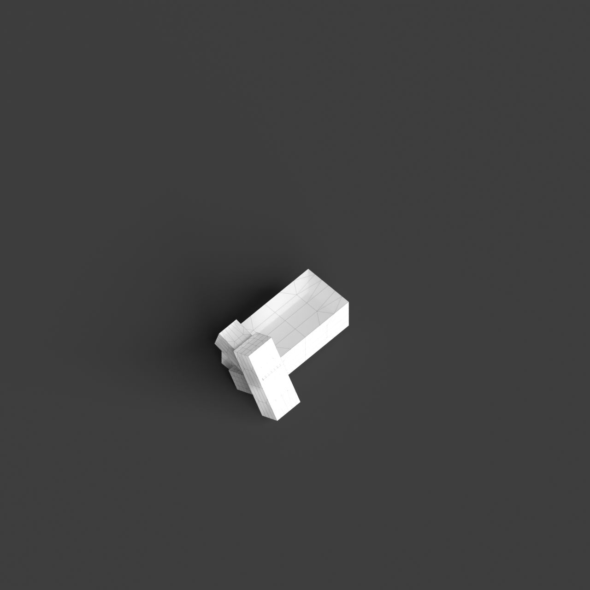

# 0009_0005_0004_cantilevering_corners  
         
## Interpretation  
  
### Implications_form :  
The metaphor of &#x27;Cantilevering corners&#x27; implies a building form where the massing is characterized by elements that extend outwards, creating a dynamic and visually engaging silhouette. These projections convey a sense of motion and tension, appearing to defy gravity while maintaining an overall balance. The spatial relationships are defined by the interaction between these outward-reaching elements and a stable core, resulting in a series of interstitial spaces that invite exploration and interaction. The design suggests an architectural language that emphasizes contrast and the unexpected, challenging traditional notions of support and enclosure.  
### Metaphor :  
Cantilevering corners  
### Key_traits :  
The metaphor implies a dynamic interaction between stability and motion, suggesting architectural elements that project outward from a structure with a sense of tension and balance. This can manifest in a building design where certain sections boldly jut out, creating dramatic overhangs or unexpected spaces that defy conventional expectations of gravity and support.  
### Design_task :  
Develop an Architectural Concept Model that embodies &#x27;Cantilevering corners&#x27; by focusing on the contrast between stability and motion. Start with a central core that serves as the anchor for the composition. From this core, extend multiple sections outward in a way that appears both daring and balanced. Utilize varied angles and lengths to create a sense of dynamic movement. Highlight the transition between solid and void by incorporating negative spaces beneath the cantilevered elements. Experiment with transparency and opacity in materials to accentuate the interplay of light and shadow, enhancing the perception of tension and balance. Consider how these cantilevered sections can create engaging, functional spaces that encourage interaction with the surrounding environment.  
## Agent summary :  
The provided function, `create_dynamic_cantilever_model`, generates an architectural concept model embodying the metaphor of &quot;Cantilevering corners.&quot; It establishes a central core as the structural anchor and extends various cantilevered sections outward at specified angles and lengths. This approach emphasizes the contrast between stability and motion, creating a dynamic interplay of solid and void spaces. The cantilevers are designed to appear as if they defy gravity, enhancing the building&#x27;s visual tension and balance. By manipulating dimensions, angles, and material properties, the function fosters engaging, exploratory spaces that challenge traditional architectural norms.