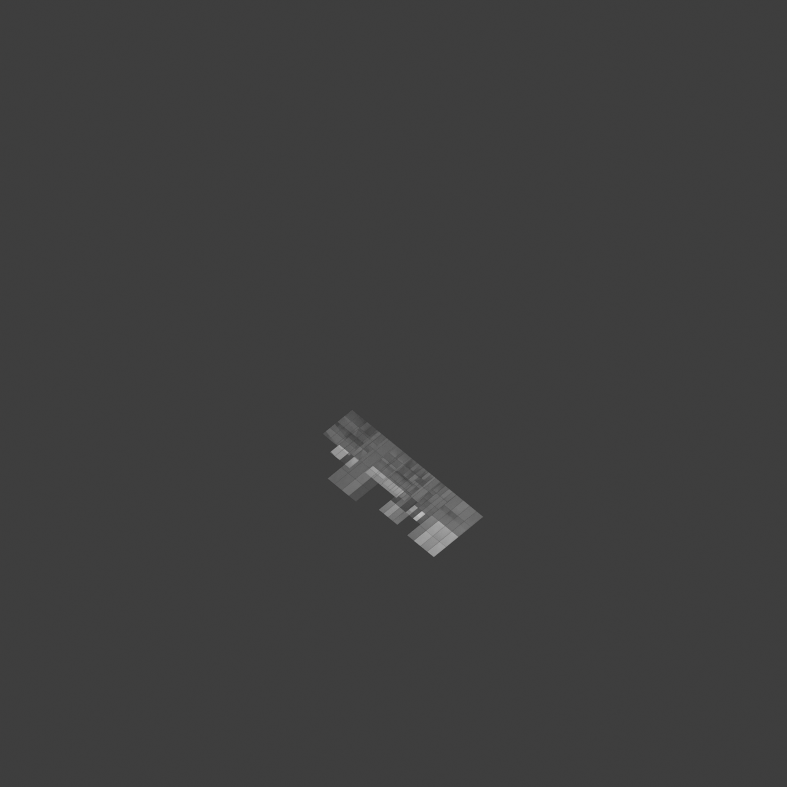
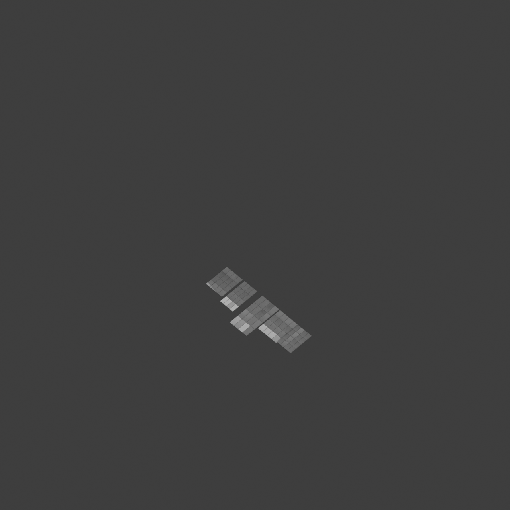
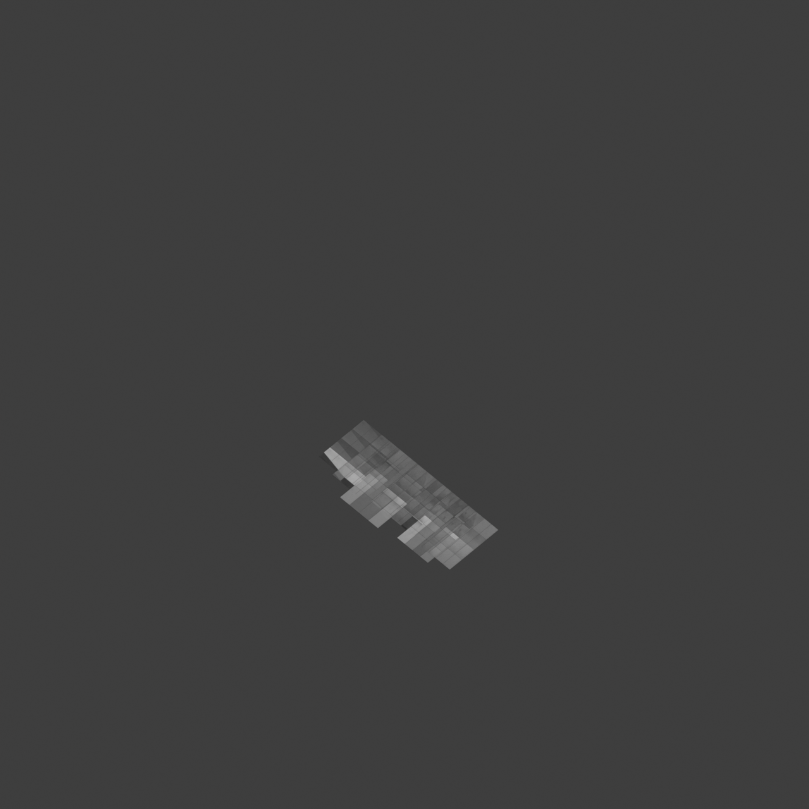
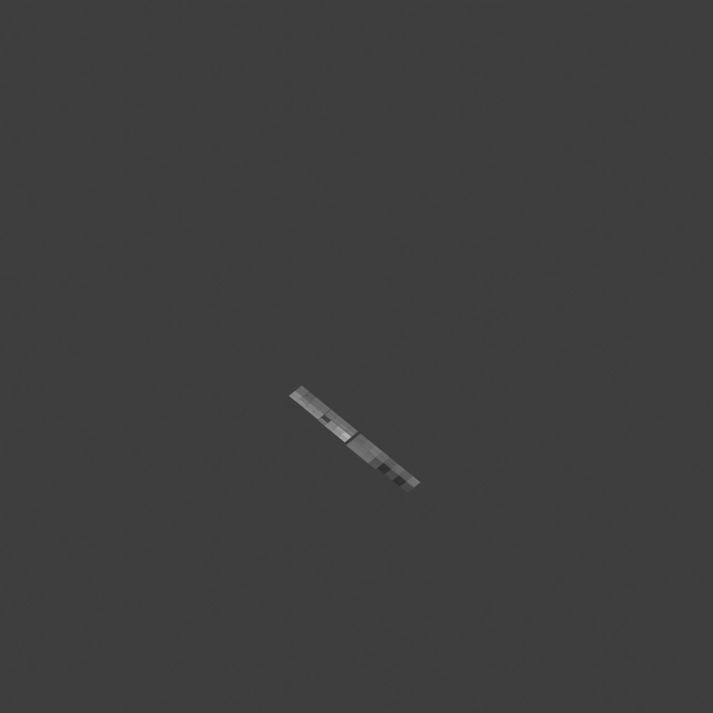

# 0010_0001_0002_mirrored_folded_planes  
         
## Interpretation  
  
### Implications_form :  
The metaphor &#x27;Mirrored folded planes&#x27; suggests a building form that features angular, dynamic surfaces that appear to be folded and then mirrored across a central axis or plane. This creates a sense of movement and depth in the building&#x27;s silhouette, with a complex interplay of light and shadow on its surfaces. The spatial relationships in the building are influenced by the reflective symmetry, leading to a structured yet intricate layout where spaces mirror each other across a central core or spine. This creates a rhythmic repetition of forms and spaces, allowing for both complexity and clarity in spatial organization.  
### Metaphor :  
Mirrored folded planes  
### Key_traits :  
This metaphor suggests a design driven by the interplay of symmetry and complexity. The &#x27;folded planes&#x27; introduce dynamic, angular forms that create a sense of movement and depth, while &#x27;mirrored&#x27; implies a reflective symmetry, doubling the visual impact and creating harmonious balance. This combination can lead to spaces that are both intricate and coherent, with a rhythmic repetition of forms that draw the eye and engage the viewer in an exploration of layered geometries.  
### Design_task :  
Create an Architectural Concept Model that embodies the &#x27;Mirrored folded planes&#x27; metaphor by using a series of angular, folded surfaces arranged symmetrically around a central axis. Ensure that the model demonstrates a clear sense of movement and depth through the interplay of shadows and reflections. Use reflective materials or mirrored surfaces to emphasize the symmetry and doubling effect, and design the spatial layout to reflect a mirrored organization with interconnected spaces that repeat across the central spine. The model should highlight the balance between complexity and coherence, inviting exploration of its layered geometries.  
## Agent summary :  
The provided function generates an architectural concept model based on the metaphor of &quot;Mirrored folded planes.&quot; It creates a series of dynamic, angular surfaces arranged symmetrically around a central axis, emphasizing movement and depth. By utilizing parameters like axis length, plane count, and fold variation, the function introduces variations in width and height to create visually engaging folded planes. Each plane is mirrored across the central axis, enhancing the reflective symmetry and complexity. The resulting model showcases a rhythmic repetition of forms and interconnected spaces, inviting exploration and highlighting the balance between intricacy and coherence in spatial organization.