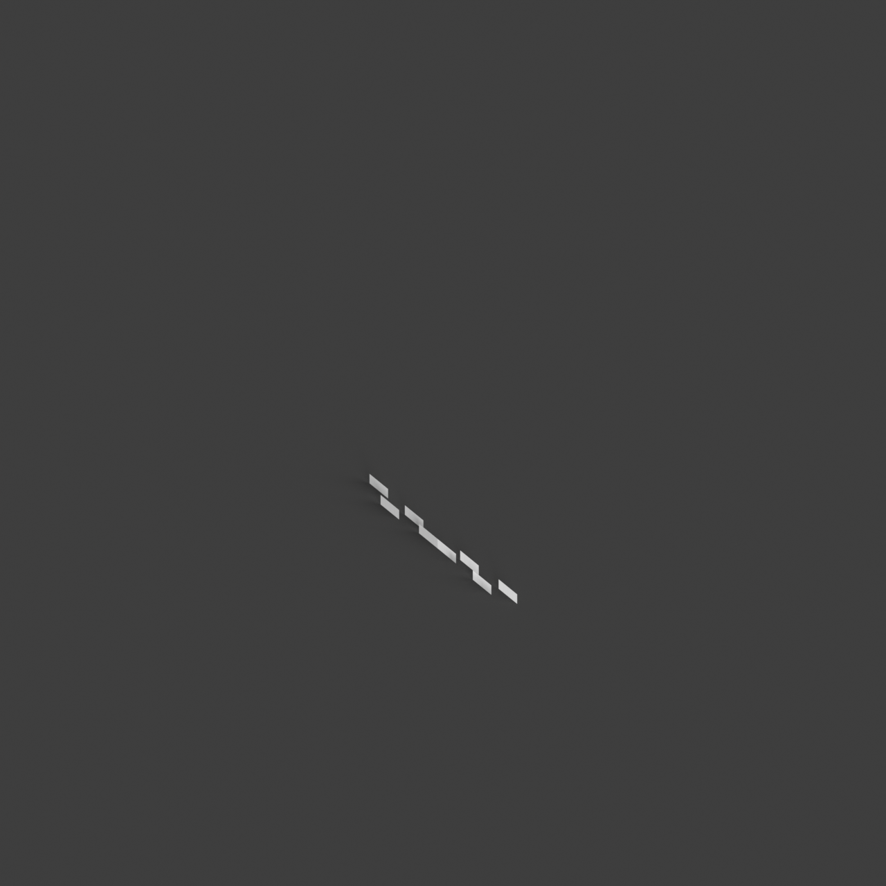
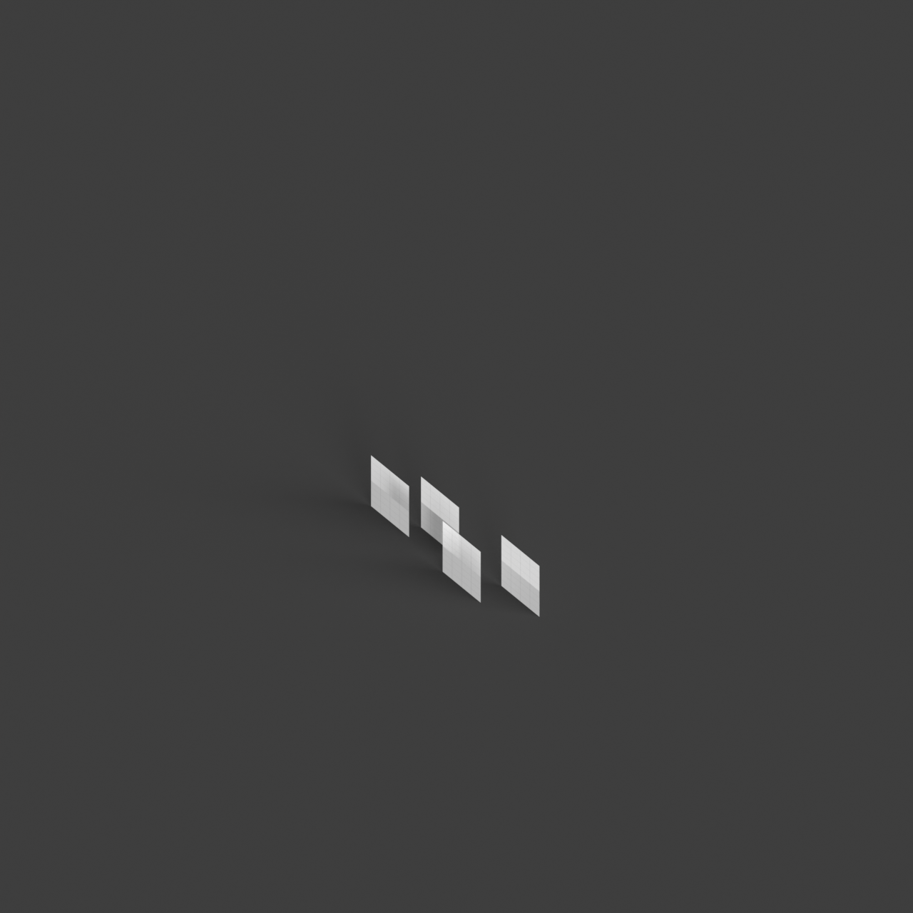

# 0010_0002_0004_mirrored_folded_planes  
         
## Interpretation  
  
### Implications_form :  
The metaphor &#x27;Mirrored folded planes&#x27; suggests a building form characterized by angular, folded geometries that create a dynamic interplay of form and void. The mirroring aspect implies a synchronized reflection across multiple planes or axes, enhancing the sense of order and unity. This leads to a building silhouette that exudes movement and visual tension, with surfaces that catch light differently based on their orientation. Spatially, this metaphor could result in a layout where spaces are organized around dual or multiple mirrored focal points, creating a network of interconnected environments that encourage fluid movement and visual exploration.  
### Metaphor :  
Mirrored folded planes  
### Key_traits :  
This metaphor suggests a design driven by the interplay of symmetry and complexity. The &#x27;folded planes&#x27; introduce dynamic, angular forms that create a sense of movement and depth, while &#x27;mirrored&#x27; implies a reflective symmetry, doubling the visual impact and creating harmonious balance. This combination can lead to spaces that are both intricate and coherent, with a rhythmic repetition of forms that draw the eye and engage the viewer in an exploration of layered geometries.  
### Design_task :  
Design an Architectural Concept Model inspired by the &#x27;Mirrored folded planes&#x27; metaphor by utilizing a composition of angular, folded elements that interact across several mirrored axes. Focus on creating a sense of visual movement and tension through the strategic positioning of folds and voids. Employ materials that accentuate light interaction and reflection, such as translucent or semi-reflective surfaces. Arrange spaces to revolve around dual or multiple mirrored centers, ensuring a coherent yet intricate spatial narrative that encourages exploration. The model should effectively communicate the balance between dynamic complexity and harmonious repetition in its design.  
## Agent summary :  
The provided function generates an architectural concept model inspired by the metaphor &quot;Mirrored folded planes.&quot; It creates a series of angular, folded geometries that reflect across specified axes, embodying movement and visual tension. By defining base dimensions and fold heights, the function constructs folded planes with varying angles. Mirroring these planes enhances symmetry and visual complexity, aligning with the metaphor&#x27;s theme. The generated geometries offer a dynamic interplay of light and shadow, while their arrangement around mirrored focal points fosters interconnected spatial experiences, ultimately achieving a balance between intricate forms and cohesive design, encouraging exploration within the architectural narrative.