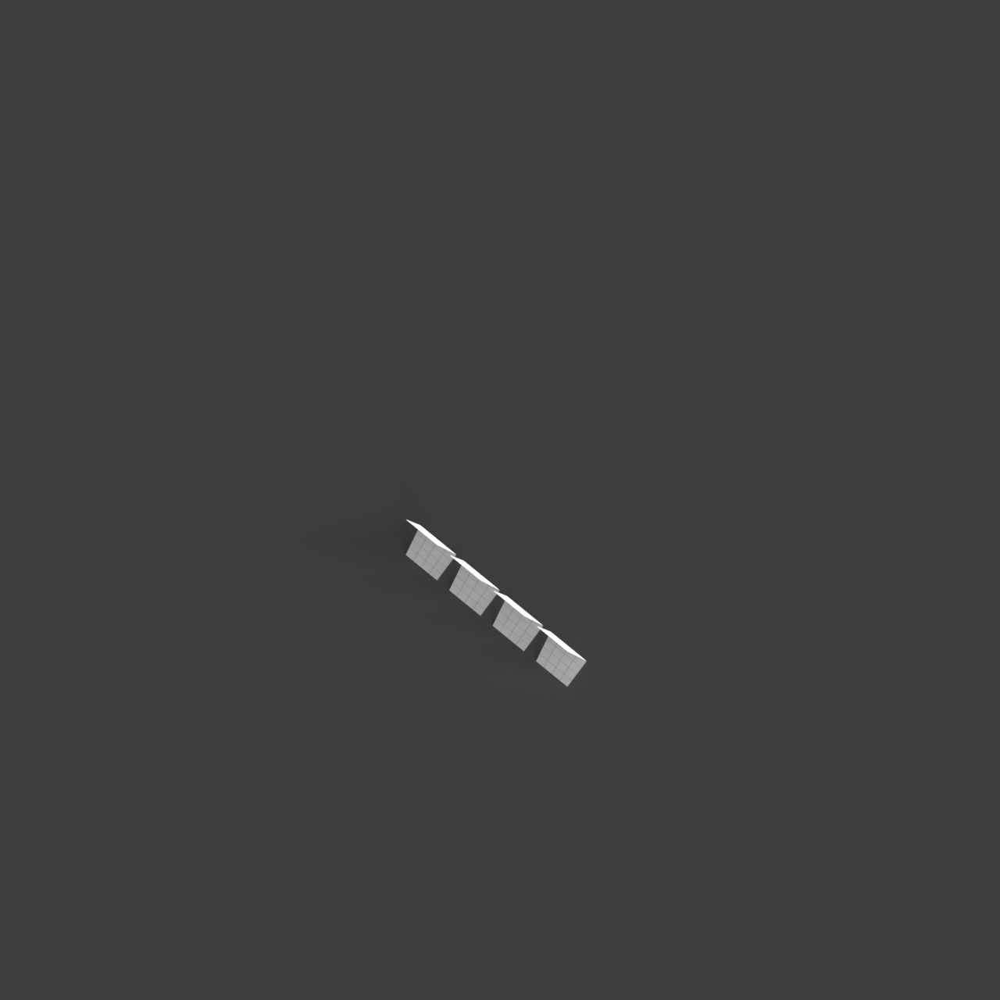
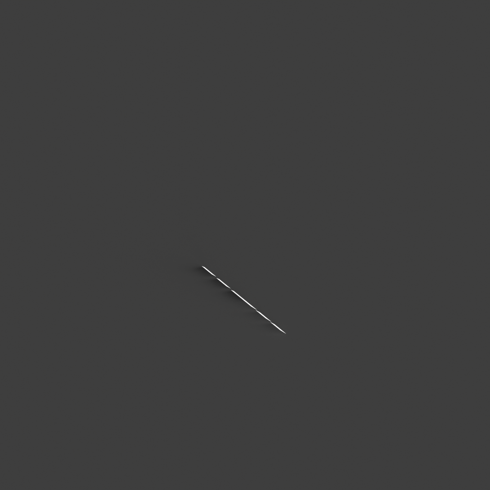
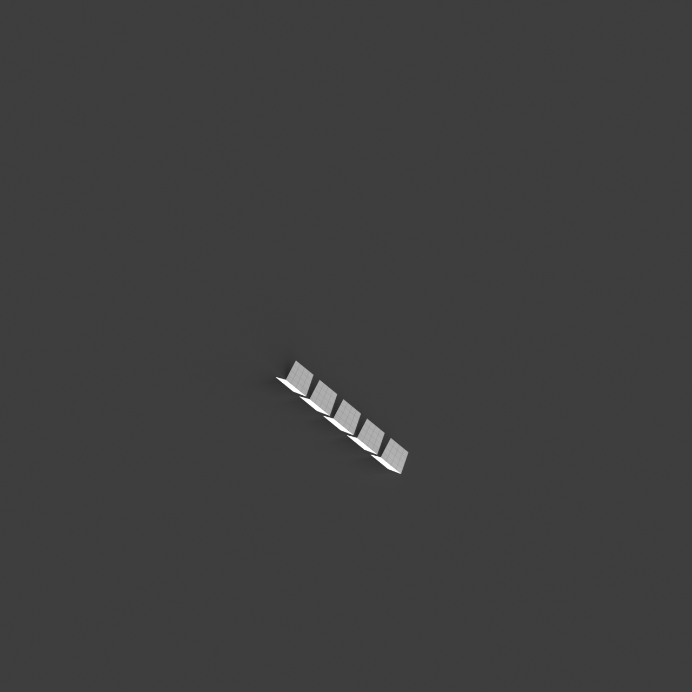
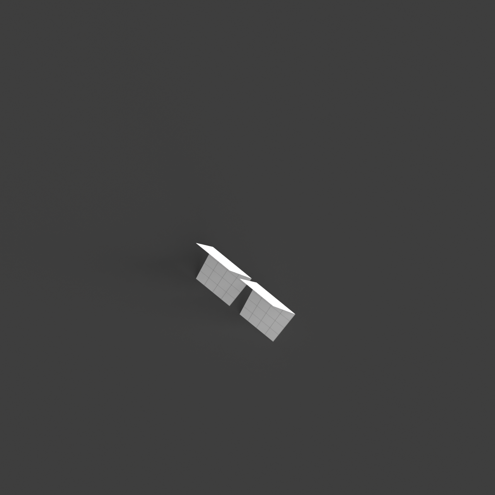

# 0010_0003_0005_mirrored_folded_planes  
         
## Interpretation  
  
### Implications_form :  
The metaphor &#x27;Mirrored folded planes&#x27; suggests an architectural form where angular, folded geometries are arranged in a way that creates a visually dynamic environment. The mirroring aspect implies that these forms are reflected across different axes, enhancing the sense of symmetry and balance. This results in a building silhouette that is both intricate and harmonious, with a play of light and shadow that varies depending on the time of day. Spatially, this metaphor could lead to a layout where spaces are organized in a sequential manner, reflecting each other across mirrored planes, creating a sense of continuity and fluidity in the movement through the building.  
### Metaphor :  
Mirrored folded planes  
### Key_traits :  
This metaphor suggests a design driven by the interplay of symmetry and complexity. The &#x27;folded planes&#x27; introduce dynamic, angular forms that create a sense of movement and depth, while &#x27;mirrored&#x27; implies a reflective symmetry, doubling the visual impact and creating harmonious balance. This combination can lead to spaces that are both intricate and coherent, with a rhythmic repetition of forms that draw the eye and engage the viewer in an exploration of layered geometries.  
### Design_task :  
Develop an Architectural Concept Model that captures the &#x27;Mirrored folded planes&#x27; metaphor by employing a series of angular, folded forms that are mirrored across different axes to create a coherent yet intricate design. Focus on achieving a balance between complexity and unity by using materials that enhance light reflection and shadow play. Arrange the spaces in a sequential order that reflects across the mirrored planes, ensuring a fluid transition from one space to another. The model should emphasize the harmonious repetition of forms and spaces, while also inviting exploration through its layered geometric design.  
## Agent summary :  
The function `generate_mirrored_folded_planes` creates an architectural concept model inspired by the metaphor &quot;Mirrored folded planes.&quot; It generates a series of angular, folded geometries, using specified dimensions and a defined number of planes. Each plane is created at a fixed angle and then mirrored across a chosen axis (x, y, or z) to establish symmetry and visual complexity. The function emphasizes the interplay of light and shadow through reflective materials and spatial organization, ensuring a fluid transition and continuity between spaces. Ultimately, this results in a coherent, intricate architectural form that invites exploration.