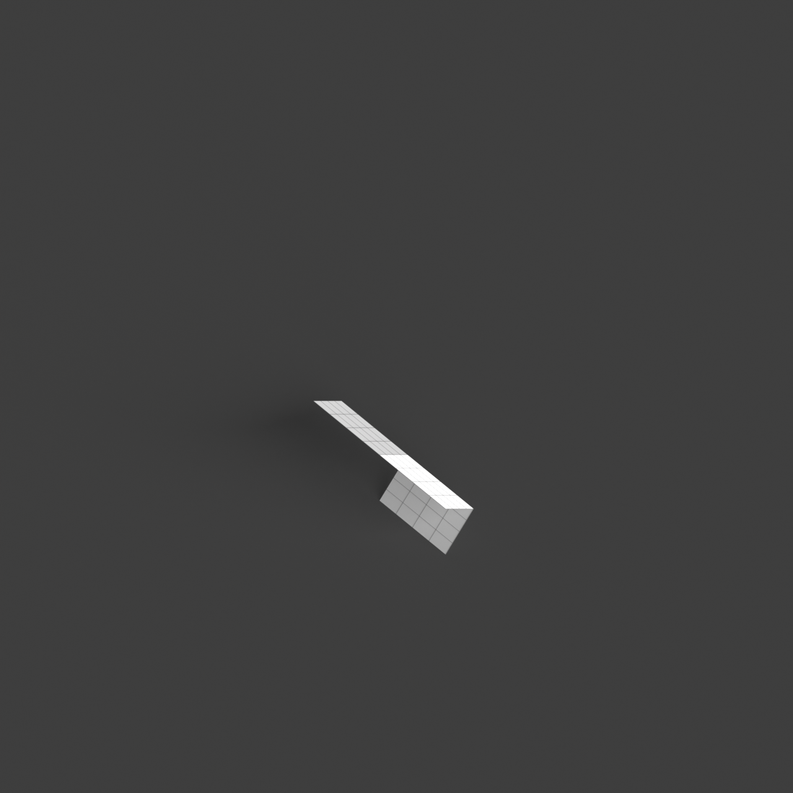
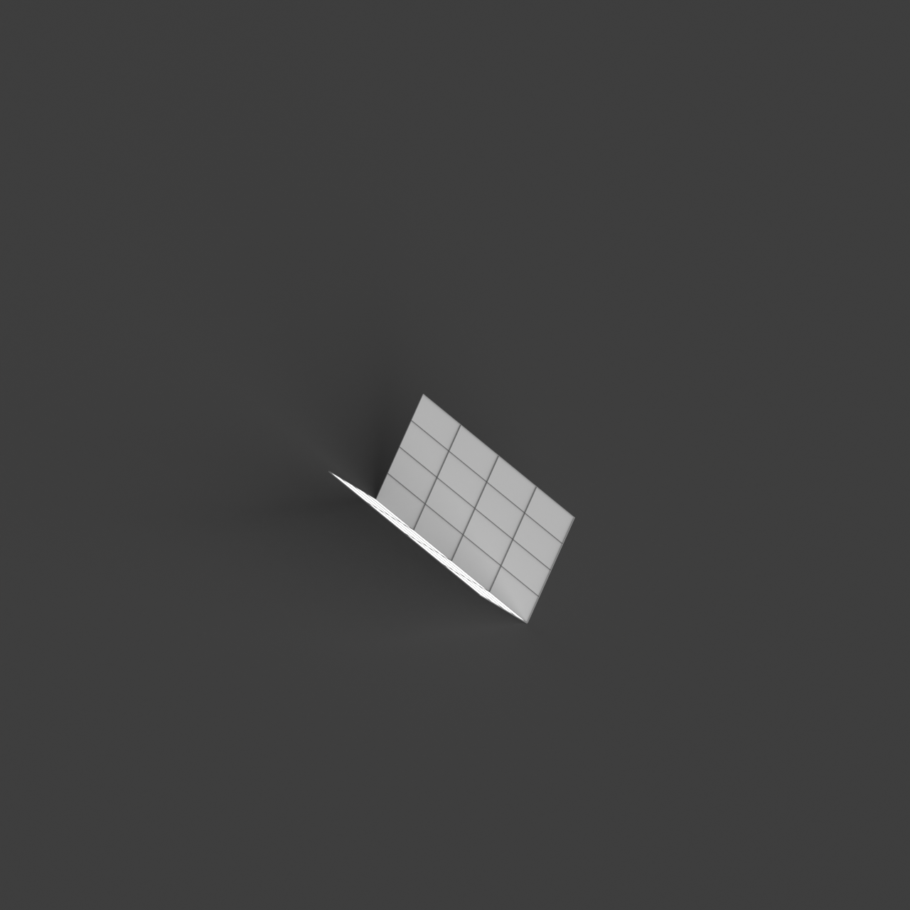
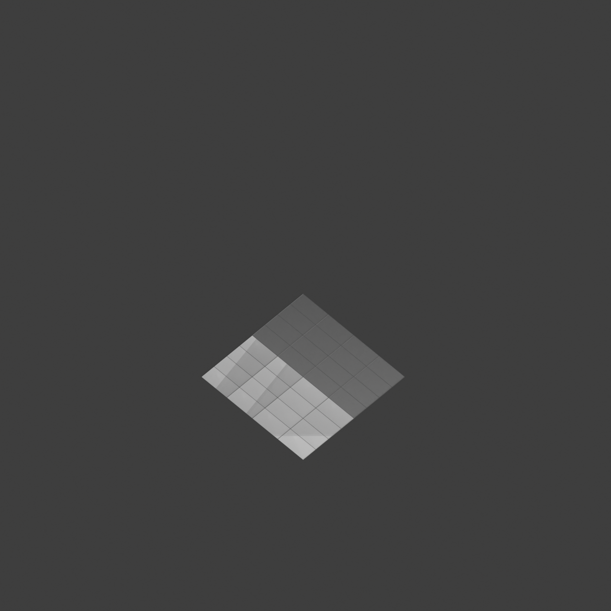

# 0010_0005_0005_mirrored_folded_planes  
         
## Interpretation  
  
### Implications_form :  
The metaphor &#x27;Mirrored folded planes&#x27; suggests a building form where the interplay of angular geometries and reflective symmetry creates a sense of dynamic equilibrium. The folded planes introduce a series of sharp, angular surfaces that suggest movement and directionality, while the mirroring adds a layer of visual doubling that enhances the perception of depth and complexity. The building&#x27;s silhouette would be characterized by these folded and mirrored elements, creating a striking visual rhythm of light and shadow. Spatially, the metaphor implies a configuration where spaces are not only mirrored but also interlocked, creating a cohesive yet intricate network of spaces that encourage a choreographed flow and interaction.  
### Metaphor :  
Mirrored folded planes  
### Key_traits :  
This metaphor suggests a design driven by the interplay of symmetry and complexity. The &#x27;folded planes&#x27; introduce dynamic, angular forms that create a sense of movement and depth, while &#x27;mirrored&#x27; implies a reflective symmetry, doubling the visual impact and creating harmonious balance. This combination can lead to spaces that are both intricate and coherent, with a rhythmic repetition of forms that draw the eye and engage the viewer in an exploration of layered geometries.  
### Design_task :  
Construct an Architectural Concept Model that represents the &#x27;Mirrored folded planes&#x27; metaphor by utilizing a series of interlocked, angular forms that reflect across multiple axes, creating a cohesive yet intricate design. Focus on achieving dynamic equilibrium by strategically folding and arranging the planes to create a rhythmic interplay of light and shadow. Use materials that accentuate the mirroring effect and highlight the interaction of surfaces. Arrange the spaces to interlock and mirror each other, ensuring a fluid and choreographed spatial experience. The model should communicate the balance between complexity and coherence, inviting viewers to explore its layered and rhythmic geometries.  
## Agent summary :  
The function `generate_mirrored_folded_planes` creates an architectural concept model inspired by the metaphor &quot;Mirrored folded planes.&quot; It generates interlocked, angular forms by folding a base rectangle at specified angles, resulting in dynamic surfaces that suggest movement. The model incorporates reflective symmetry by mirroring these geometries across defined axes, enhancing visual complexity and depth. This process emphasizes the interplay of light and shadow, achieving a rhythmic design that invites exploration. The outcome is a cohesive yet intricate network of spaces, embodying the metaphor&#x27;s essence of balance between complexity and coherence, while promoting a choreographed spatial experience.