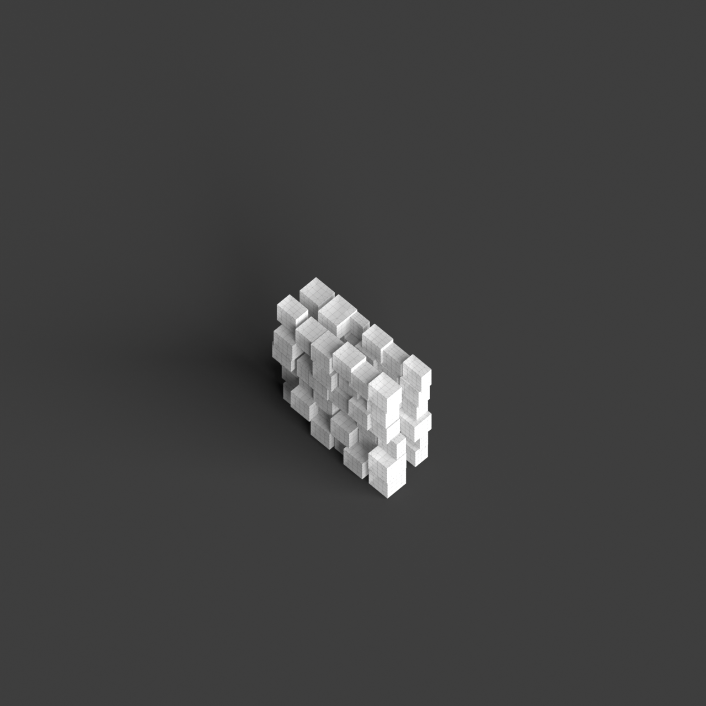
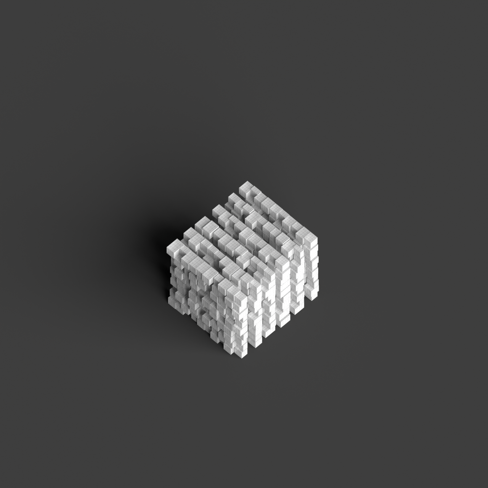

# 0011_0002_0004_shifted_grid  
         
## Interpretation  
  
### Implications_form :  
The &#x27;Shifted Grid&#x27; metaphor implies a transformation of the building&#x27;s massing and spatial relationships by introducing a dynamic and fluid reconfiguration of a standard grid. This results in a building form that departs from traditional orthogonal layouts, featuring irregular alignments and intersections that create a sense of movement and unpredictability. The geometry may involve staggered or misaligned volumes that interact to produce a complex silhouette with varied orientations. Spatially, the metaphor suggests a layout where spaces are interconnected in non-conventional ways, fostering a sense of exploration and discovery. This allows for diverse circulation paths that enhance the occupant&#x27;s journey through the building, as well as opportunities for creative play with light and shadow, adaptability in spatial use, and unexpected spatial experiences.  
### Metaphor :  
Shifted grid  
### Key_traits :  
The shifted grid metaphor implies a dynamic reconfiguration of a regular pattern, creating a sense of movement and fluidity within the structure. It suggests a departure from traditional orthogonal layouts, introducing unexpected alignments and intersections. This can lead to innovative spatial arrangements, where the shift creates opportunities for varied circulation paths, diverse spatial experiences, and a playful interaction with light and shadow. The shifted grid also allows for adaptability and flexibility in design, accommodating diverse functions and fostering a sense of discovery as occupants navigate through the space.  
### Design_task :  
Develop an Architectural Concept Model that captures the essence of the &#x27;Shifted Grid&#x27; metaphor by beginning with a regular grid framework and introducing deliberate shifts and offsets in the grid lines. Use these shifts to create a series of interconnected volumes and spaces that deviate from traditional alignment. Focus on producing a model that emphasizes the movement and fluidity inherent in the metaphor by incorporating staggered layers or planes and varying orientations. Highlight the interaction of light and shadow by incorporating elements that project or recede, casting interesting shadows and creating dynamic contrasts. The model should also showcase adaptability, with spaces that can be reconfigured or adjusted to accommodate various functions, prompting a sense of exploration and offering diverse spatial experiences.  
## Agent summary :  
The `create_shifted_grid_architectural_model` function generates an architectural concept model inspired by the &quot;Shifted Grid&quot; metaphor. It begins with a regular grid, applying random shifts to create staggered and misaligned volumes. This produces interconnected spaces that deviate from traditional layouts, enhancing movement and fluidity. The function incorporates height variations to add complexity and visual interest, fostering diverse spatial experiences. By manipulating light and shadow through varied orientations and projections, the model encourages exploration and adaptability, capturing the essence of the metaphor while allowing for innovative design solutions that invite occupant interaction.