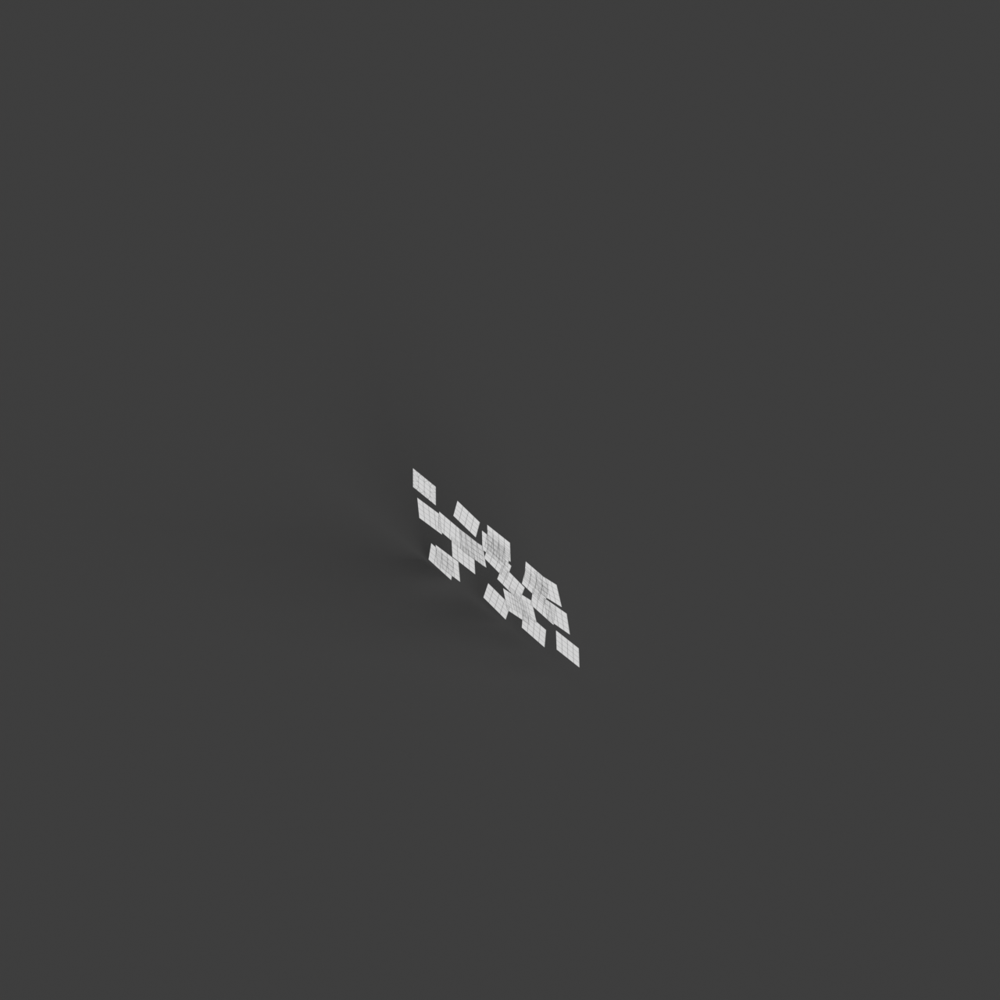

# 0011_0003_0005_shifted_grid  
         
## Interpretation  
  
### Implications_form :  
The &#x27;Shifted Grid&#x27; metaphor influences the building&#x27;s form and massing by introducing a dynamic interplay of shifted and rotated elements that diverge from a conventional grid. This results in a structure where volumes are misaligned, creating unexpected intersections and a silhouette marked by varied angles and projections. Spatially, the metaphor encourages a non-linear arrangement where spaces are interwoven with a sense of fluidity and motion, promoting unique circulation paths and enhancing the occupant&#x27;s journey through diverse spatial experiences. The shifted grid facilitates adaptability and flexibility, allowing spaces to be reconfigured to support multiple functions and creating opportunities for playful interactions with light and shadow.  
### Metaphor :  
Shifted grid  
### Key_traits :  
The shifted grid metaphor implies a dynamic reconfiguration of a regular pattern, creating a sense of movement and fluidity within the structure. It suggests a departure from traditional orthogonal layouts, introducing unexpected alignments and intersections. This can lead to innovative spatial arrangements, where the shift creates opportunities for varied circulation paths, diverse spatial experiences, and a playful interaction with light and shadow. The shifted grid also allows for adaptability and flexibility in design, accommodating diverse functions and fostering a sense of discovery as occupants navigate through the space.  
### Design_task :  
Construct an Architectural Concept Model that translates the &#x27;Shifted Grid&#x27; metaphor by initiating with a conventional grid structure, then applying strategic shifts and rotations to select elements. Emphasize the dynamic reconfiguration through the use of intersecting and overlapping planes that create a complex and layered silhouette. Focus on developing a layout with interwoven spaces that offer varied circulation paths and distinct zones with unique scales and purposes. Employ angled surfaces and non-orthogonal elements to manipulate light and shadow, enhancing the model&#x27;s sense of movement and discovery. Ensure the model demonstrates adaptability, with spaces that can be transformed or rearranged to accommodate a range of functions, inviting exploration and interaction within the design.  
## Agent summary :  
The provided function, `create_shifted_grid_concept_model_v2`, generates an architectural concept model by interpreting the &#x27;Shifted Grid&#x27; metaphor. It begins with a traditional grid framework and introduces dynamic shifts and rotations to individual cells, resulting in a non-linear arrangement. By randomly applying shifts and rotations to the grid elements, the function creates overlapping planes and varied silhouettes that embody fluidity and movement. This approach fosters unique spatial experiences and diverse circulation paths, allowing for adaptable spaces. Ultimately, the model invites exploration and interaction, reflecting the metaphor&#x27;s emphasis on innovative spatial arrangements and playful light manipulation.