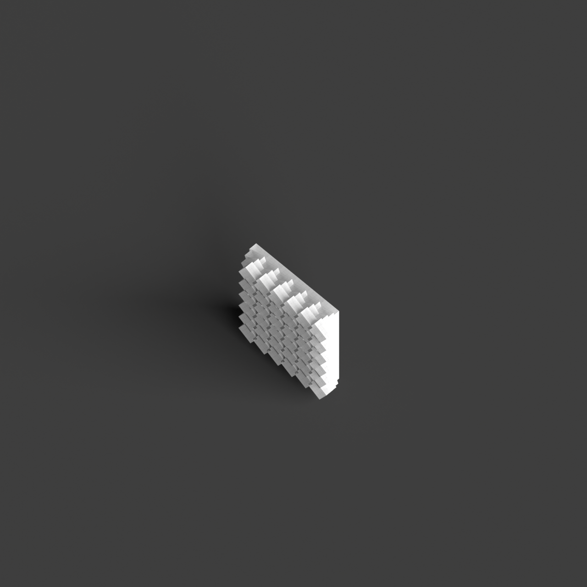
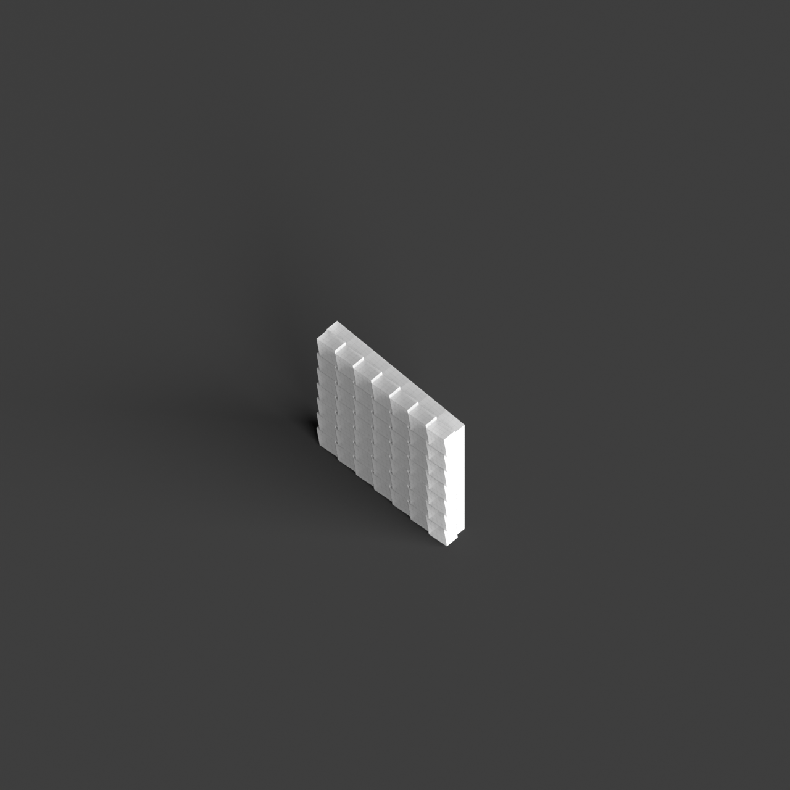
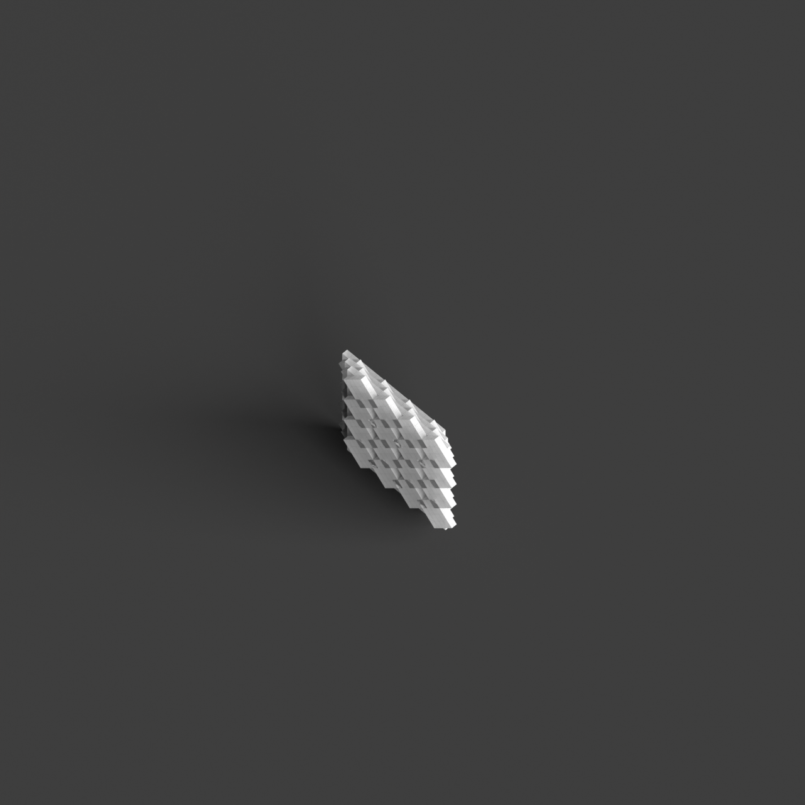

# 0011_0004_0002_shifted_grid  
         
## Interpretation  
  
### Implications_form :  
The &#x27;Shifted Grid&#x27; metaphor impacts the building&#x27;s form and massing by encouraging a departure from strict orthogonal structures, leading to varied and dynamic configurations. This results in a building that features a playful and intricate silhouette, characterized by irregular angles, projections, and unexpected alignments. The spatial relationships are fluid and adaptable, allowing for innovative circulation paths that meander through the structure, creating a series of interconnected spaces with varying scales and functions. The metaphor fosters an environment where light and shadow interact in complex ways, enhancing the sense of movement and discovery within the space.  
### Metaphor :  
Shifted grid  
### Key_traits :  
The shifted grid metaphor implies a dynamic reconfiguration of a regular pattern, creating a sense of movement and fluidity within the structure. It suggests a departure from traditional orthogonal layouts, introducing unexpected alignments and intersections. This can lead to innovative spatial arrangements, where the shift creates opportunities for varied circulation paths, diverse spatial experiences, and a playful interaction with light and shadow. The shifted grid also allows for adaptability and flexibility in design, accommodating diverse functions and fostering a sense of discovery as occupants navigate through the space.  
### Design_task :  
Design an Architectural Concept Model that articulates the &#x27;Shifted Grid&#x27; metaphor by initiating with a conventional grid and introducing strategic shifts and rotations across the entire framework. Utilize a combination of overlapping and intersecting volumes to craft a dynamic silhouette with diverse angles and projections. Focus on creating a network of non-linear circulation paths that weave through a sequence of interconnected spaces, each with its unique function and scale. Emphasize the interaction of light and shadow by incorporating elements that cast intricate patterns, enhancing the model&#x27;s sense of fluid movement and exploration. Ensure the model demonstrates flexibility by allowing for reconfigurable spaces that can adapt to various functions, encouraging a sense of discovery and playful engagement with the architectural form.  
## Agent summary :  
The provided function generates an architectural concept model inspired by the &quot;Shifted Grid&quot; metaphor. It begins with a conventional grid and applies strategic shifts and rotations to each grid cell, resulting in a dynamic and playful architectural form. By iterating through layers and modifying positions and orientations, the function creates varied volumes that enhance spatial relationships and circulation paths. The model emphasizes fluid movement and interaction with light and shadow, fostering a sense of discovery. Ultimately, the function produces a series of interconnected Breps, representing a flexible design that accommodates diverse functions and experiences within the space.