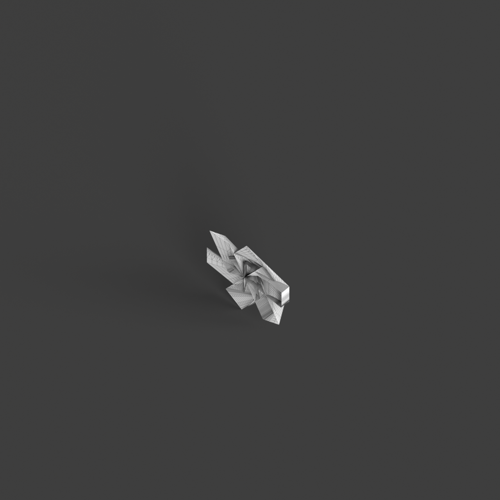
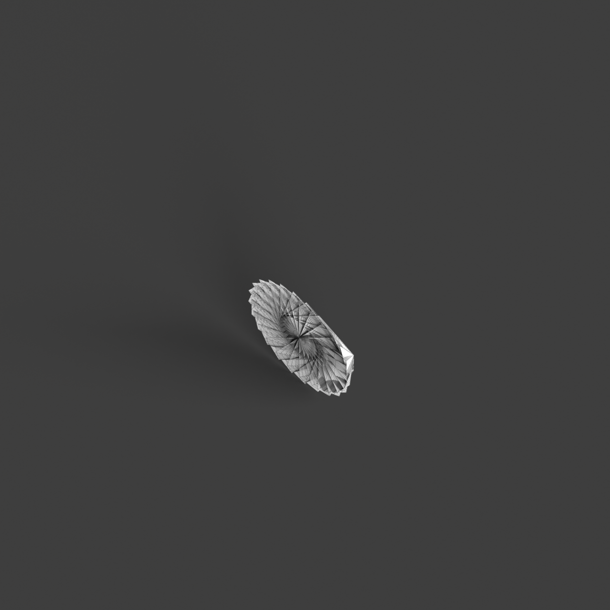
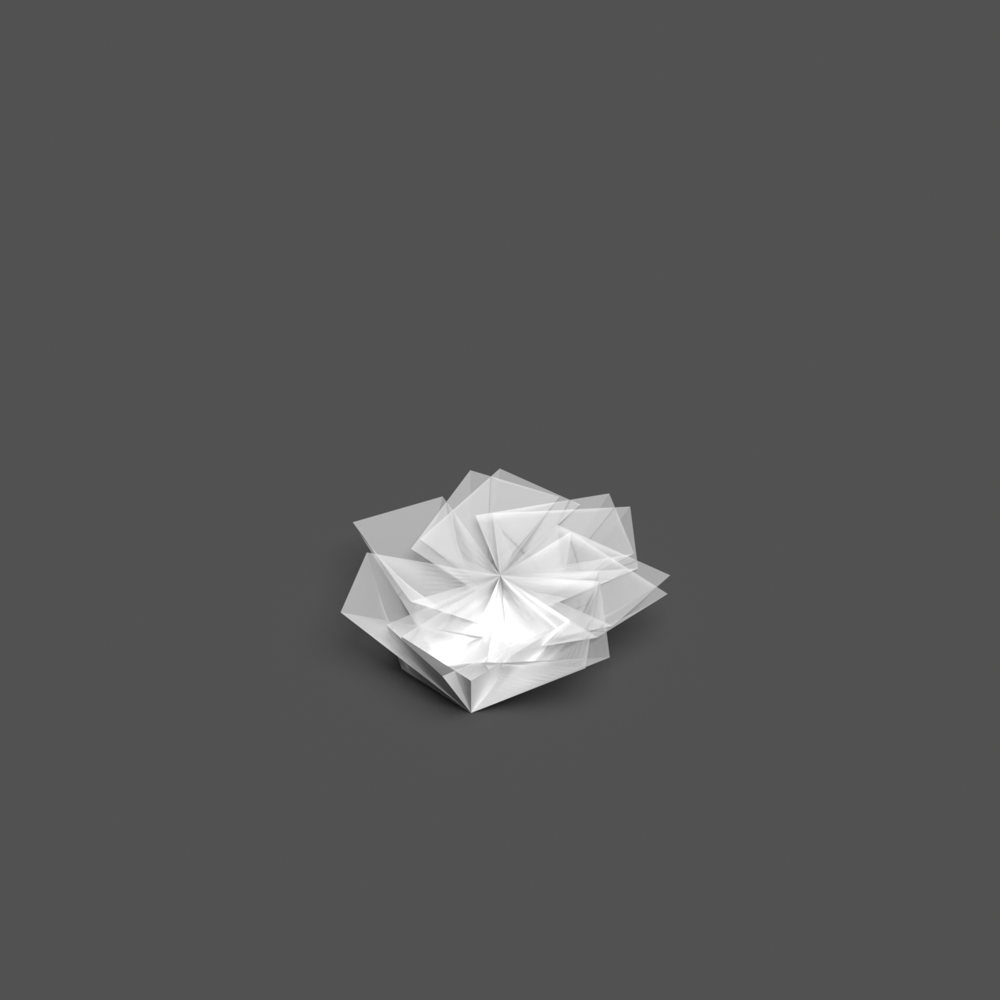

# 0012_0005_0001_twisted_volumes  
         
## Interpretation  
  
### Implications_form :  
The metaphor &#x27;Twisted volumes&#x27; influences the building&#x27;s form and massing by integrating a series of entwined and contorted geometric shapes that suggest a sense of tension and fluidity. This results in a silhouette that is both dynamic and expressive, evoking a sense of motion and continual transformation. The spatial relationships within the building are redefined by these twists, leading to layered and intersecting spaces that offer unique spatial experiences and circulation paths. The twisting action enhances the interaction between interior and exterior spaces, creating diverse visual connections and views. Additionally, the manipulation of light and shadow is emphasized, as the twisted forms allow for an intricate play of light that shifts and evolves throughout the day.  
### Metaphor :  
Twisted volumes  
### Key_traits :  
The metaphor &#x27;Twisted volumes&#x27; suggests dynamic and fluid forms that manipulate perception through rotation and distortion. By twisting the volumes, the design conveys movement and tension, creating a sense of energy and transformation. This approach can lead to unexpected spatial relationships and perspectives, allowing for innovative circulation paths and enhancing the interaction between interior and exterior spaces. The twisting action also implies a play with light and shadow, as the changing angles capture and reflect light differently throughout the day.  
### Design_task :  
To embody the &#x27;Twisted volumes&#x27; metaphor in an Architectural Concept Model, begin by designing a core structure composed of interwoven and distorted geometric forms. Focus on creating a sense of fluidity and tension by experimenting with varying degrees of twist and contortion. Explore how these twisted forms can create layered spatial experiences and innovative circulation paths. Pay close attention to the interplay of light and shadow by incorporating materials and textures that reflect and diffuse light in unique ways. Consider how the exterior silhouette can convey a sense of dynamic movement and energy while maintaining coherence with the interior spatial logic. The model should capture the transformative essence of the twisting action, illustrating how the metaphor influences both the form and the spatial experience.  
## Agent summary :  
The function `create_twisted_volumes_model` generates an architectural concept model inspired by the metaphor &quot;Twisted volumes.&quot; It constructs a series of interwoven and distorted rectangular prisms, each twisted around its axis, embodying fluidity and tension. By varying the number of twists, base dimensions, and twist angles, the function creates dynamic silhouettes that evoke movement and transformation. The resulting model features layered spatial experiences and innovative circulation paths, enhancing interactions between interior and exterior spaces. Additionally, the twisted forms facilitate intricate light and shadow play, reflecting the metaphor&#x27;s emphasis on dynamic perception and visual connection.