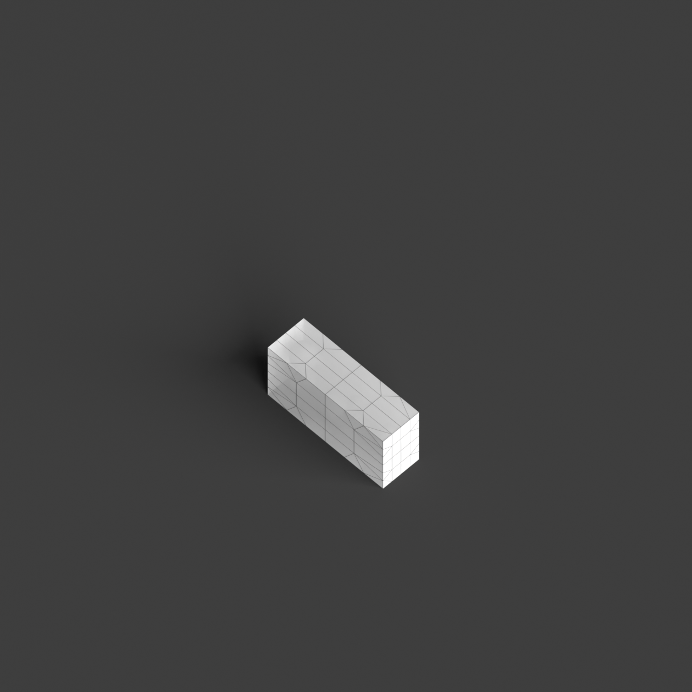
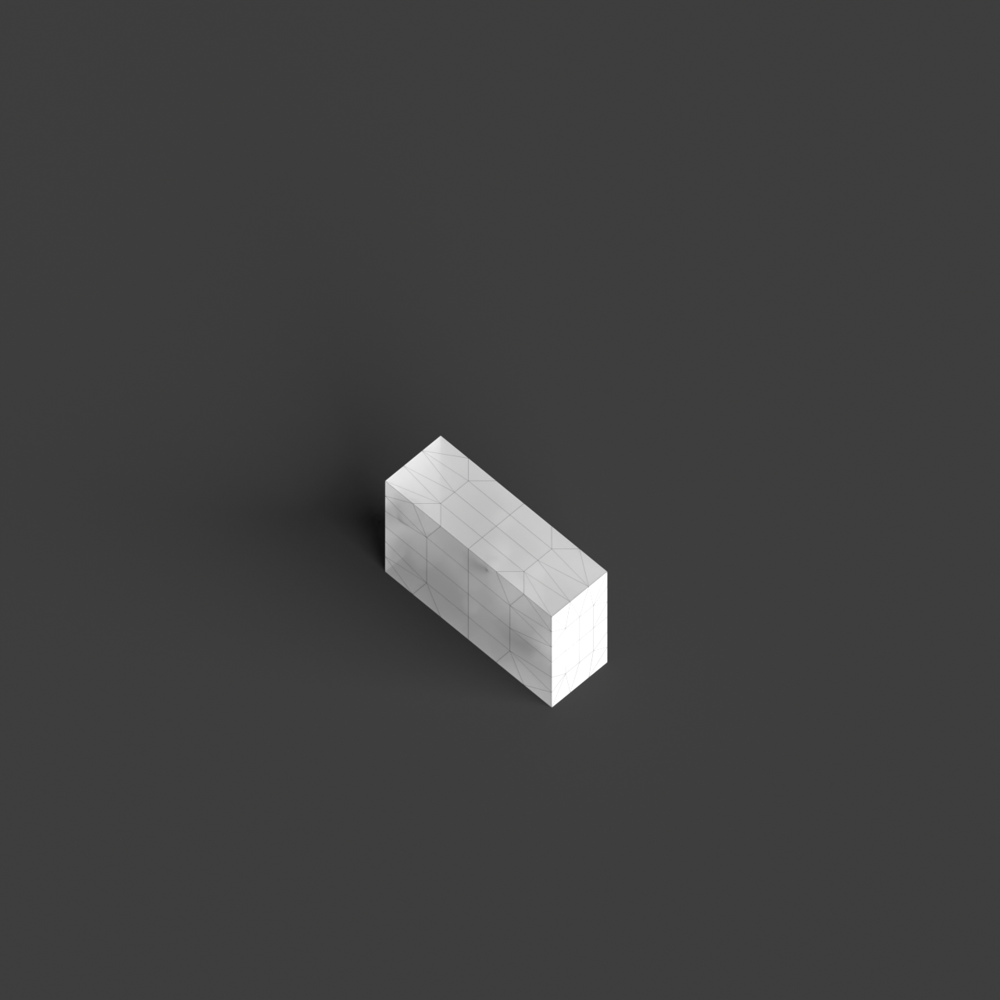
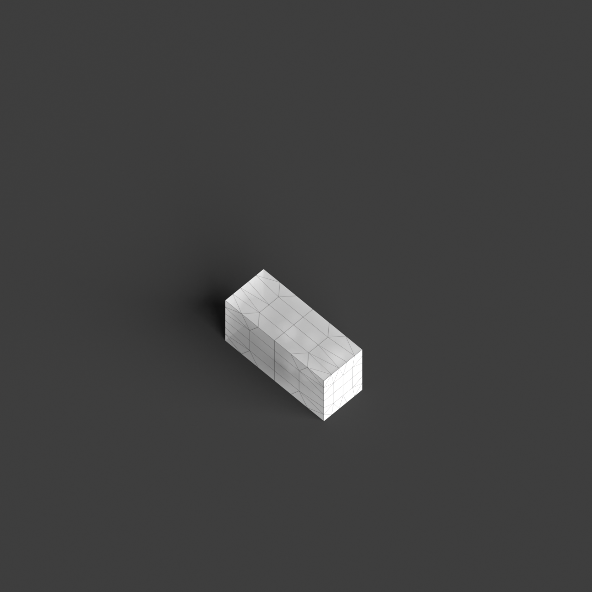

# 0014_0001_0005_porous_fractured_monolith  
         
## Interpretation  
  
### Implications_form :  
The metaphor &#x27;Porous fractured monolith&#x27; shapes the building&#x27;s Form &amp; Massing by suggesting a bold, singular form that is punctuated by strategic voids and openings, creating a balance between solidity and transparency. This results in a dynamic silhouette that appears both stable and fragmented, with an interplay of light and shadow enhancing its tectonic expression. Spatially, the metaphor informs a layout where interior spaces are interconnected with the exterior through these voids, promoting flow and interaction across the structure. The fractured nature introduces unexpected pathways and vistas, facilitating a journey through the building that is both engaging and exploratory. The arrangement of entities reflects a balance between private and public realms, with the voids serving as transitional zones that enhance connectivity and accessibility.  
### Metaphor :  
Porous fractured monolith  
### Key_traits :  
The metaphor &#x27;Porous fractured monolith&#x27; suggests a design that combines the solidity and singularity of a monolithic form with a sense of permeability and fragmentation. The key traits include a strong, unified mass that is visually and structurally significant, yet it is punctuated by voids or gaps that create a sense of lightness and openness. This duality allows for dynamic interaction between interior and exterior spaces, promoting natural ventilation and light penetration. The fractured aspect implies a deliberate, irregular division or disruption in the form, introducing complexity and a sense of movement or tension within the solid structure. The porous quality invites connectivity, fostering interaction and engagement between different spatial zones.  
### Design_task :  
Create an Architectural Concept Model that embodies the &#x27;Porous fractured monolith&#x27; by using a single block of material to represent the monolithic form. Introduce strategic cuts and voids within this block to manifest the porous quality, ensuring these openings are irregular and dynamic to suggest the fractured aspect. Use contrasting materials or textures to emphasize the voids and their role in connecting different spatial zones. Focus on how these voids interact with light and shadow, and how they guide movement and interaction throughout the design. The model should communicate the duality of mass and void, solidity and permeability, and the dynamic spatial relationships that result from this interplay.  
## Agent summary :  
The function `generate_porosity_fractured_monolith` creates an architectural concept model embodying the &#x27;Porous fractured monolith&#x27; metaphor. It starts by defining a solid block that represents the monolithic form. The function then introduces a specified number of irregular voids, simulating the porous and fractured characteristics of the design. These voids enhance the interplay of light and shadow, creating dynamic spatial relationships that facilitate movement and interaction. By adjusting void sizes and locations, the model embodies the duality of solidity and permeability, promoting connectivity between interior and exterior spaces while reflecting the metaphors essence of complexity and engagement.
