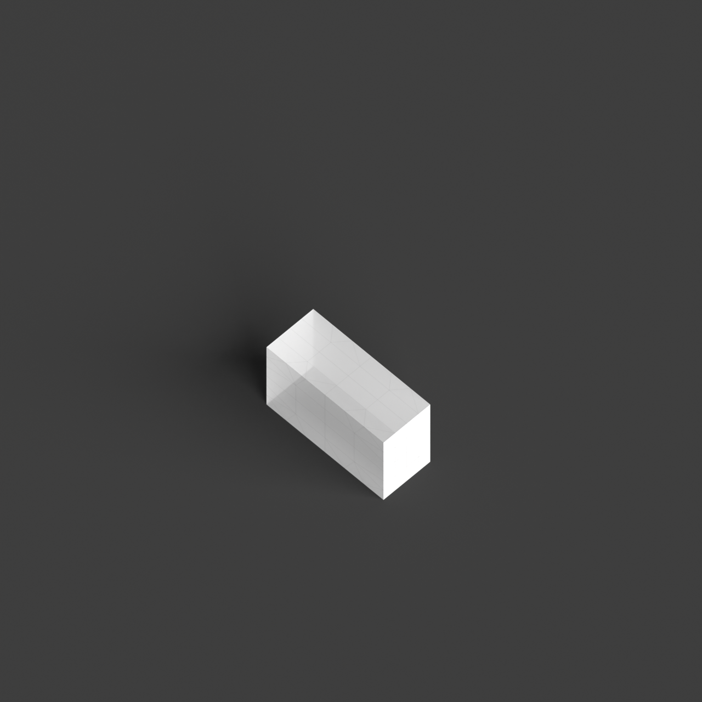
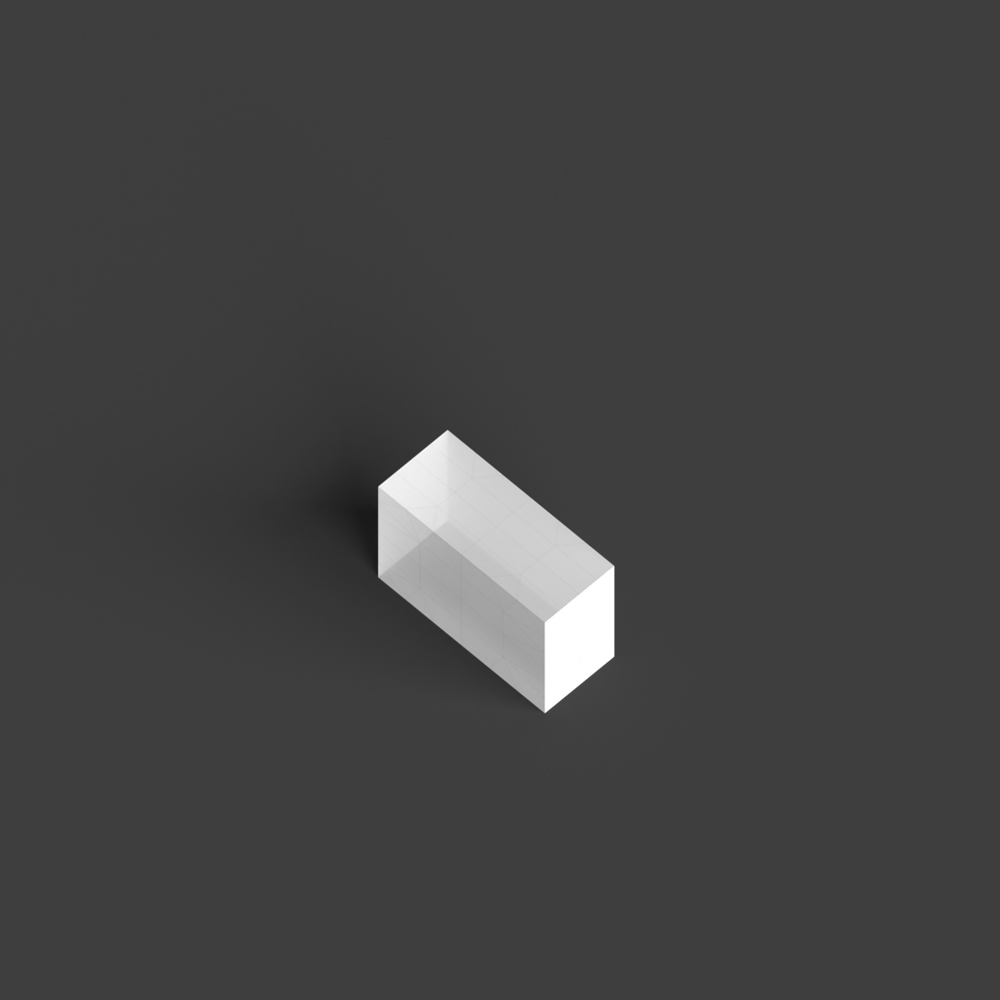

# 0014_0002_0003_porous_fractured_monolith  
         
## Interpretation  
  
### Implications_form :  
The metaphor &#x27;Porous fractured monolith&#x27; suggests a building form where the massing is dominant and cohesive, yet it is intricately interwoven with voids that break the surface to allow interaction between inside and out. The form is characterized by a sense of heaviness and permanence, contrasted by areas of light penetration and airflow. The fractures are not merely superficial but penetrate deeply, creating a series of interconnected spaces with a sense of progression and discovery. These voids act as conduits for circulation and interaction, creating a network of spaces that transition between private and public realms. The silhouette of the building is bold yet fragmented, with a tectonic language that communicates strength through its mass and complexity through its voids.  
### Metaphor :  
Porous fractured monolith  
### Key_traits :  
The metaphor &#x27;Porous fractured monolith&#x27; suggests a design that combines the solidity and singularity of a monolithic form with a sense of permeability and fragmentation. The key traits include a strong, unified mass that is visually and structurally significant, yet it is punctuated by voids or gaps that create a sense of lightness and openness. This duality allows for dynamic interaction between interior and exterior spaces, promoting natural ventilation and light penetration. The fractured aspect implies a deliberate, irregular division or disruption in the form, introducing complexity and a sense of movement or tension within the solid structure. The porous quality invites connectivity, fostering interaction and engagement between different spatial zones.  
### Design_task :  
Design an Architectural Concept Model for the &#x27;Porous fractured monolith&#x27; by starting with a solid, monolithic form as the base. Introduce a network of voids and cuts that penetrate deeply into the form, emphasizing the fractured quality by varying the size and orientation of these voids. Use layering techniques to reveal how these voids create spatial connections and transitions, focusing on their role in light penetration and airflow. Consider using translucent materials for the voids to highlight their permeability and interaction with light. The model should explore the interplay between the monolithic mass and the dynamic voids, highlighting how these elements create a complex spatial experience that encourages movement and interaction throughout the structure.  
## Agent summary :  
The provided function `create_porous_fractured_monolith` generates an architectural concept model based on the metaphor of a &quot;Porous fractured monolith.&quot; It starts by creating a solid base form, simulating a unified mass. The function introduces a series of voids cylindrical and conical shapes randomly positioned and sized to emphasize the fractured quality of the design. These voids penetrate deeply into the monolith, allowing for light penetration and airflow, which fosters interaction between spaces. The resulting geometries reflect a strong, cohesive mass interspersed with dynamic voids, capturing the metaphor&#x27;s essence of complexity and connectivity in spatial design.
