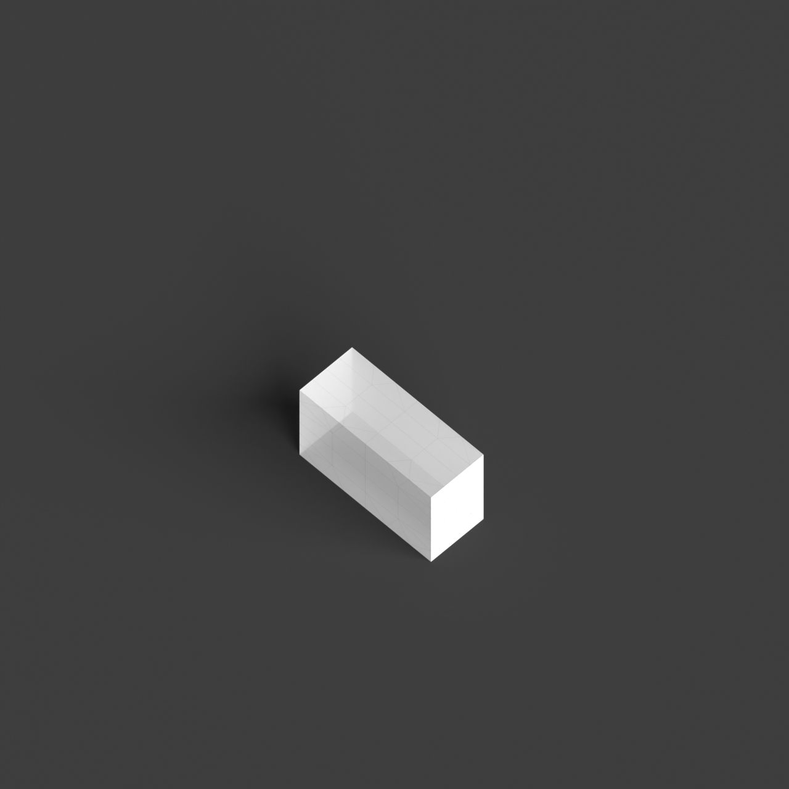
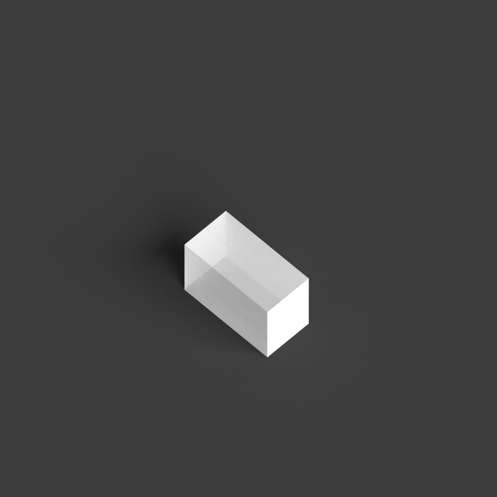

# 0014_0005_0004_porous_fractured_monolith  
         
## Interpretation  
  
### Implications_form :  
The metaphor &#x27;Porous fractured monolith&#x27; suggests a form that combines a substantial, singular mass with a network of voids that introduce complexity and movement. This results in a building form that appears both solid and dynamic, with a silhouette that is robust yet fractured. The voids create a sense of permeability and lightness, allowing for natural light and air to penetrate deeply into the structure. Spatially, the metaphor informs an arrangement where the voids serve as connectors between different zones, stimulating interaction and engagement. The fractures introduce unexpected spatial sequences and vistas, promoting exploration and fluid transitions between private and public areas. The design reflects a balance between enclosure and openness, with the voids acting as dynamic intermediaries that enhance connectivity and accessibility.  
### Metaphor :  
Porous fractured monolith  
### Key_traits :  
The metaphor &#x27;Porous fractured monolith&#x27; suggests a design that combines the solidity and singularity of a monolithic form with a sense of permeability and fragmentation. The key traits include a strong, unified mass that is visually and structurally significant, yet it is punctuated by voids or gaps that create a sense of lightness and openness. This duality allows for dynamic interaction between interior and exterior spaces, promoting natural ventilation and light penetration. The fractured aspect implies a deliberate, irregular division or disruption in the form, introducing complexity and a sense of movement or tension within the solid structure. The porous quality invites connectivity, fostering interaction and engagement between different spatial zones.  
### Design_task :  
Craft an Architectural Concept Model that embodies the &#x27;Porous fractured monolith&#x27; by starting with a substantial, cohesive mass to represent the monolithic form. Integrate a series of voids and fractures that vary in size and orientation, ensuring they convey the dynamic and complex nature of the metaphor. Use a combination of materials with different opacities to highlight the contrast between solid and void spaces, with lighter materials emphasizing the permeability of the voids. Focus on how these voids influence the spatial flow and interaction within the model, creating pathways and connections that encourage exploration. The model should capture the tension between the solid mass and the dynamic voids, illustrating a harmonious balance between stability and openness, while inviting curiosity and engagement.  
## Agent summary :  
The provided function, `create_fractured_monolith_with_pathways`, generates a 3D architectural model that embodies the metaphor of a &quot;Porous fractured monolith.&quot; It begins by creating a solid monolithic base, representing the substantial mass. The function then integrates a specified number of voids, varying in size and orientation, to reflect the metaphor&#x27;s dynamic and complex nature. Pathways are carved into the structure, enhancing spatial connectivity and encouraging exploration. The result is a model that balances solidity and openness, illustrating the interplay of solid and void spaces while promoting natural light, ventilation, and interaction among different zones.