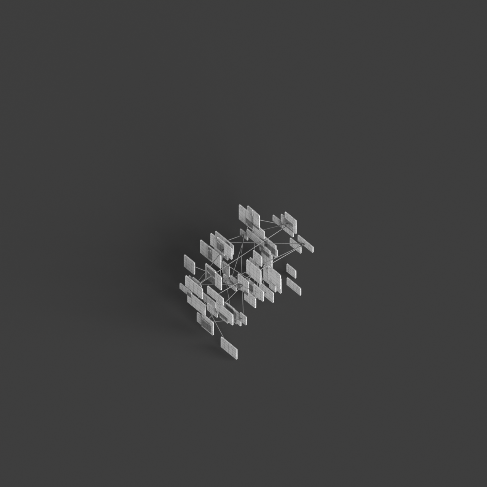
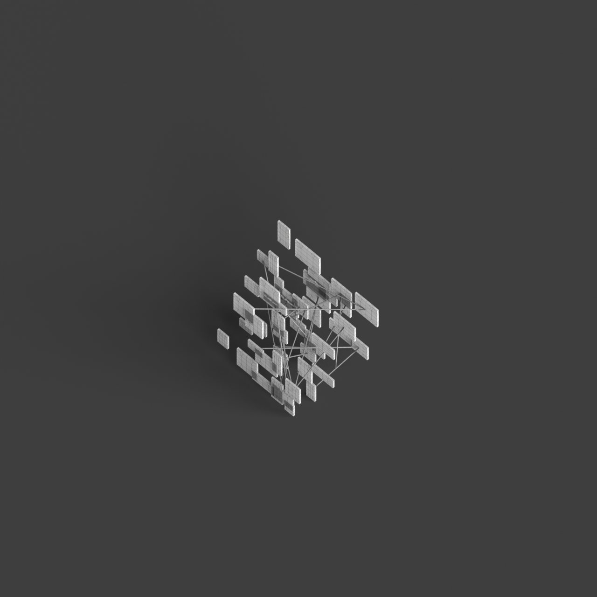
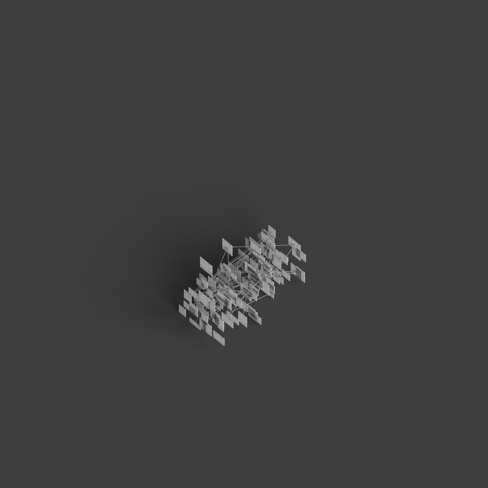
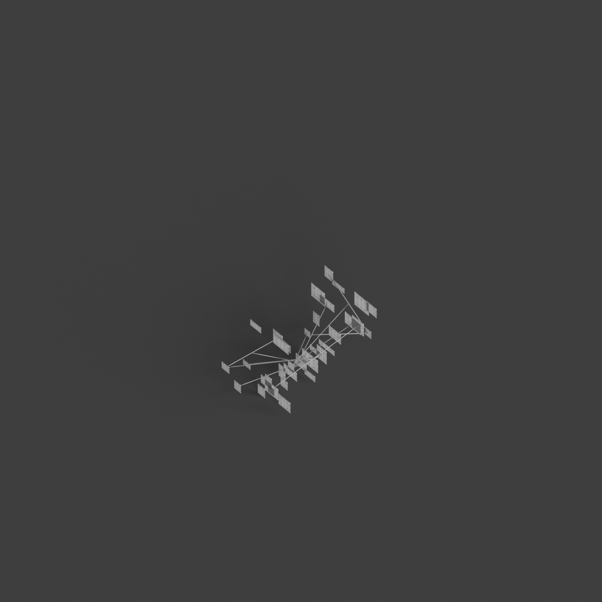
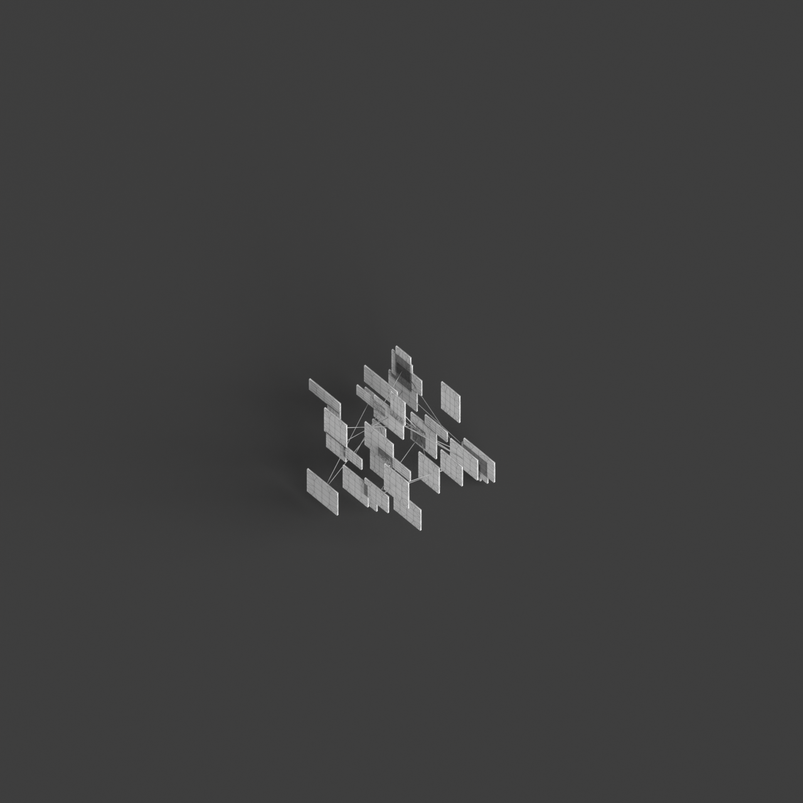

# 0015_0002_0003_suspended_intersecting_assembly  
         
## Interpretation  
  
### Implications_form :  
The metaphor &#x27;Suspended intersecting assembly&#x27; implies a building form where elements are strategically elevated, creating the illusion of floating structures. The design is characterized by a dynamic interplay of overlapping and crossing elements that form a cohesive yet intricate spatial network. This approach highlights the interaction between different architectural components, fostering an open and airy environment. The massing is likely to be fragmented yet harmonious, allowing for multiple viewpoints and pathways. The overall silhouette is defined by a series of intersecting volumes and lines that convey a sense of lightness and structural elegance, akin to a delicate balance maintained by gravity-defying elements.  
### Metaphor :  
Suspended intersecting assembly  
### Key_traits :  
The metaphor suggests a design characterized by elements that are elevated and appear to float within the space, creating dynamic intersections and connections. This approach emphasizes a sense of lightness and fluidity, encouraging visual interconnectivity and structural transparency. The suspended nature of the elements implies a delicate balance and a play with gravity, while the intersections create a dynamic network of relationships and spatial dialogues.  
### Design_task :  
Develop an Architectural Concept Model that represents the &#x27;Suspended intersecting assembly&#x27; by employing a framework of fine tensile cables to depict the suspended nature of elements. Use semi-transparent materials, such as frosted glass or mesh, to illustrate the floating components and their intersections. Arrange these materials in a way that they crisscross and overlap, creating layers of spatial complexity. Emphasize the fluidity and lightness of the design by focusing on the negative spaces formed between the intersecting elements. Consider integrating reflective surfaces to enhance the perception of suspension and interconnectivity, allowing light to play across the model and reveal the dynamic nature of the assembly.  
## Agent summary :  
The function `create_suspended_intersecting_assembly_v2` generates an architectural concept model based on the metaphor of &quot;Suspended intersecting assembly.&quot; By employing a layered structure, it creates various horizontal layers of floating elements, represented as boxes, arranged within a defined base area. The elements are interlinked by tensile cables, which enhance the illusion of suspension and interconnectivity. The model incorporates randomness in element placement and size, echoing the dynamic interplay highlighted in the metaphor. This approach emphasizes lightness and spatial complexity, aligning with the architectural vision of overlapping volumes and the delicate balance suggested by the metaphor.