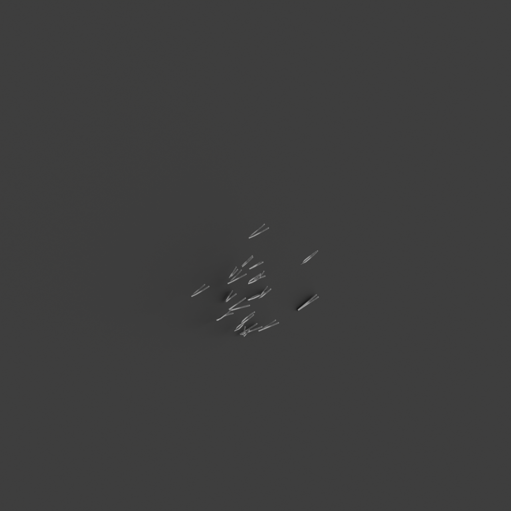
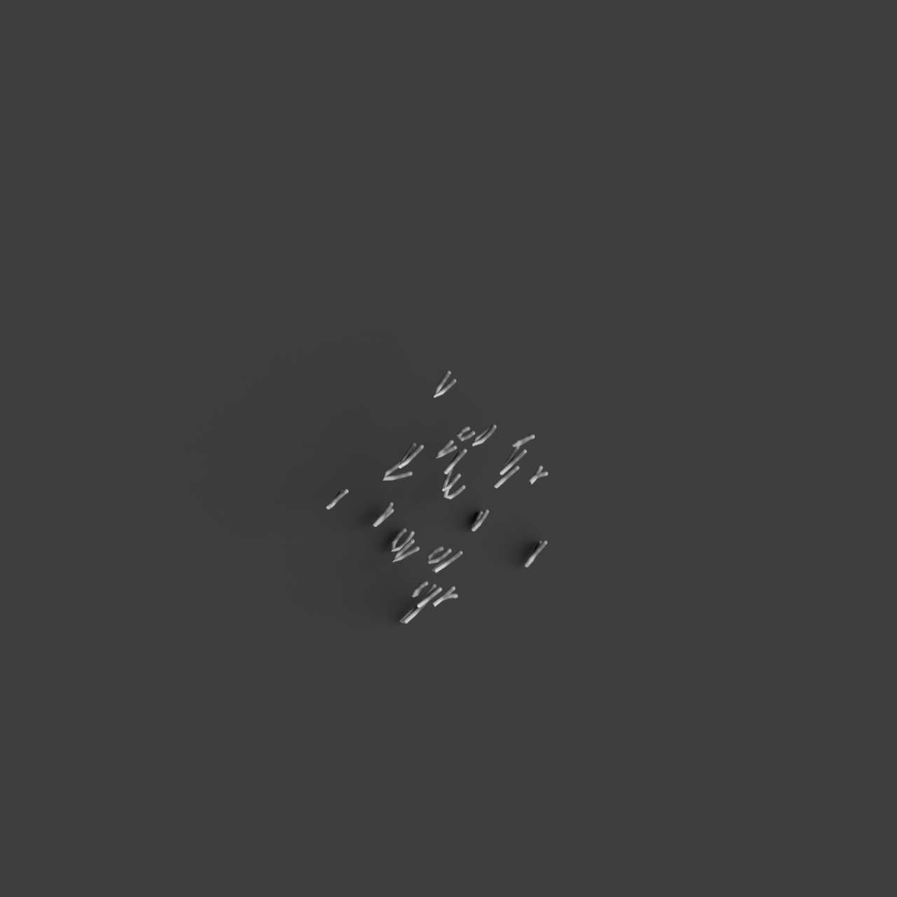
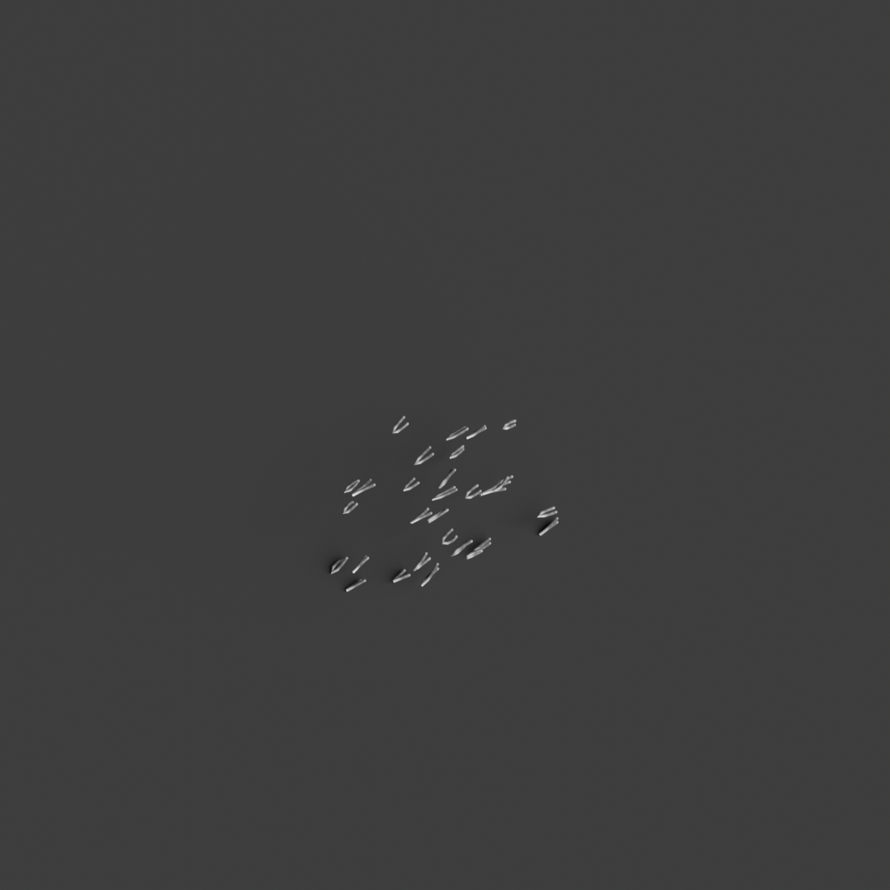

# 0015_0003_0005_suspended_intersecting_assembly  
         
## Interpretation  
  
### Implications_form :  
The metaphor &#x27;Suspended intersecting assembly&#x27; suggests a building form with elements strategically elevated to create a sense of floating, intersecting structures. The building&#x27;s massing is defined by a series of hovering components that interact in a dynamic and fluid manner, forming complex spatial relationships. These interactions create a network of pathways and visual connections that enhance movement and engagement within the space. The overall geometry is likely to feature intersecting curves and lines, contributing to a silhouette that embodies a delicate balance and structural elegance, while conveying a sense of transparency and openness.  
### Metaphor :  
Suspended intersecting assembly  
### Key_traits :  
The metaphor suggests a design characterized by elements that are elevated and appear to float within the space, creating dynamic intersections and connections. This approach emphasizes a sense of lightness and fluidity, encouraging visual interconnectivity and structural transparency. The suspended nature of the elements implies a delicate balance and a play with gravity, while the intersections create a dynamic network of relationships and spatial dialogues.  
### Design_task :  
Design an Architectural Concept Model that encapsulates the &#x27;Suspended intersecting assembly&#x27; by using a combination of curved rods and flexible materials to represent the floating and intersecting elements. Arrange these components to create a series of overlapping arcs and lines that form a cohesive network, highlighting the interplay between different architectural elements. Focus on creating a sense of lightness and fluidity by ensuring the components appear to hover and interact delicately within the space. Incorporate modular connections that can be adjusted to explore various configurations, emphasizing adaptability and movement. Use light and shadow to accentuate the intersections and the perception of suspension, enhancing the model&#x27;s dynamic and interconnected nature.  
## Agent summary :  
The function `create_suspended_intersecting_assembly` generates an architectural concept model based on the metaphor of a &quot;Suspended intersecting assembly.&quot; It creates a series of 3D geometries representing elevated, curved elements that appear to float and intersect dynamically. By arranging these elements in a grid pattern with varying heights and orientations, the function emphasizes lightness and fluidity, reflecting the metaphor&#x27;s key traits. The use of random control points for curves simulates organic movement, while modular connections allow for adaptability. This model captures the delicate balance and transparency implied in the design task, enhancing spatial relationships and engagement.