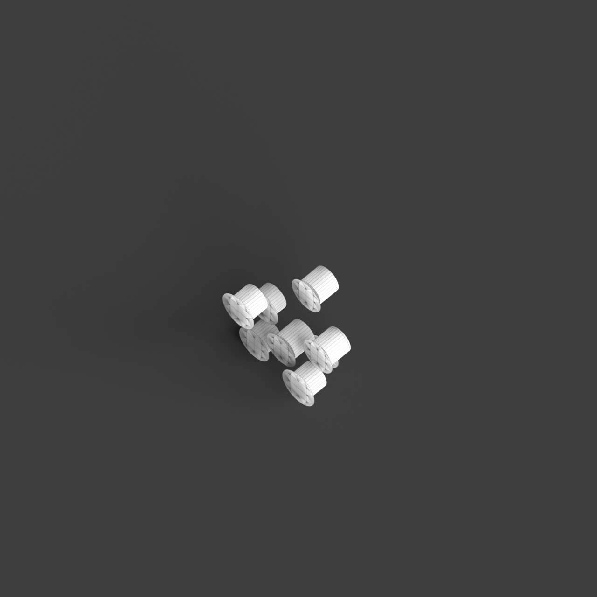
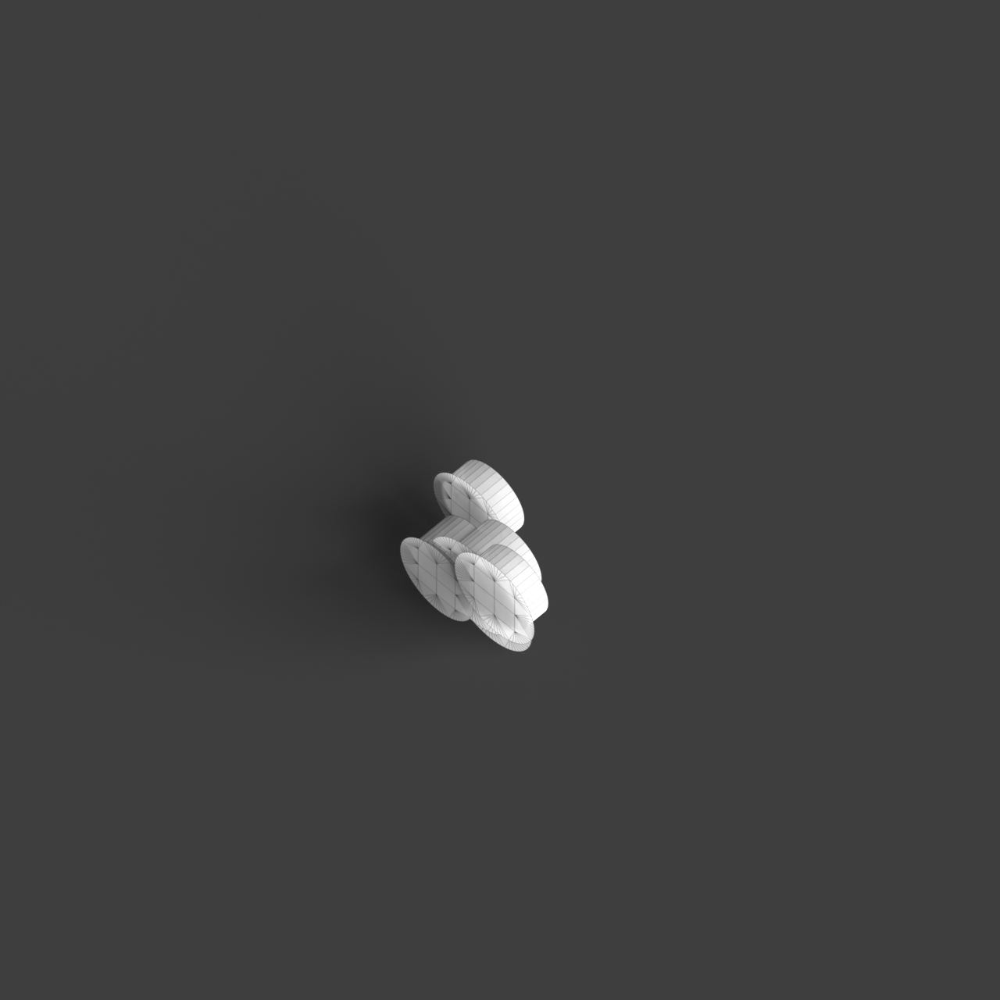
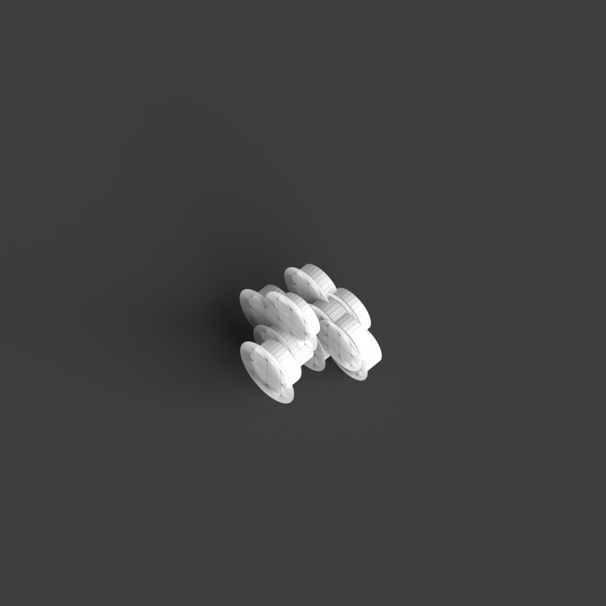
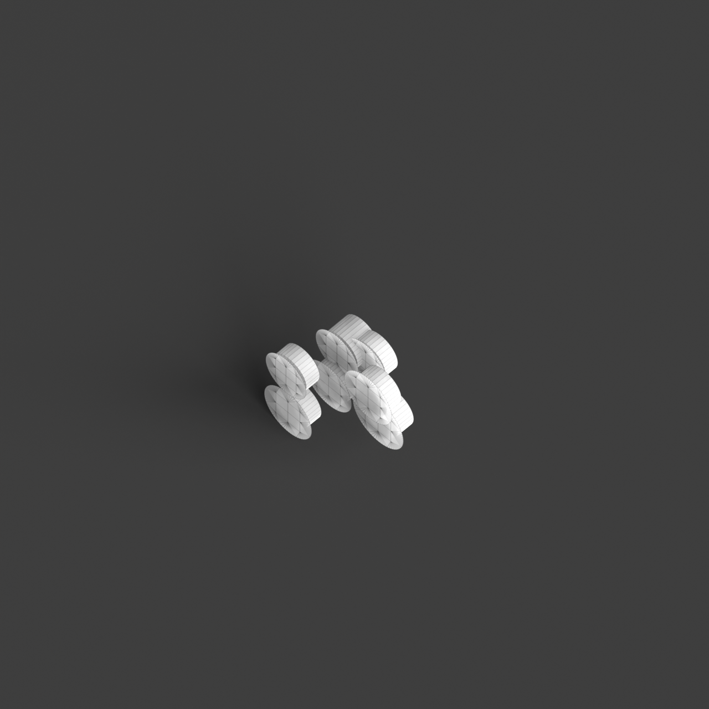
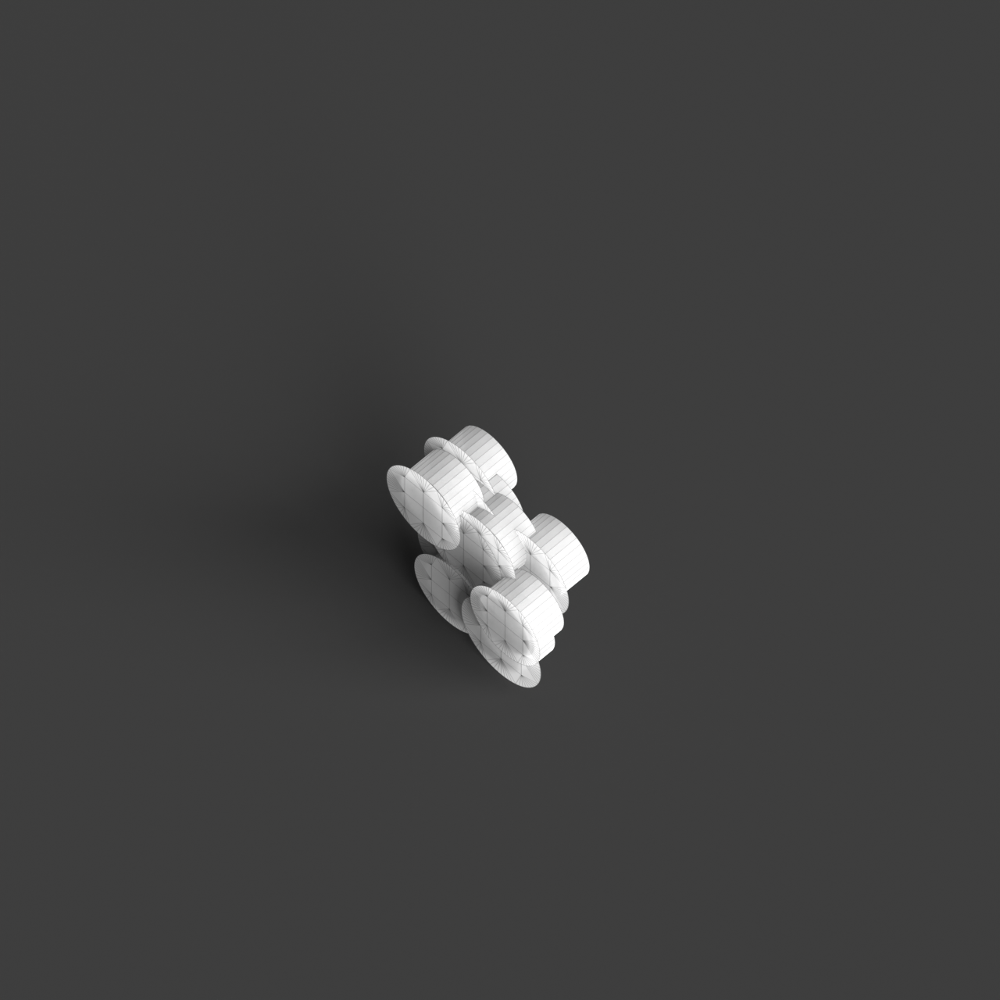

# 0015_0004_0003_suspended_intersecting_assembly  
         
## Interpretation  
  
### Implications_form :  
The metaphor &#x27;Suspended intersecting assembly&#x27; implies a building design where elements appear to float, intersecting dynamically to create a network of relationships within the space. The massing is characterized by elevated components that convey a sense of lightness and defy gravity, emphasizing fluidity and transparency. Spatial relationships are defined by strategic intersections that generate a dialogue between volumes, fostering interaction and visual connection. The geometry may feature angular and curvilinear elements that intersect at varying heights, contributing to a silhouette that suggests movement and structural elegance.  
### Metaphor :  
Suspended intersecting assembly  
### Key_traits :  
The metaphor suggests a design characterized by elements that are elevated and appear to float within the space, creating dynamic intersections and connections. This approach emphasizes a sense of lightness and fluidity, encouraging visual interconnectivity and structural transparency. The suspended nature of the elements implies a delicate balance and a play with gravity, while the intersections create a dynamic network of relationships and spatial dialogues.  
### Design_task :  
Construct an Architectural Concept Model embodying the &#x27;Suspended intersecting assembly&#x27; by incorporating a series of modular, interlocking elements that can be rearranged to explore different configurations. Use lightweight materials such as balsa wood or thin metal rods to create a framework that supports translucent panels or fabrics, representing the floating components. Arrange these elements to intersect at various levels, forming a lattice-like structure that emphasizes the play of light and shadow. Focus on creating a sense of balance and tension, where each module appears to hover and interact within the space. Incorporate adjustable joints or hinges to allow for dynamic reconfiguration, highlighting the adaptability and fluidity of the design. Use subtle lighting to enhance the perception of suspension and interconnectivity, accentuating the model&#x27;s dynamic and intricate nature.  
## Agent summary :  
The provided function generates an architectural concept model based on the metaphor of &quot;Suspended intersecting assembly&quot; by creating a series of modular, interlocking cylindrical elements and translucent panels. Utilizing random height variations and rotations, it mimics the appearance of floating components that intersect dynamically. The function constructs these elements with lightweight materials, emphasizing transparency and fluidity in design. By strategically arranging the modules at different heights and applying subtle translations, the model achieves a delicate balance that reflects the interplay of light and shadow. This approach encapsulates the metaphor&#x27;s essence of interconnectivity and structural elegance.