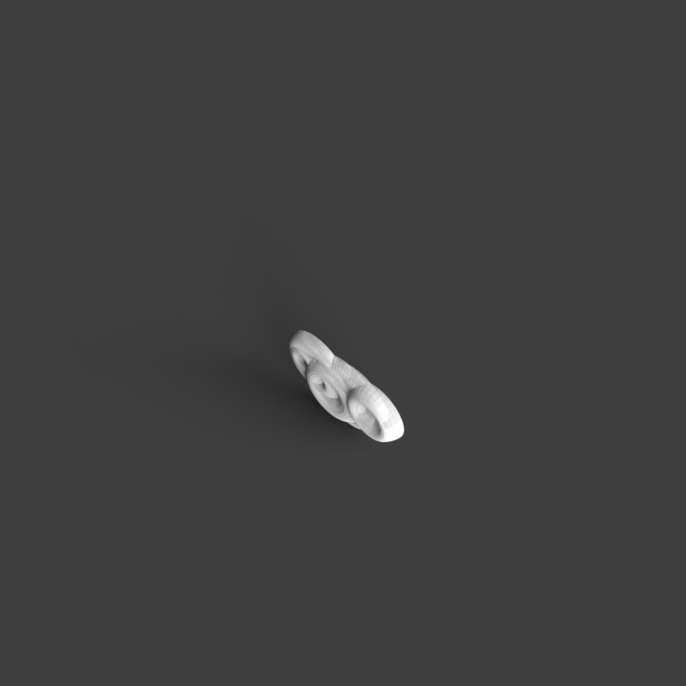

# 0016_0001_0001_curved_partitions  
         
## Interpretation  
  
### Implications_form :  
The metaphor of &#x27;curved partitions&#x27; shapes the building&#x27;s form and massing by emphasizing fluid, organic shapes that create a sense of movement and transition. The building&#x27;s silhouette might be characterized by smooth, flowing lines that mimic natural forms, contrasting with rigid, angular structures. Spatial relationships within the building are informed by these curves, encouraging spaces that flow into one another seamlessly. Curved partitions can delineate areas without creating stark separations, allowing for a dynamic interaction of public and private spaces. This approach can enhance the play of light and shadow, creating a more nuanced and atmospheric environment, while maintaining a harmonious and elegant aesthetic.  
### Metaphor :  
Curved partitions  
### Key_traits :  
The metaphor of &#x27;curved partitions&#x27; suggests a design characterized by fluidity and organic movement. It implies a spatial organization that is dynamic and flowing, where boundaries are softened and spaces transition smoothly from one to another. The use of curves introduces a sense of continuity and natural progression, allowing for an interplay of light and shadow. This can create intimate and private areas within a larger open space, offering a sense of enclosure without rigidity. The design can evoke a sense of calm and elegance, encouraging exploration and interaction with the environment.  
### Design_task :  
To embody the metaphor of &#x27;curved partitions&#x27; in an Architectural Concept Model, focus on creating a series of interlocking, flowing forms that suggest movement and continuity. Utilize materials like flexible foam or bendable wood strips to create the partitions, allowing them to curve and twist naturally. Arrange these partitions to define spaces without fully enclosing them, suggesting a progression of spaces where one flows into the next. Consider incorporating elements that interact with light, such as perforations or translucent materials, to emphasize the interplay of light and shadow. The model should convey a sense of calm and exploration, encouraging viewers to move around and interact with the environment, discovering new perspectives and spatial relationships from different angles.  
## Agent summary :  
The function `create_curved_partition_model` generates an architectural concept model by creating a series of interlocking, flowing curved partitions. Utilizing specified parameters such as width, depth, height, and the number of curves, the function defines smooth, organic shapes that embody the metaphor of &#x27;curved partitions&#x27;. It employs random variations in curve heights to enhance dynamism, allowing for seamless spatial transitions. By revolving NURBS curves around a vertical axis, the function produces 3D geometries that suggest movement and continuity. Ultimately, this approach fosters a harmonious environment, encouraging exploration and interaction within the architectural space.