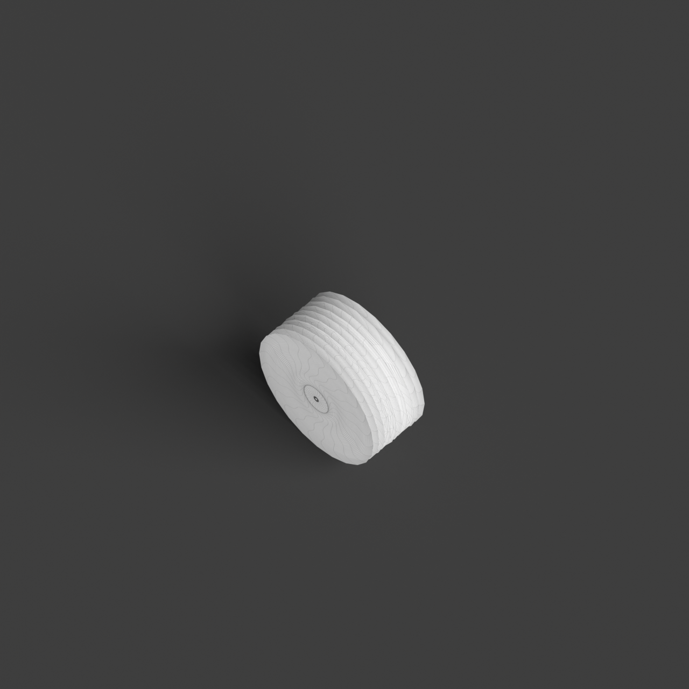
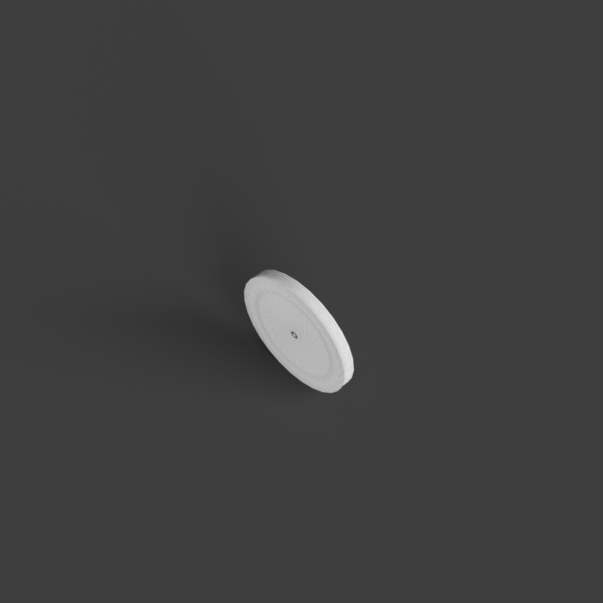
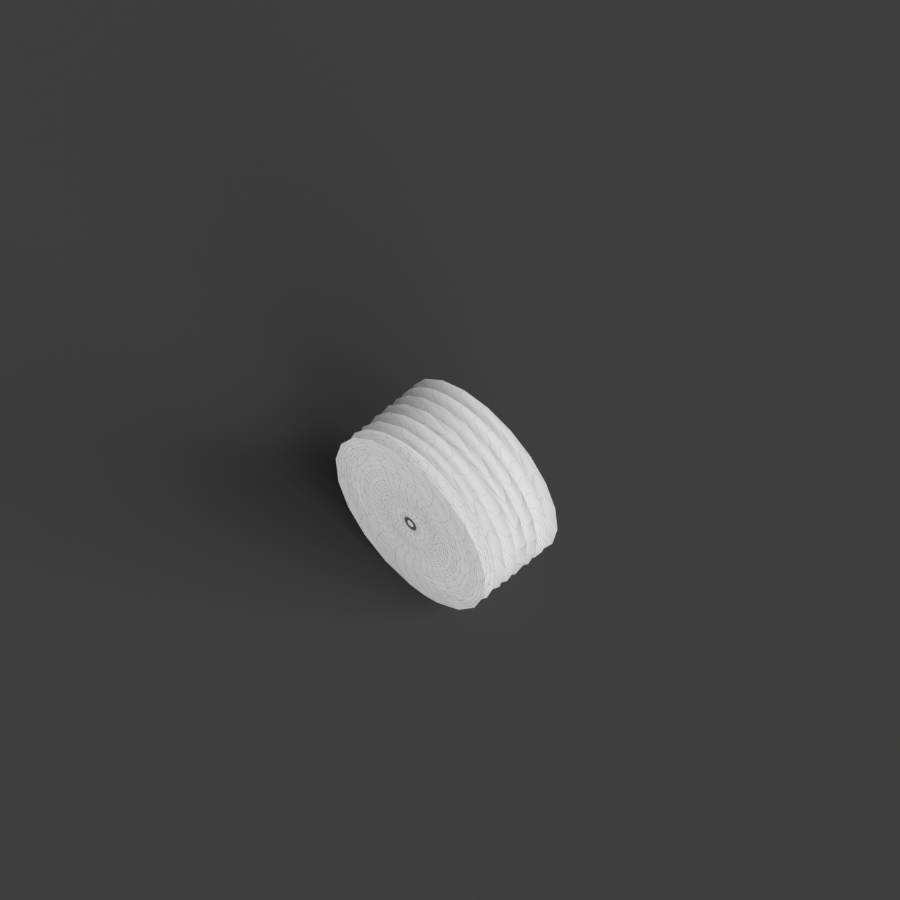

# 0016_0002_0003_curved_partitions  
         
## Interpretation  
  
### Implications_form :  
The metaphor of &#x27;curved partitions&#x27; informs the building&#x27;s form and massing by introducing elements that mimic natural landscapes, such as hills or waves, where spaces emerge from and recede into the forms. The silhouette may appear as a series of undulating layers, creating a visual rhythm that conveys movement and dynamism. Spatial relationships are shaped by the transitions created by these curves, which guide circulation and create zones of varying intimacy. The curved partitions can serve as both functional and aesthetic elements, providing privacy while maintaining openness, and allowing light to filter through in unexpected patterns, enhancing the overall ambiance and sensory experience of the space.  
### Metaphor :  
Curved partitions  
### Key_traits :  
The metaphor of &#x27;curved partitions&#x27; suggests a design characterized by fluidity and organic movement. It implies a spatial organization that is dynamic and flowing, where boundaries are softened and spaces transition smoothly from one to another. The use of curves introduces a sense of continuity and natural progression, allowing for an interplay of light and shadow. This can create intimate and private areas within a larger open space, offering a sense of enclosure without rigidity. The design can evoke a sense of calm and elegance, encouraging exploration and interaction with the environment.  
### Design_task :  
To create an Architectural Concept Model that embodies the &#x27;curved partitions&#x27; metaphor, focus on constructing a landscape-like form composed of layered, sweeping curves. Use materials such as pliable wire or layered paper to build these partitions, emphasizing their flow and interaction. Arrange them to create a terrain-like structure where spaces are defined by the rise and fall of the curves, encouraging a sense of exploration and discovery. Incorporate elements that cast shadows or diffuse light, such as mesh or semi-transparent fabrics, to accentuate the dynamic interplay of light and shadow. The model should invite viewers to navigate through the spaces, experiencing the gradual shifts in enclosure and openness, while maintaining a cohesive and elegant aesthetic that resonates with the metaphor of fluidity and organic movement.  
## Agent summary :  
The provided function generates an architectural concept model inspired by the metaphor of &quot;curved partitions.&quot; It creates a landscape-like structure through multiple layers of sweeping curves, simulating organic forms reminiscent of hills or waves. By adjusting parameters such as layer count, spacing, and curve variability, the model embodies fluidity and dynamic spatial relationships. Each curve is formed using control points and is revolved around a vertical axis to produce a three-dimensional surface. This approach not only emphasizes aesthetic qualities but also facilitates light interaction and spatial transitions, inviting exploration and enhancing the sensory experience of the environment.