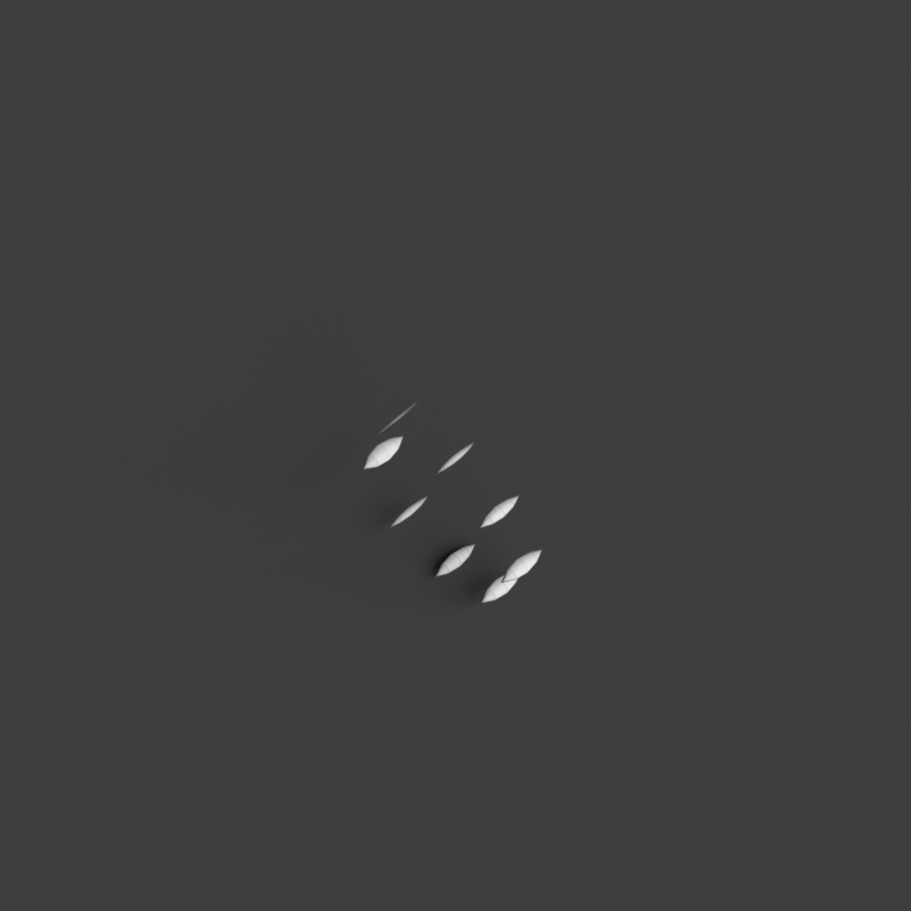
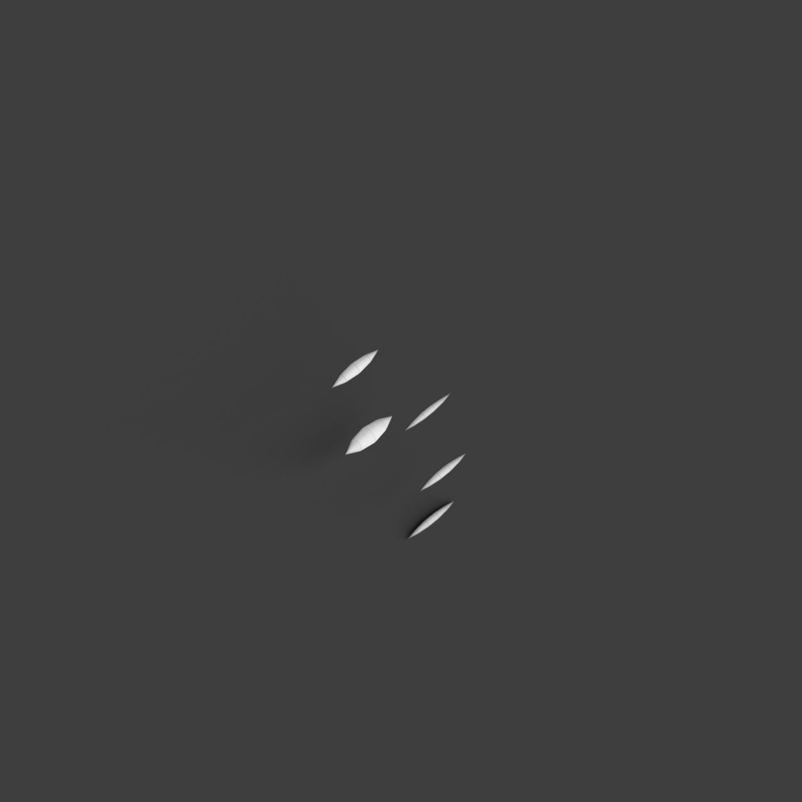

# 0016_0003_0001_curved_partitions  
         
## Interpretation  
  
### Implications_form :  
The metaphor of &#x27;curved partitions&#x27; shapes the building&#x27;s form and massing by introducing a dynamic interplay between fluid surfaces and structured volumes. The building&#x27;s silhouette may be characterized by rhythmic curves that create a sense of organic movement, echoing natural forms like shells or petals. Spatial relationships are defined by the gentle transitions between spaces, where the curved partitions guide movement and create zones with varying degrees of interaction and intimacy. These partitions can serve as both separators and connectors, allowing for a seamless flow of light and shadow that enhances the atmosphere and experiential quality of the space. This design approach encourages a balance between openness and enclosure, inviting exploration and fostering a sense of calm and discovery.  
### Metaphor :  
Curved partitions  
### Key_traits :  
The metaphor of &#x27;curved partitions&#x27; suggests a design characterized by fluidity and organic movement. It implies a spatial organization that is dynamic and flowing, where boundaries are softened and spaces transition smoothly from one to another. The use of curves introduces a sense of continuity and natural progression, allowing for an interplay of light and shadow. This can create intimate and private areas within a larger open space, offering a sense of enclosure without rigidity. The design can evoke a sense of calm and elegance, encouraging exploration and interaction with the environment.  
### Design_task :  
To embody the metaphor of &#x27;curved partitions&#x27; in an Architectural Concept Model, focus on crafting a series of interconnected curvilinear elements that suggest both division and continuity. Use materials such as flexible acrylic sheets or molded clay to form the partitions, allowing them to undulate and interact with each other. Arrange these elements to create a spatial narrative where each curve leads naturally to the next, defining areas without rigid separations. Consider integrating features that manipulate light, such as reflective surfaces or cutouts, to enhance the dynamic interplay of illumination and shadow. The model should evoke a sense of tranquility and curiosity, encouraging viewers to explore the spaces and experience the subtle transitions and interactions from different vantage points, while maintaining an elegant and fluid aesthetic that aligns with the metaphor.  
## Agent summary :  
The provided function, `create_dynamic_curved_partitions_model`, generates an architectural concept model that embodies the metaphor of &quot;curved partitions.&quot; It creates a series of interconnected, curvilinear surfaces that reflect fluidity and dynamic spatial transitions. By varying the number and radius of curves, along with their height, the model captures the essence of organic forms, allowing for smooth transitions between different spatial zones. These partitions facilitate light interaction, enhancing the atmosphere and encouraging exploration. The design evokes a sense of tranquility and curiosity, aligning with the metaphor&#x27;s emphasis on balance, movement, and the interplay of openness and enclosure.