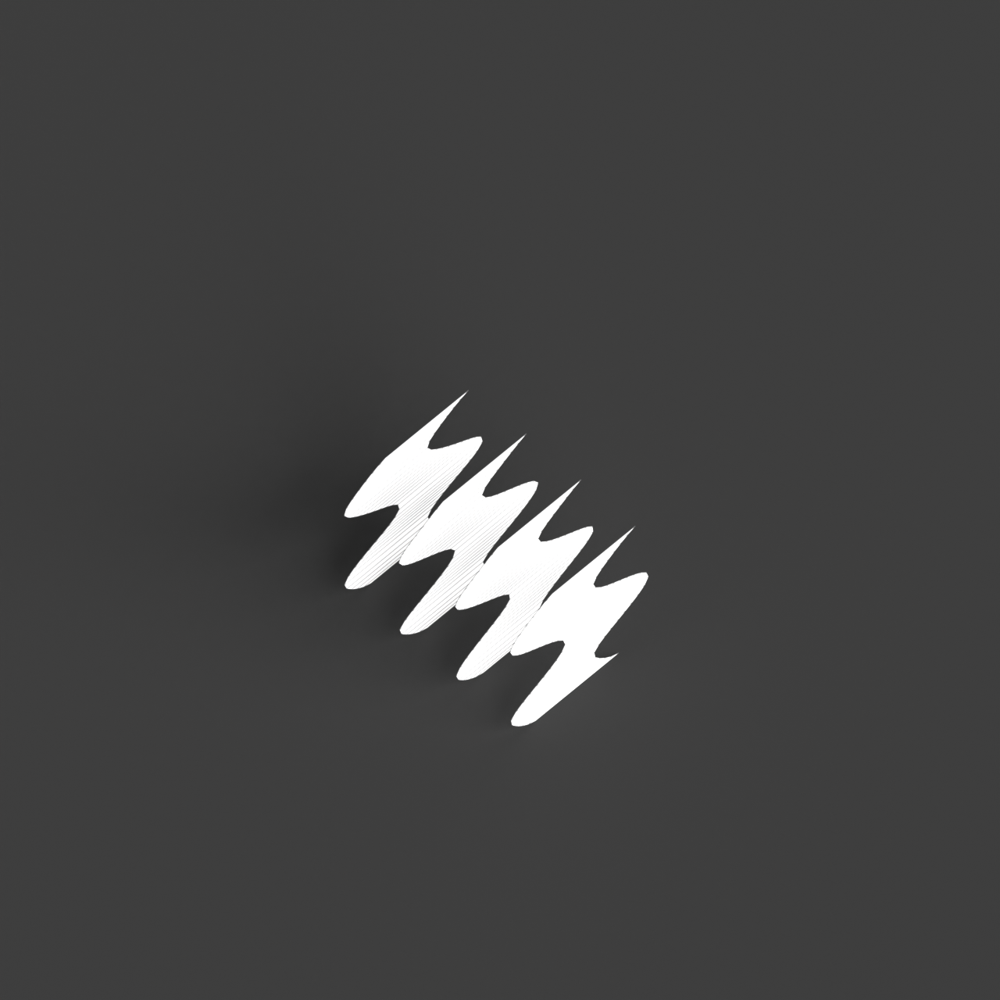
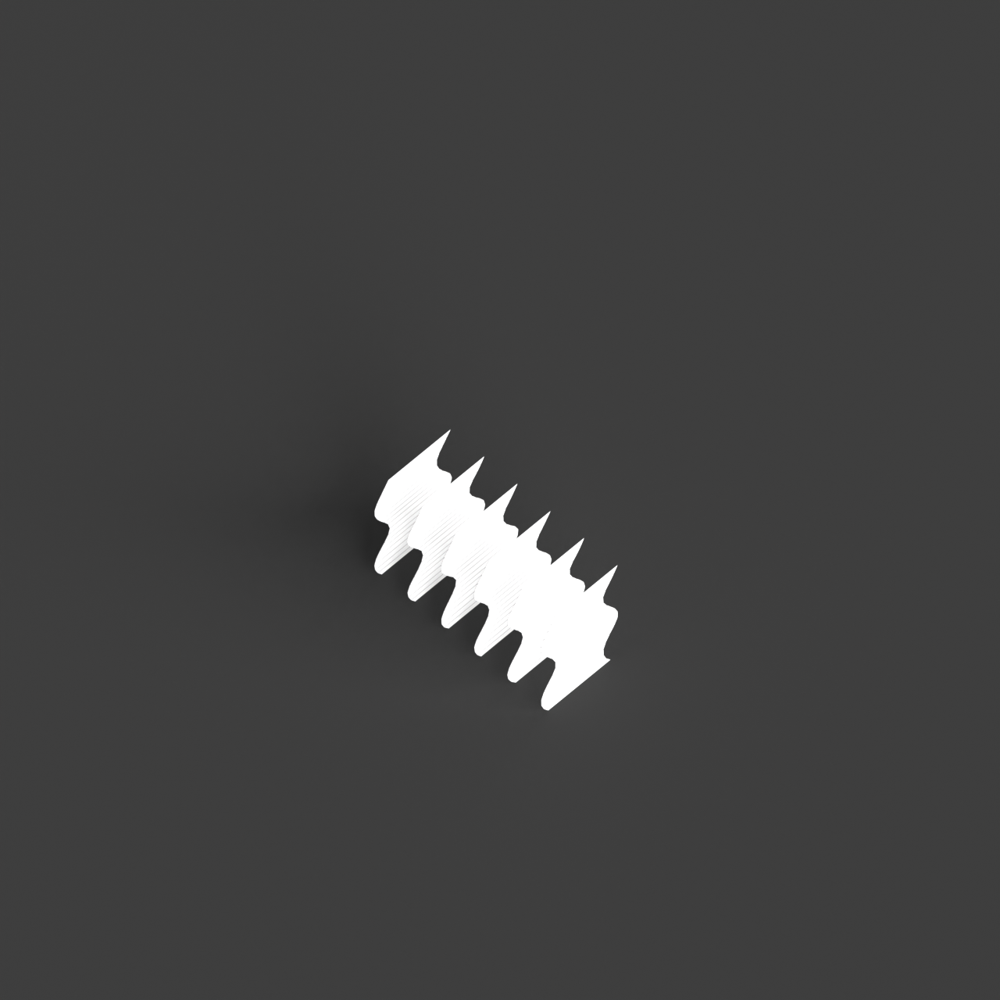
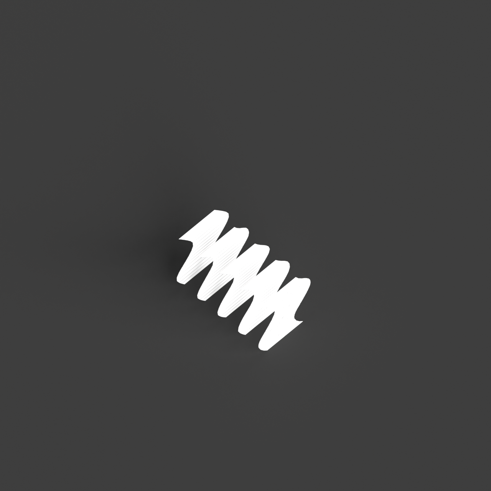
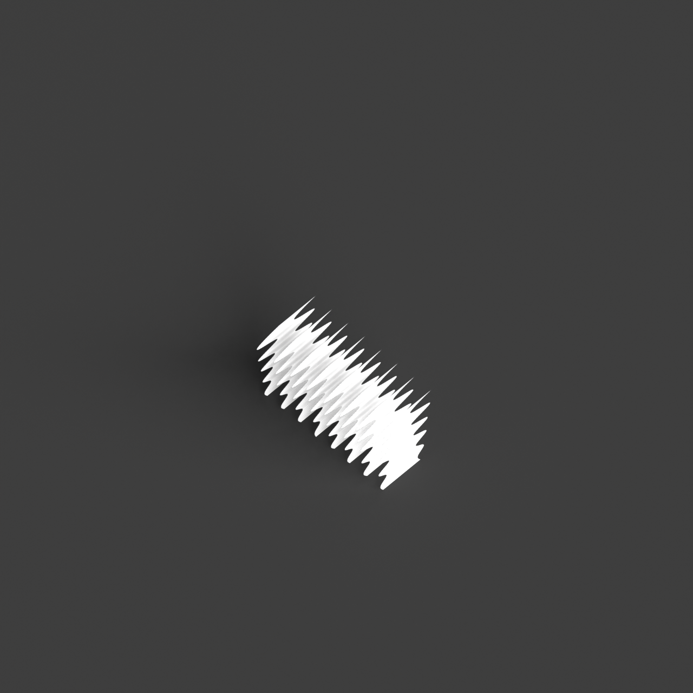

# 0016_0005_0001_curved_partitions  
         
## Interpretation  
  
### Implications_form :  
The metaphor of &#x27;curved partitions&#x27; shapes the building&#x27;s form and massing through the integration of fluid, wave-like contours that suggest a seamless and natural flow. The building&#x27;s silhouette may be characterized by continuous and enveloping curves, resembling elements found in nature such as water currents or sand dunes. Spatial relationships are informed by these organic shapes, creating a layout where spaces are interconnected and transition smoothly, encouraging a meandering circulation. Curved partitions serve as gentle dividers, offering privacy while maintaining openness and allowing light to dance across surfaces in a dynamic interplay, enhancing the atmospheric quality of the space. This design approach fosters a sense of tranquility and engagement, inviting users to explore and interact with the environment while experiencing the subtle shifts in space and light.  
### Metaphor :  
Curved partitions  
### Key_traits :  
The metaphor of &#x27;curved partitions&#x27; suggests a design characterized by fluidity and organic movement. It implies a spatial organization that is dynamic and flowing, where boundaries are softened and spaces transition smoothly from one to another. The use of curves introduces a sense of continuity and natural progression, allowing for an interplay of light and shadow. This can create intimate and private areas within a larger open space, offering a sense of enclosure without rigidity. The design can evoke a sense of calm and elegance, encouraging exploration and interaction with the environment.  
### Design_task :  
To embody the metaphor of &#x27;curved partitions&#x27; in an Architectural Concept Model, focus on creating a series of undulating forms that define and connect spaces. Use materials such as bendable wire mesh or flexible silicone sheets to construct the partitions, allowing them to form organic, wave-like patterns. Arrange these elements to create a rhythmic flow of spaces, where each curve leads naturally to the next, fostering a sense of movement and discovery. Integrate components that manipulate light, such as translucent panels or reflective surfaces, to emphasize the dynamic interaction of light and shadow across the partitions. The model should evoke a serene and inviting environment, encouraging viewers to navigate through the spaces, experiencing the fluid transitions and harmonious spatial relationships that embody the metaphor&#x27;s essence of fluidity and organic movement.  
## Agent summary :  
The provided function generates an architectural concept model by creating a series of vertical, wave-like partitions that embody the metaphor of &quot;curved partitions.&quot; It achieves this through a mathematical approach, where wave curves are calculated based on specified parameters like amplitude and frequency. The function uses Rhino&#x27;s geometry library to create smooth, undulating surfaces that define and connect spaces, facilitating fluid circulation and interaction. By manipulating these curves and integrating light-responsive materials, the model evokes a serene atmosphere, encouraging exploration and engagement with the environment, thus effectively translating the metaphor into a tangible architectural form.