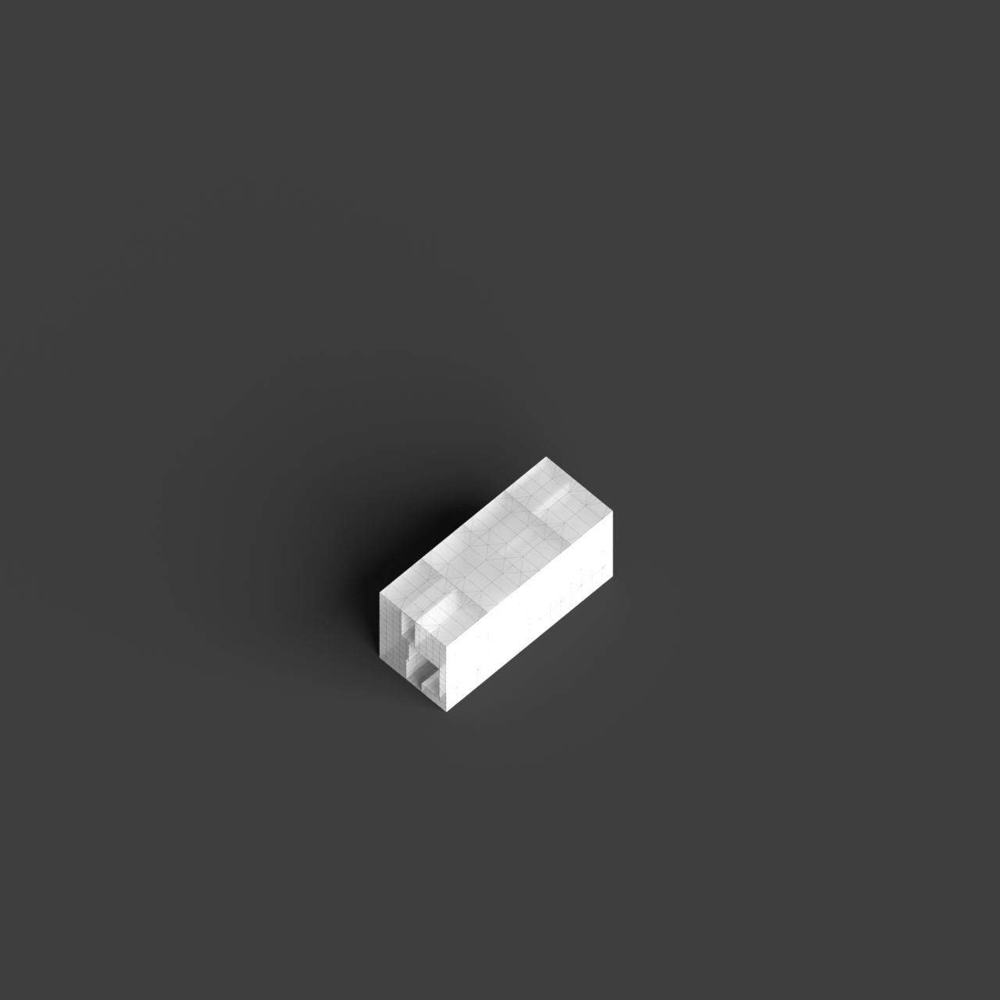
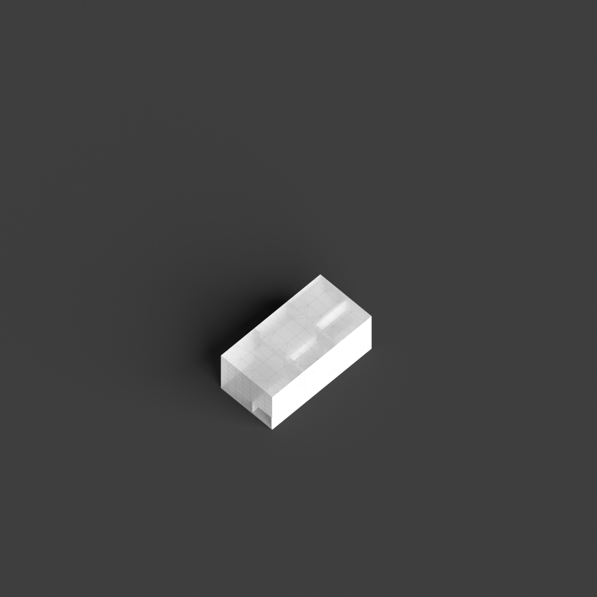
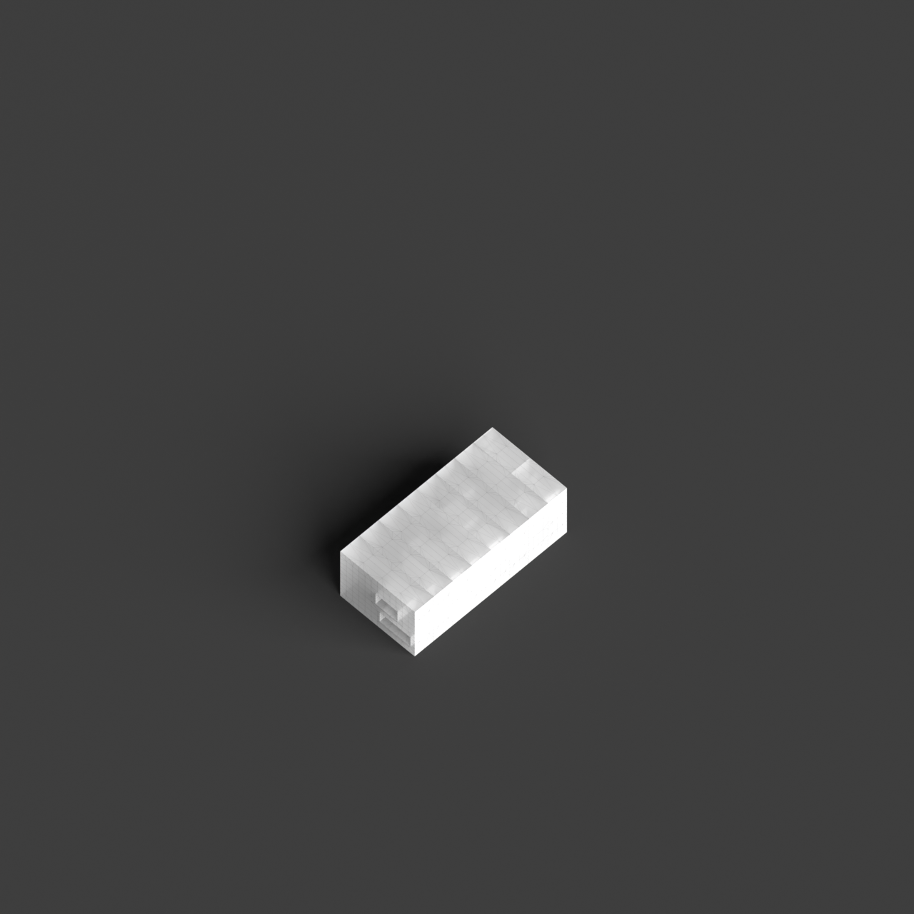

# 0018_0001_0003_perforated_vertical_landscape  
         
## Interpretation  
  
### Implications_form :  
The &#x27;Perforated vertical landscape&#x27; metaphor shapes the building&#x27;s form by emphasizing a vertical structure that intersperses solid elements with voids, creating a rhythmic pattern of light and shadow. This structure allows for a dynamic interplay between interior and exterior spaces, enhancing spatial relationships through transparency and permeability. The silhouette of the building might resemble a natural cliff face or mountain, with openings that mimic natural erosion or pathways. The arrangement of spaces is informed by this interplay, with areas designed to maximize the penetration of light and views while maintaining privacy and shelter where needed.  
### Metaphor :  
Perforated vertical landscape  
### Key_traits :  
This metaphor suggests a design that integrates verticality with porous elements, creating a structure that allows light, air, and views to penetrate through its form. It implies a rhythmic interplay between solid and void, offering dynamic visual and spatial experiences. The design can evoke the sense of a natural landscape, reimagined in a vertical orientation, where perforations serve as pathways for interaction between interior and exterior environments.  
### Design_task :  
Create an Architectural Concept Model that embodies the &#x27;Perforated vertical landscape&#x27; metaphor by constructing a vertical form with alternating solid and void elements. Use materials that allow light and air to penetrate, such as translucent panels or lattice frameworks. Design the model to have a dynamic silhouette that evokes a natural landscape, with layers and textures that suggest geological formations. Arrange the spaces in the model to highlight the interaction between interior and exterior, incorporating pathways or corridors that guide light and views throughout the structure. Focus on the balance of mass and void to convey the metaphor&#x27;s essence of permeability and verticality.  
## Agent summary :  
The function `create_perforated_vertical_landscape` generates an architectural concept model based on the &quot;Perforated vertical landscape&quot; metaphor by constructing a vertical structure with alternating solid and void elements. It defines layers of varying heights and introduces random voids that create a dynamic silhouette reminiscent of natural landscapes, such as cliffs. This design maximizes light penetration and spatial interaction by using materials that allow air and views to flow through. The result is a model that embodies the essence of permeability and verticality, enhancing the relationship between interior and exterior spaces through rhythmic patterns of solid and void.