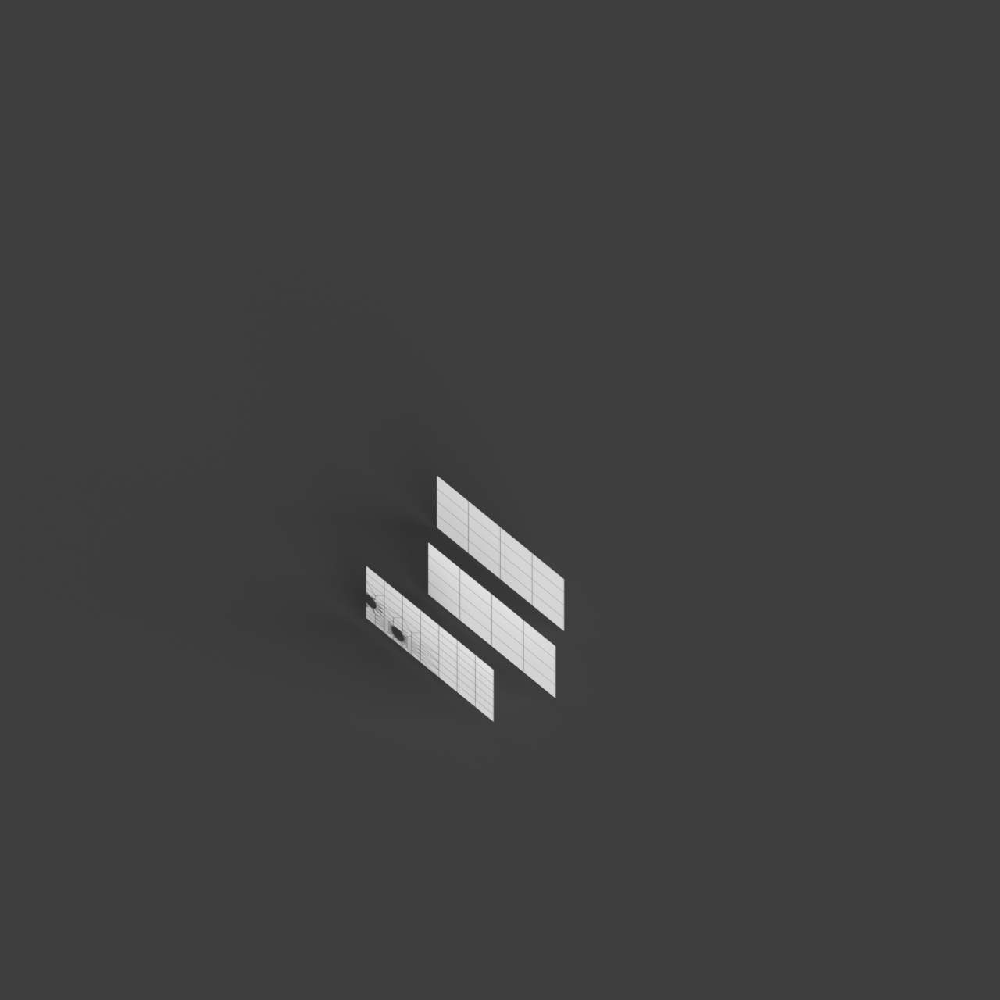
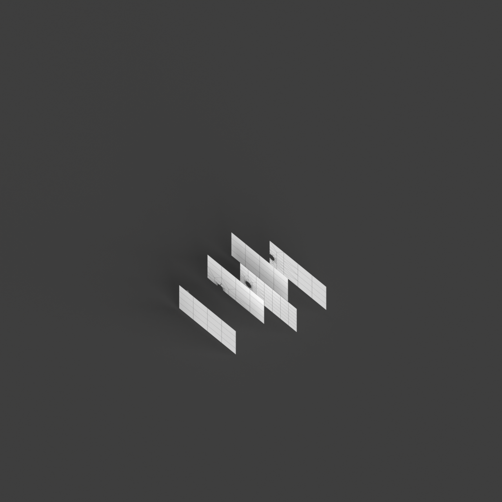

# 0018_0002_0001_perforated_vertical_landscape  
         
## Interpretation  
  
### Implications_form :  
The &#x27;Perforated vertical landscape&#x27; metaphor influences the building&#x27;s form by creating a vertical structure with a series of staggered terraces and layered platforms, each interspersed with voids and openings. This design approach allows for a cascading effect where light and air filter through multiple levels, akin to sunlight filtering through tree canopies. The spatial relationships are defined by the interaction between these staggered elements, creating a sense of movement and flow both vertically and horizontally. The silhouette may resemble a series of stacked plateaus or rock formations, with perforations serving as natural pathways for light and air, as well as visual connections between different levels.  
### Metaphor :  
Perforated vertical landscape  
### Key_traits :  
This metaphor suggests a design that integrates verticality with porous elements, creating a structure that allows light, air, and views to penetrate through its form. It implies a rhythmic interplay between solid and void, offering dynamic visual and spatial experiences. The design can evoke the sense of a natural landscape, reimagined in a vertical orientation, where perforations serve as pathways for interaction between interior and exterior environments.  
### Design_task :  
To embody the &#x27;Perforated vertical landscape&#x27; metaphor, create an Architectural Concept Model featuring a series of staggered, layered platforms. Use a combination of solid materials and perforated elements to achieve a balance between mass and void. Design the model to incorporate terraces and niches that allow light and air to flow through the structure, creating dynamic interaction between different levels. Employ techniques such as layering and overlapping to evoke the sense of a natural landscape reimagined vertically. Focus on creating pathways and views that connect the interior spaces with the exterior environment, highlighting the metaphor&#x27;s essence of permeability, verticality, and spatial interconnection.  
## Agent summary :  
The provided function, `create_perforated_vertical_landscape`, generates an architectural concept model inspired by the metaphor of a &quot;Perforated Vertical Landscape.&quot; It constructs a 3D structure composed of staggered, layered platforms that incorporate circular perforations, facilitating the flow of light and air. Each level is offset randomly, creating a dynamic visual effect reminiscent of natural landscapes. The model emphasizes verticality and permeability, allowing for spatial interconnections between interior and exterior environments. By varying parameters like height, number of levels, and perforation size, the function creates diverse interpretations of the metaphor, resulting in unique architectural forms.