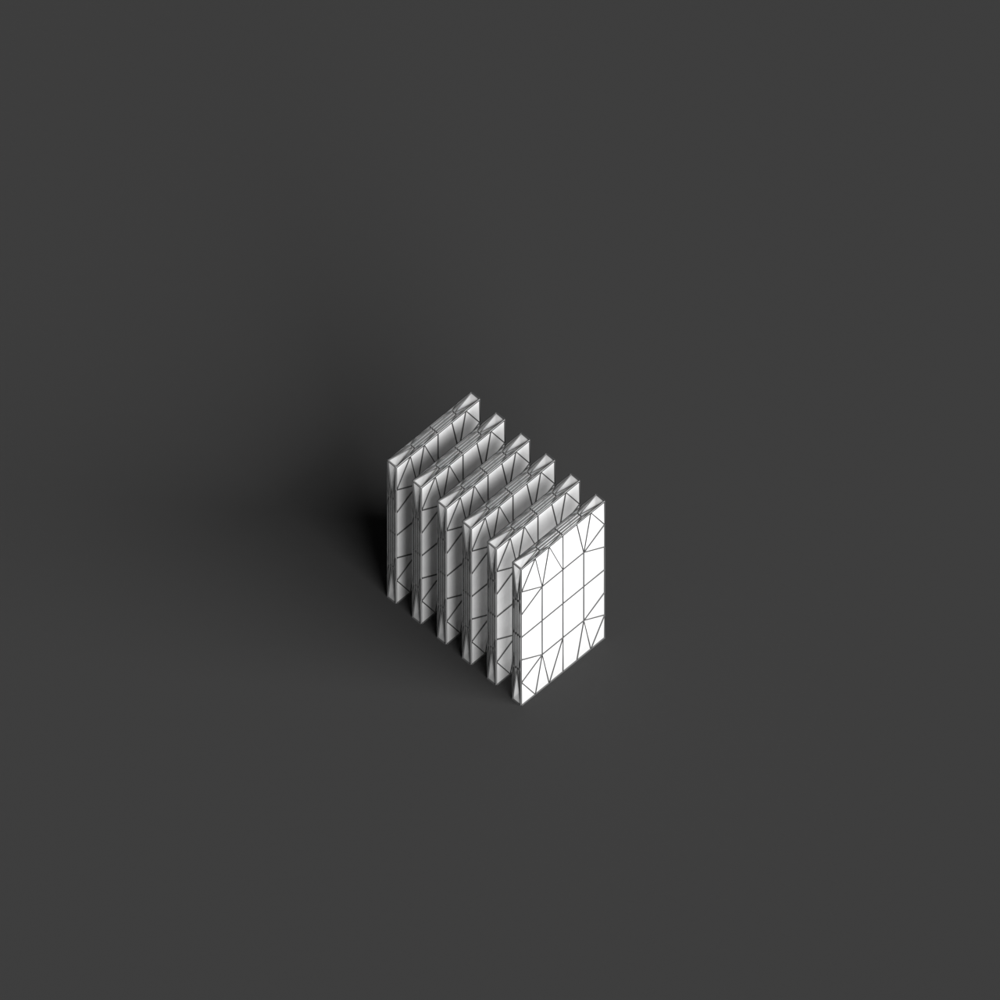
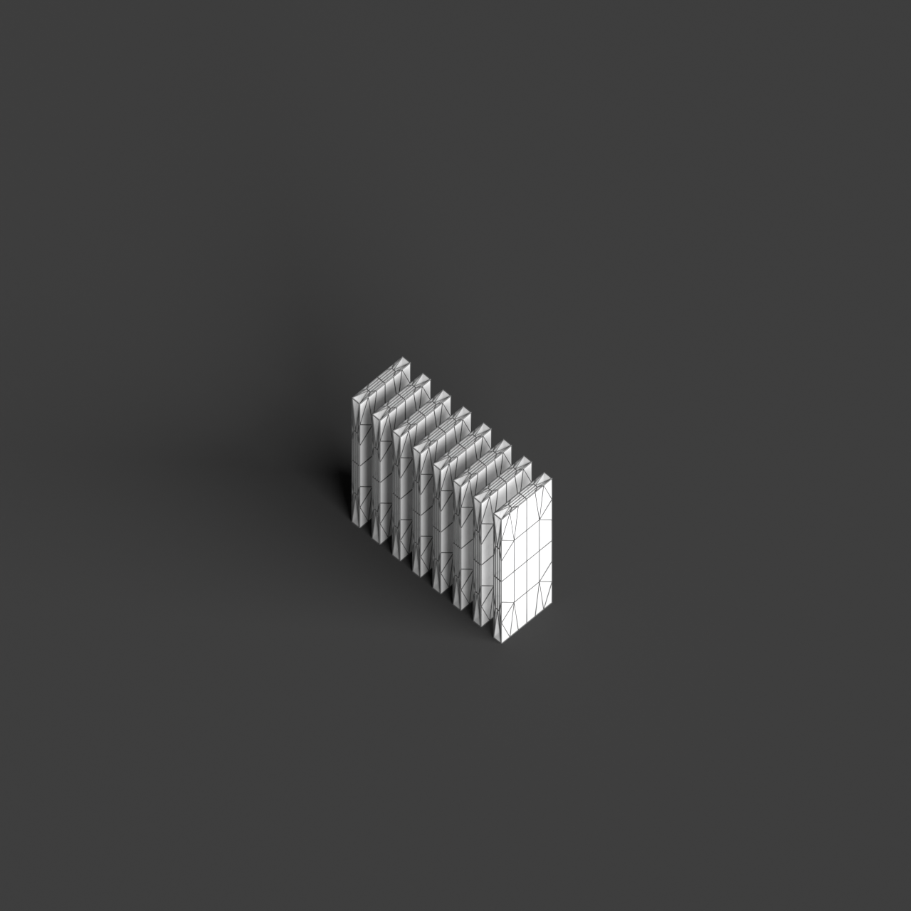
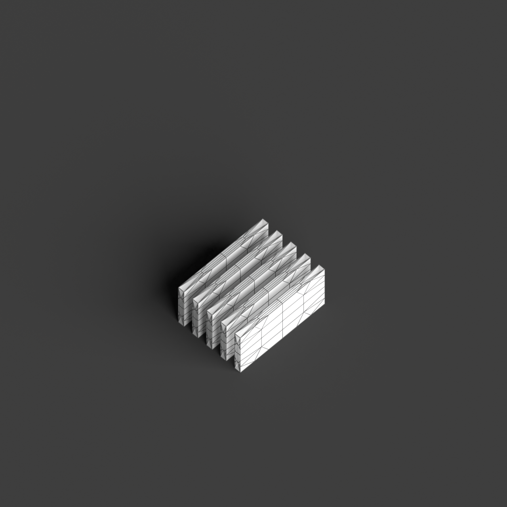
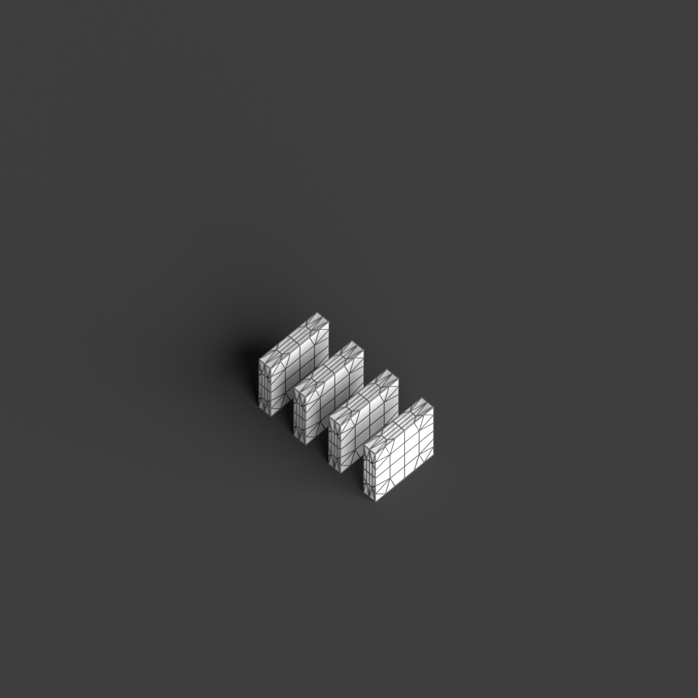

# 0018_0003_0002_perforated_vertical_landscape  
         
## Interpretation  
  
### Implications_form :  
The &#x27;Perforated vertical landscape&#x27; metaphor shapes the building&#x27;s form by emphasizing the integration of vertical layers with dynamic perforations that allow natural elements to interact with the structure. The building could exhibit a series of vertical fins or ribs, creating a pattern of voids that facilitate light penetration and air flow while providing structural rhythm. The spatial relationships within are organized around these vertical elements, allowing for flexible interior spaces that adapt to varying light conditions and views. The silhouette might suggest a sculpted natural formation, with strategic openings that resemble natural pathways or erosion patterns, enhancing connection between the building&#x27;s interior and its surrounding environment.  
### Metaphor :  
Perforated vertical landscape  
### Key_traits :  
This metaphor suggests a design that integrates verticality with porous elements, creating a structure that allows light, air, and views to penetrate through its form. It implies a rhythmic interplay between solid and void, offering dynamic visual and spatial experiences. The design can evoke the sense of a natural landscape, reimagined in a vertical orientation, where perforations serve as pathways for interaction between interior and exterior environments.  
### Design_task :  
Develop an Architectural Concept Model that encapsulates the &#x27;Perforated vertical landscape&#x27; metaphor by designing a structure composed of vertical fins or ribs with interspersed voids. Utilize materials that enhance the interaction with light and air, such as perforated metal or glass. Craft the model with a focus on vertical rhythm and texture, suggesting a connection to natural landscapes. Arrange the interior spaces to adapt to the dynamic light conditions and create visual corridors that open up to the exterior. Emphasize the verticality by varying the depth and spacing of the fins, ensuring the model conveys the metaphor&#x27;s essence of permeability and integration with the environment.  
## Agent summary :  
The function `create_perforated_vertical_landscape` generates an architectural concept model embodying the &quot;Perforated vertical landscape&quot; metaphor. It creates vertical fins with specified heights, widths, and perforation patterns to enhance light and air interaction. By defining the number and spacing of fins, along with their perforated sections, the model reflects the metaphor&#x27;s emphasis on verticality and dynamic spatial experiences. The resulting geometries evoke a natural formation, with voids that suggest pathways and connections to the environment, aligning with the design task of integrating solid and void for a responsive architectural experience.