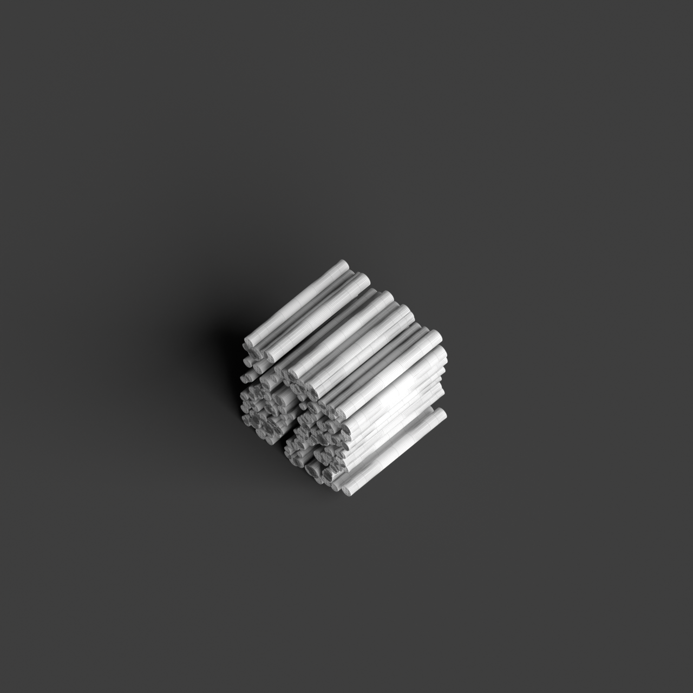
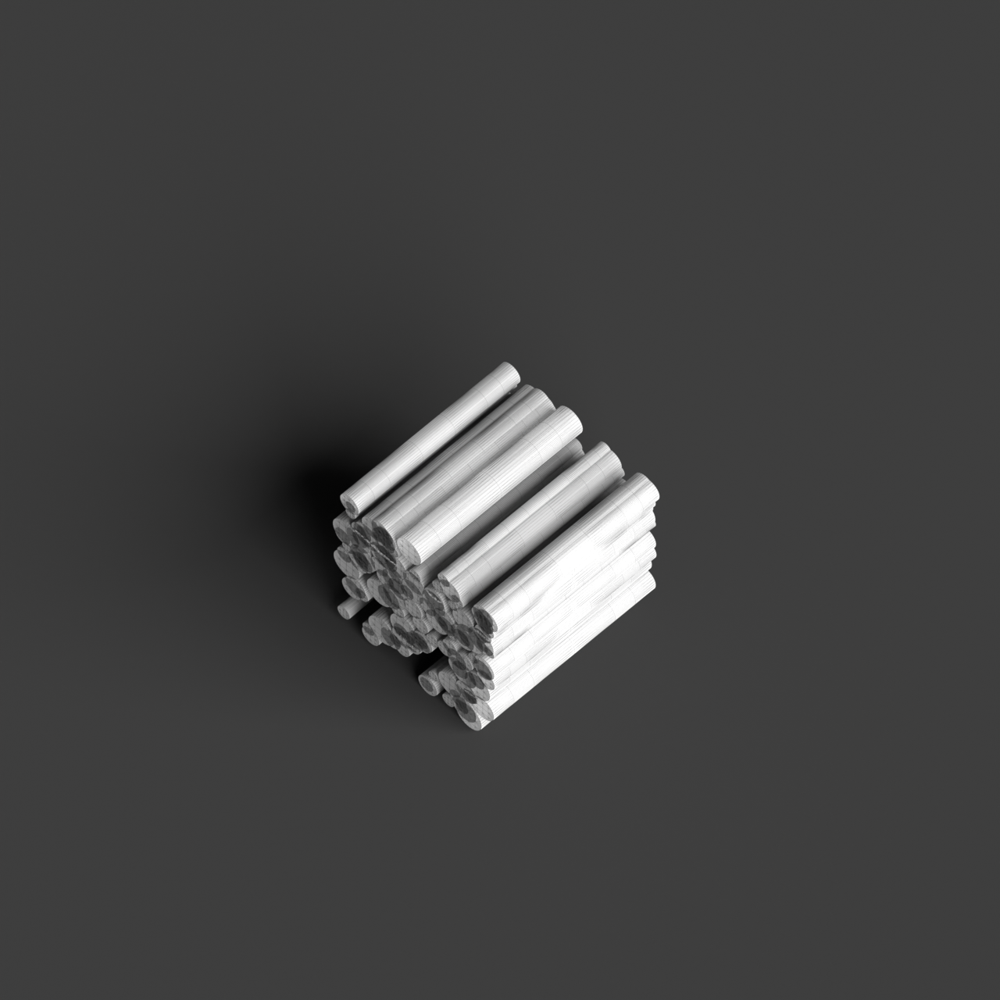
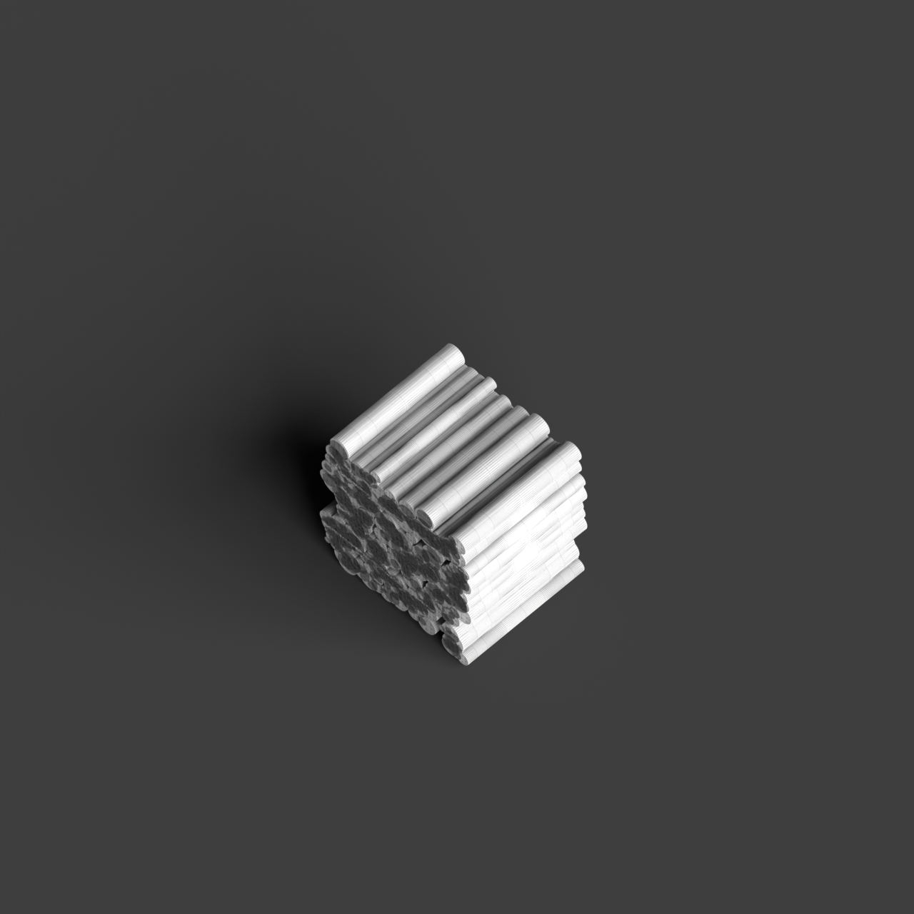

# 0018_0005_0001_perforated_vertical_landscape  
         
## Interpretation  
  
### Implications_form :  
The &#x27;Perforated vertical landscape&#x27; metaphor shapes the building&#x27;s form by introducing a series of vertical columns interspersed with voids, creating a layered effect that allows for light and air to pass through while offering varying levels of privacy. The structure resembles a vertical forest, where these columns mimic tree trunks and the voids function as pathways for natural elements. This arrangement promotes a harmonious relationship between interior and exterior spaces, with the silhouette echoing the organic forms found in nature. The spatial organization is guided by this vertical permeability, encouraging both horizontal and vertical movement and interaction within the building.  
### Metaphor :  
Perforated vertical landscape  
### Key_traits :  
This metaphor suggests a design that integrates verticality with porous elements, creating a structure that allows light, air, and views to penetrate through its form. It implies a rhythmic interplay between solid and void, offering dynamic visual and spatial experiences. The design can evoke the sense of a natural landscape, reimagined in a vertical orientation, where perforations serve as pathways for interaction between interior and exterior environments.  
### Design_task :  
Construct an Architectural Concept Model that embodies the &#x27;Perforated vertical landscape&#x27; metaphor by creating a series of vertical columns with interspersed voids. Utilize materials that reflect light and allow air passage, such as translucent acrylic or open lattice structures. Design the model to convey the sense of a vertical forest, with columns representing tree trunks and voids as natural clearings or pathways. Focus on the interplay between solid and void to encourage movement and interaction within the spaces, highlighting the connection between interior and exterior environments. Ensure the model reflects the metaphor&#x27;s essence through its vertical rhythm and organic form, inviting exploration and engagement with natural elements.  
## Agent summary :  
The function `create_perforated_vertical_landscape` generates an architectural concept model that embodies the metaphor of a &quot;Perforated vertical landscape.&quot; It creates a series of vertical columns with varying radii, simulating tree trunks, interspersed with voids that allow light and air to flow through, enhancing the relationship between interior and exterior spaces. By utilizing random positioning and radius variations within a defined area, the model captures the essence of a vertical forest, promoting dynamic spatial experiences and encouraging movement. This design reflects the metaphor&#x27;s emphasis on verticality and permeability, inviting exploration of natural elements within the structure.