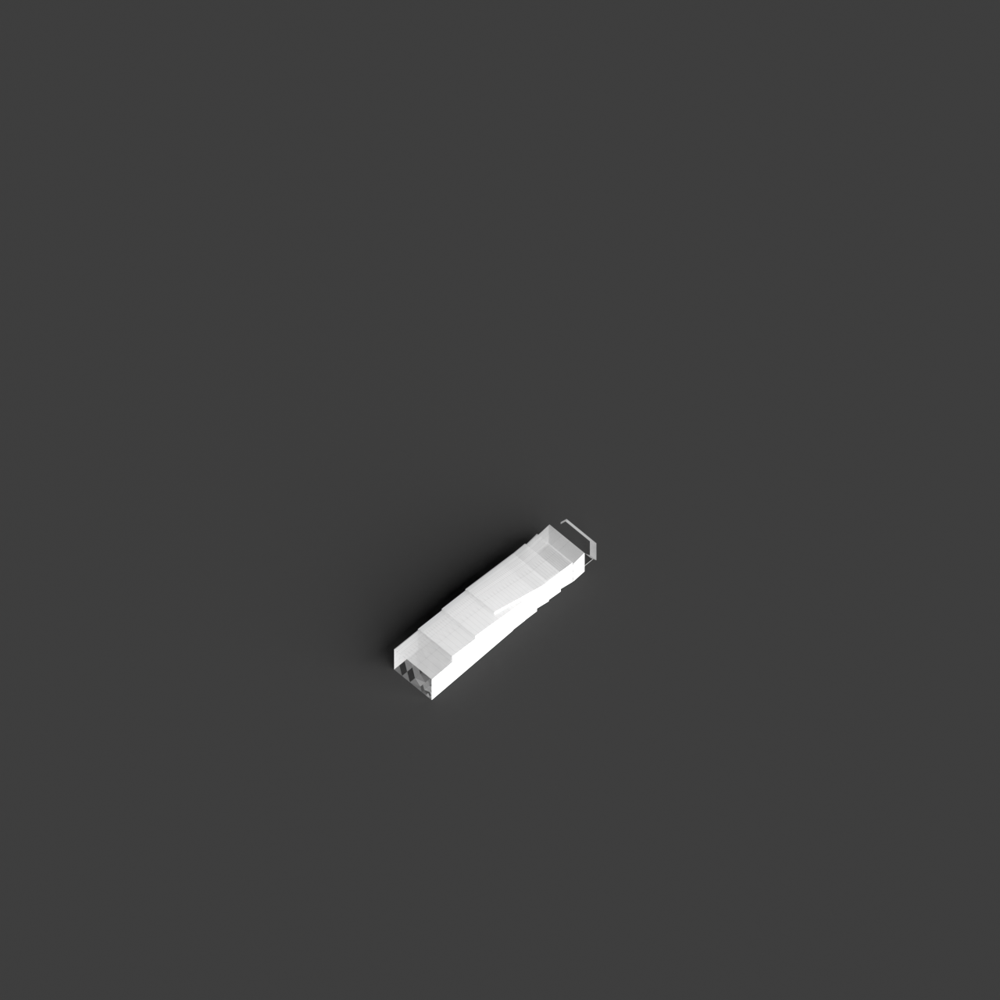
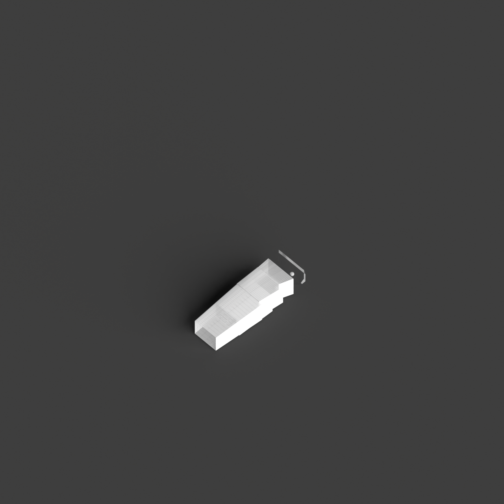
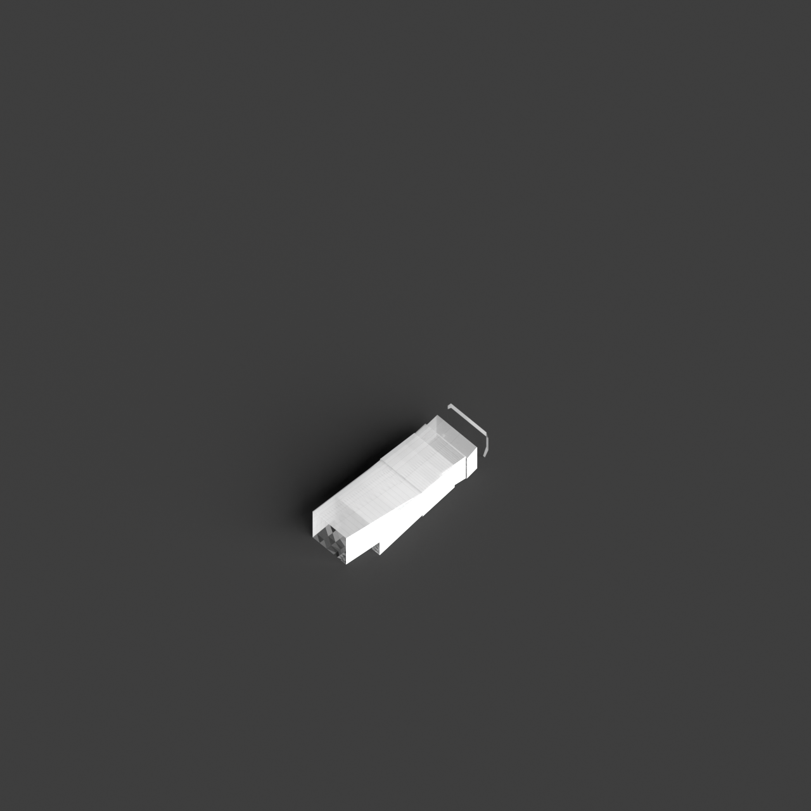
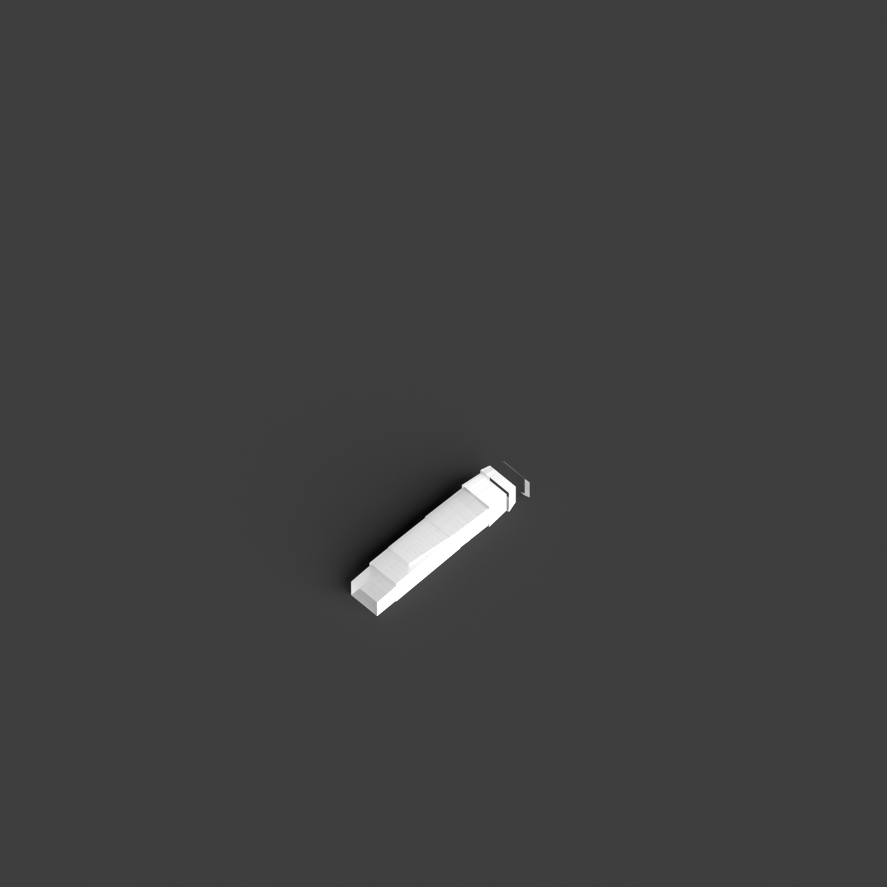

# 0020_0002_0005_stacked_forests  
         
## Interpretation  
  
### Implications_form :  
The metaphor of &#x27;Stacked forests&#x27; influences the building&#x27;s form and massing by suggesting a series of vertically stacked, organically shaped modules that mimic a forest&#x27;s diverse ecosystem. The structure should emulate a sense of density and hierarchy, with volumes interlocking and overlapping to create a complex, layered silhouette. Spatial relationships are emphasized through the incorporation of vertical and horizontal pathways that simulate the movement through a forest, offering varied experiences at different heights and depths. The geometry may include undulating forms and unexpected voids representing clearings or natural pathways, while the silhouette captures the intricate and layered nature of a forest canopy.  
### Metaphor :  
Stacked forests  
### Key_traits :  
This metaphor suggests a multi-layered, vertical organization resembling a dense, tiered forest. The design would emphasize a sense of hierarchy, depth, and organic growth. It encourages the integration of natural elements, creating spatial richness with varied levels of interaction. The structure would embody vertical connectivity, offering a diverse range of experiences and pathways, much like the layers found in a natural forest ecosystem.  
### Design_task :  
Design an Architectural Concept Model that reflects the &#x27;Stacked forests&#x27; metaphor by arranging a series of interlocking volumes, each representing a distinct layer of the forest. Focus on achieving a balance between density and openness, with sections of the model featuring densely packed volumes and others more open and airy. Incorporate vertical and horizontal circulation paths that mimic natural trails, offering exploration opportunities at various levels. Use a combination of solid and void spaces to create dynamic interactions, suggesting clearings and dense thickets. Aim for an organic form that reflects the growth patterns of a forest, with a silhouette that captures the complexity and variety found in nature.  
## Agent summary :  
The function `create_stacked_forests_concept_model` generates an architectural concept model inspired by the metaphor of &quot;Stacked forests.&quot; It constructs a series of vertically interlocking, organically shaped volumes that represent distinct forest layers. The model balances density and openness by incorporating both solid and void spaces, simulating natural clearings. Additionally, it integrates vertical and horizontal pathways resembling forest trails, enhancing exploration at various heights. By using random scaling and positioning, the function emulates the complexity and hierarchy of a forest ecosystem, resulting in a dynamic, organic structure that reflects the metaphor&#x27;s essence.