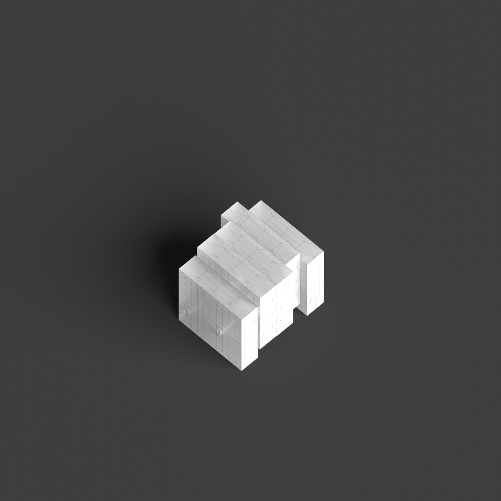
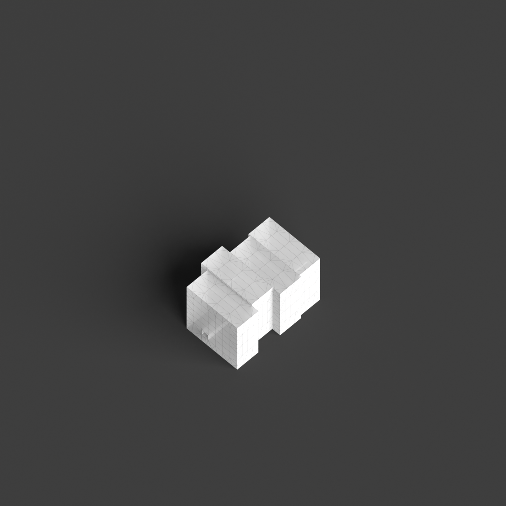
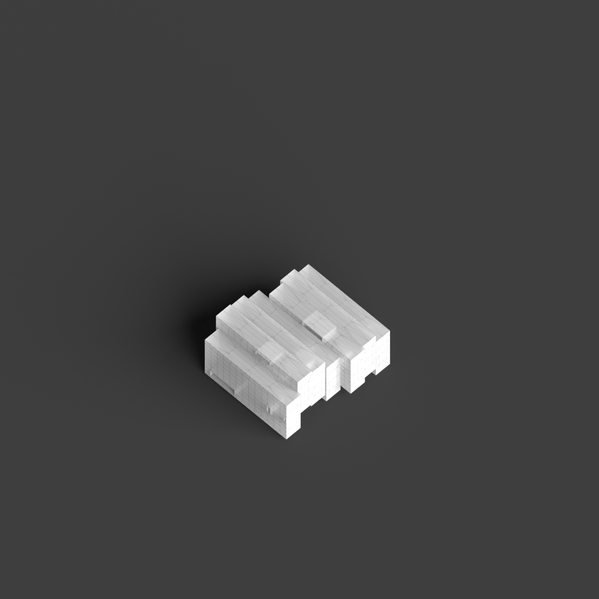
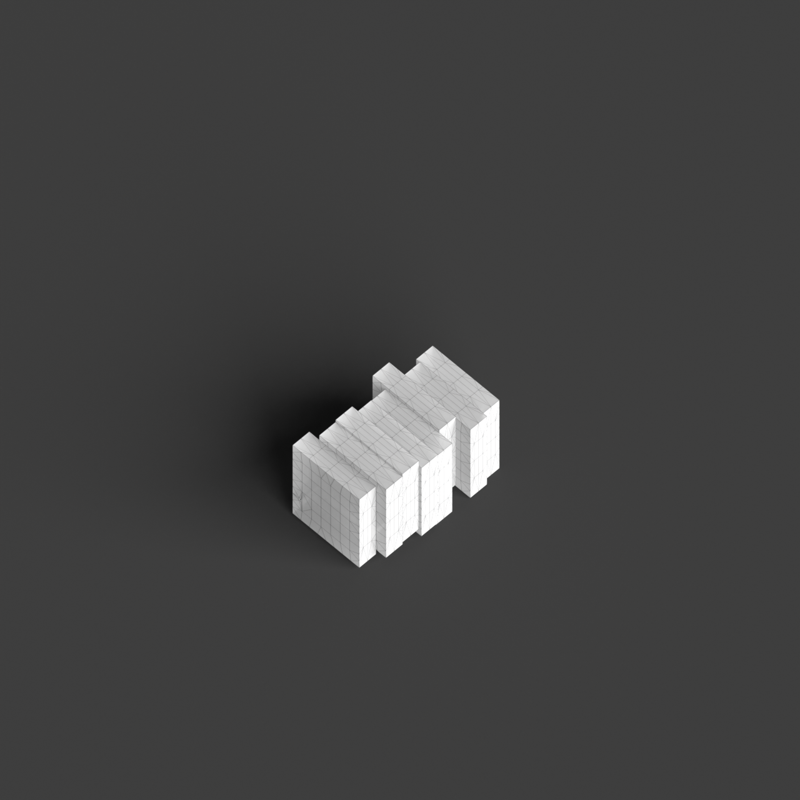
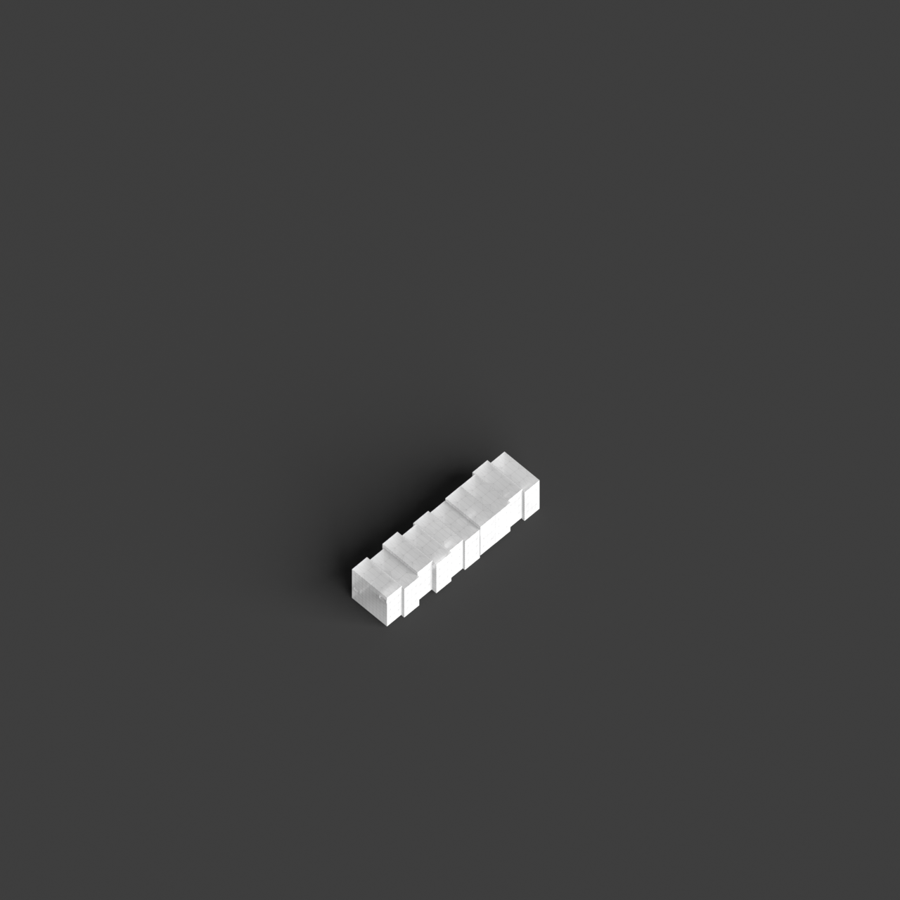

# 0020_0003_0001_stacked_forests  
         
## Interpretation  
  
### Implications_form :  
The metaphor of &#x27;Stacked forests&#x27; shapes the building&#x27;s form and massing through the creation of a vertically tiered structure that evokes the layered complexity of a forest ecosystem. This involves utilizing a series of staggered and offset volumes that create a sense of depth and hierarchy, much like the different tree strata in a forest. The spatial relationships are defined by the integration of vertical and diagonal connections that allow for fluid movement between the layers, akin to traversing different altitudes in a forest. The geometry should highlight the organic interplay of solid and void, with elements that suggest natural clearings and dense clusters. The silhouette is envisioned as a dynamic, shifting outline that captures the essence of a forest canopy swaying in the breeze.  
### Metaphor :  
Stacked forests  
### Key_traits :  
This metaphor suggests a multi-layered, vertical organization resembling a dense, tiered forest. The design would emphasize a sense of hierarchy, depth, and organic growth. It encourages the integration of natural elements, creating spatial richness with varied levels of interaction. The structure would embody vertical connectivity, offering a diverse range of experiences and pathways, much like the layers found in a natural forest ecosystem.  
### Design_task :  
Construct an Architectural Concept Model that embodies the &#x27;Stacked forests&#x27; metaphor by arranging staggered and offset volumes to create a tiered effect. Focus on establishing a hierarchy of layers, with some areas appearing dense and others more open. Integrate vertical and diagonal circulation paths to mimic the natural movement found in a forest, providing diverse experiences as one ascends through the structure. Use a combination of solid and void elements to represent clearings and thickets, enhancing the organic feel of the model. Aim for a silhouette that reflects the fluid and dynamic nature of a forest, capturing the interplay between stability and movement.  
## Agent summary :  
The function `create_stacked_forests_model` generates a 3D architectural concept model that embodies the &quot;Stacked forests&quot; metaphor by creating a vertically tiered structure. It utilizes staggered and offset volumes to emulate the layers of a forest, with varying widths and heights reflecting the hierarchy and complexity of a natural ecosystem. The model incorporates void spaces to represent clearings, enhancing the organic feel. Vertical and diagonal circulation paths are included to facilitate movement through the layers, mirroring the experience of traversing different forest altitudes. The resulting silhouette captures the dynamic interplay of solidity and movement, akin to a swaying forest canopy.