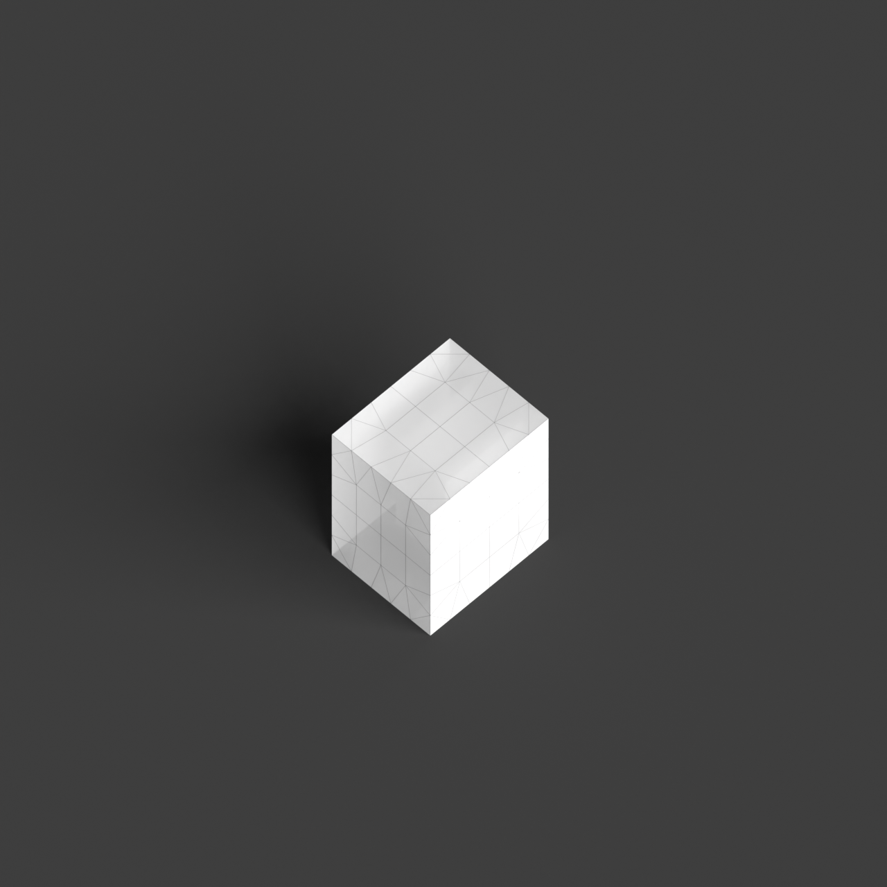
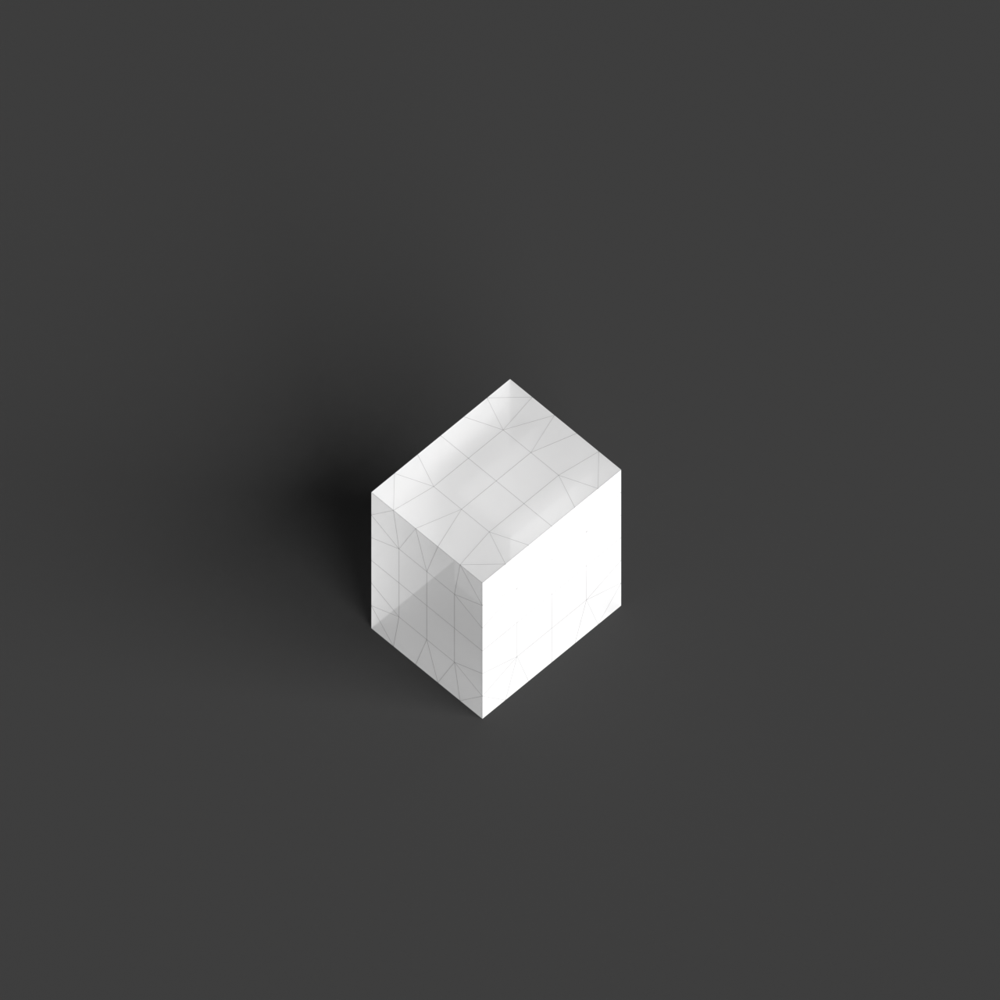
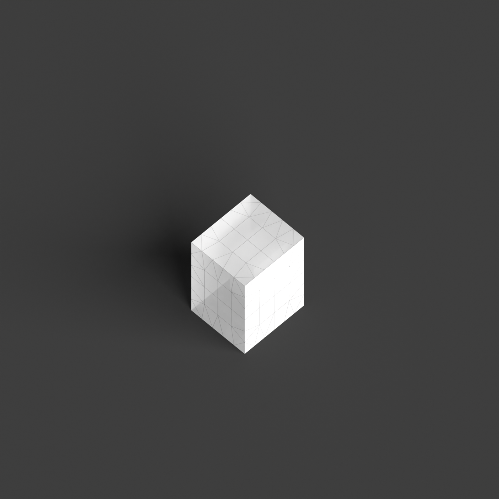

# 0001_0001_0005_house_within_a_house  
         
## Interpretation  
  
### Implications_form :  
The &#x27;House within a house&#x27; metaphor implies a structure where the massing is characterized by a distinct layering effect, with an inner core or sanctuary enveloped by an outer shell. This results in a silhouette that suggests depth and complexity, as though one can peel back layers to reveal hidden interior spaces. The geometry may consist of nested volumes, where the inner volume is partially or fully enclosed by the outer volume, creating a spatial hierarchy that prioritizes privacy and protection. Spatial relationships are defined by a sense of progression and transition, moving from the public outer spaces to the private inner sanctum, allowing for varied spatial experiences and a sense of retreat or enclosure.  
### Metaphor :  
House within a house  
### Key_traits :  
This metaphor suggests a layered spatial hierarchy, where one spatial entity is encapsulated within another. It implies a design approach focused on nesting, protection, and privacy, with the potential for creating complex interior-exterior relationships. The concept is about creating an internal sanctuary or core, surrounded by another volume, allowing for varied spatial experiences and a sense of retreat or enclosure.  
### Design_task :  
To embody the &#x27;House within a house&#x27; metaphor in an Architectural Concept Model, create a series of nested volumes where each successive layer represents a different level of privacy and function. Use transparent or translucent materials for the outer layers to suggest permeability and gradual transition from exterior to interior. The innermost volume should be more opaque and intimate, representing the core sanctuary. Experiment with different geometrical shapes for the nested volumes to explore how they interact and influence each other&#x27;s form. The model should communicate the idea of moving through layers, emphasizing the progression from public to private spaces, and illustrating the protective and enclosing qualities of the design.  
## Agent summary :  
The function `create_house_within_house_model` generates an architectural concept model based on the &quot;House within a house&quot; metaphor by creating two nested volumes: an inner sanctuary and an outer shell. It defines the dimensions and transparency levels of both volumes using parameters. The inner volume, representing privacy and intimacy, is constructed as a more opaque box, while the outer volume, suggesting transition and openness, is a larger, semi-transparent box. This layering creates a visual and spatial hierarchy, illustrating the metaphor&#x27;s implications of protection and retreat, and facilitating varied spatial experiences as one moves from the exterior to the interior.