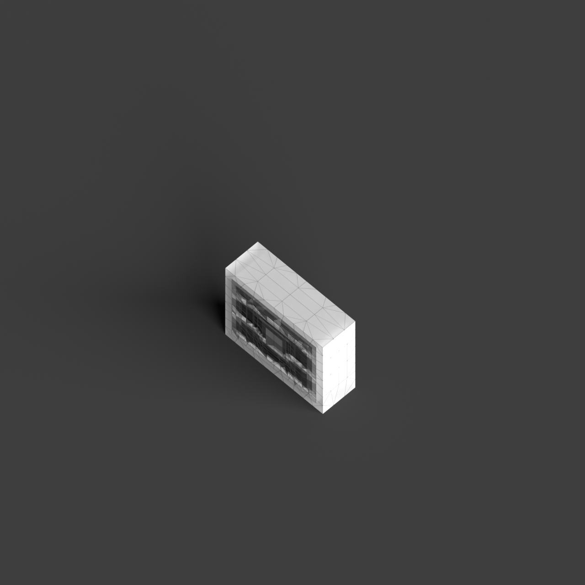
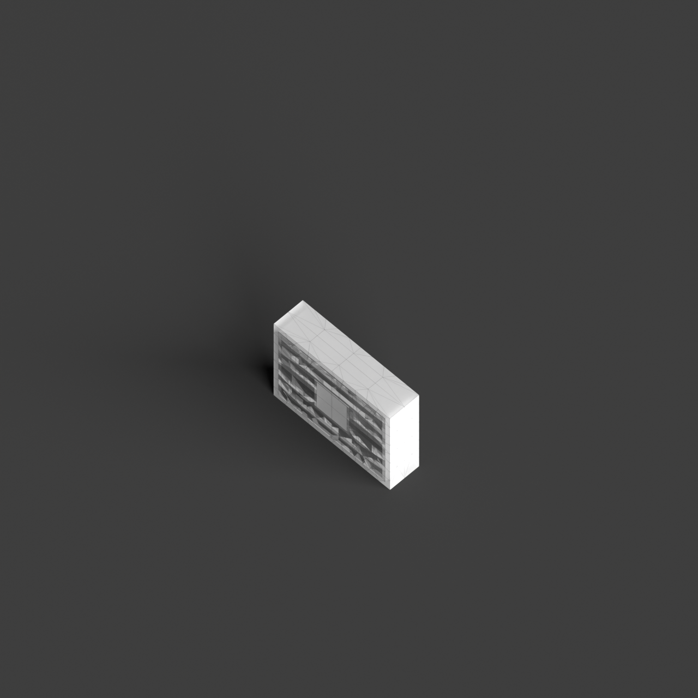

# 0001_0002_0004_house_within_a_house  
         
## Interpretation  
  
### Implications_form :  
The &#x27;House within a house&#x27; metaphor suggests a form where the building&#x27;s massing is articulated through concentric or overlapping layers, evoking a sense of containment and gradual discovery. The outer layer acts as a protective shell, while the inner structure serves as a retreat or sanctuary, creating a dynamic interplay between openness and enclosure. The building&#x27;s silhouette may resemble a series of interlocking or cascading forms, each representing a different spatial function or level of intimacy. Spatial relationships are defined by thresholds and transitional zones, where movement through the building reveals a sequence of spaces with varying degrees of openness, encouraging exploration and interaction with the layered environment.  
### Metaphor :  
House within a house  
### Key_traits :  
This metaphor suggests a layered spatial hierarchy, where one spatial entity is encapsulated within another. It implies a design approach focused on nesting, protection, and privacy, with the potential for creating complex interior-exterior relationships. The concept is about creating an internal sanctuary or core, surrounded by another volume, allowing for varied spatial experiences and a sense of retreat or enclosure.  
### Design_task :  
To embody the &#x27;House within a house&#x27; metaphor in an Architectural Concept Model, design a composition of interlocking forms that convey a sense of nesting and protection. Use contrasting materials and textures to differentiate between the layers, emphasizing the transition from the outer shell to the inner sanctuary. Explore the use of curved or angular geometries to suggest the interplay between containment and openness. Incorporate elements such as courtyards or voids to create a dialogue between the layers, facilitating light penetration and visual connections. The model should visually communicate the concept of a layered spatial hierarchy, highlighting the progression from public to private spaces and the protective qualities of the design.  
## Agent summary :  
The provided function generates an architectural concept model based on the &quot;House within a house&quot; metaphor by creating a series of concentric layers that visually represent nesting and protection. Each layer, defined by a decreasing base length and width, symbolizes a transition from public to private space. The inclusion of voids in alternating layers fosters interaction and light penetration, reinforcing the metaphor&#x27;s themes of containment and exploration. The model&#x27;s varying geometries and heights reflect a layered spatial hierarchy, while contrasting materials and textures can be applied to distinguish the outer protective shell from the inner sanctuary, enhancing the overall design narrative.