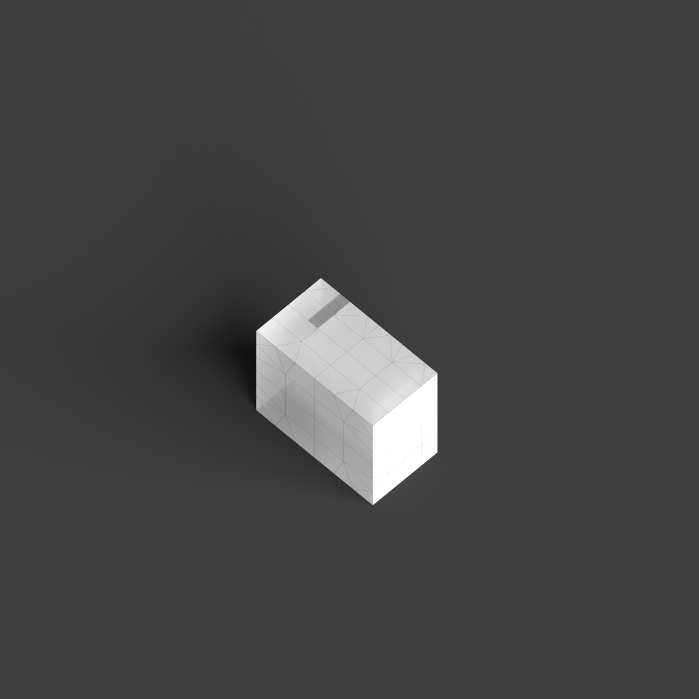
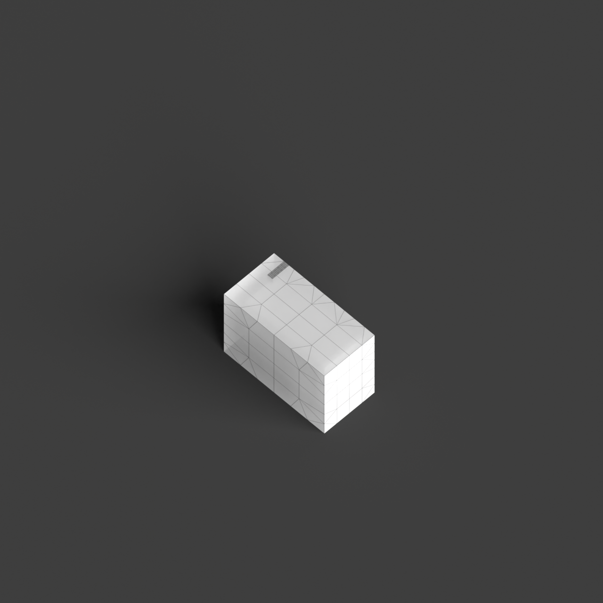
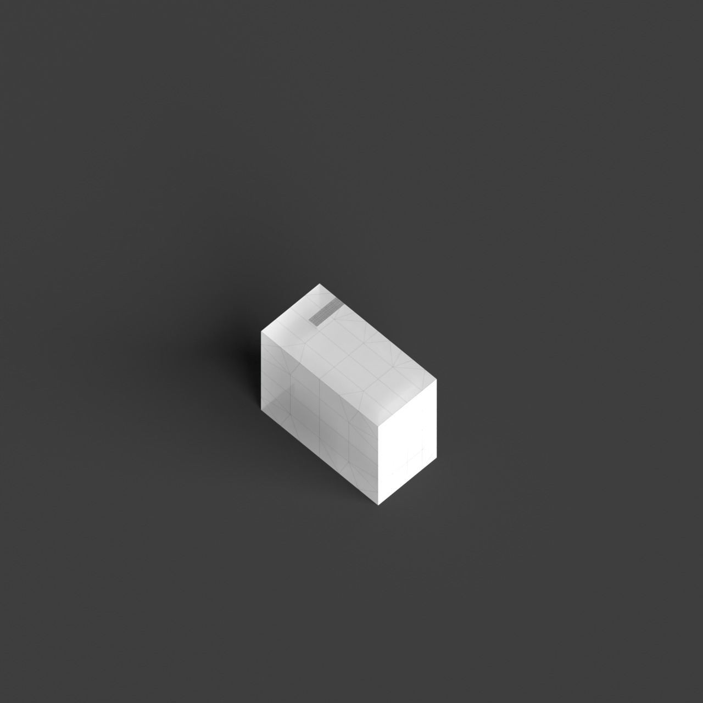

# 0001_0003_0003_house_within_a_house  
         
## Interpretation  
  
### Implications_form :  
The &#x27;House within a house&#x27; metaphor implies a design where the building&#x27;s massing is characterized by distinct yet interconnected layers, creating a duality of spaces that interact with each other. The silhouette might suggest a seamless integration of an inner sanctuary enveloped by an outer protective form, giving the impression of a cohesive yet complex entity. The geometry could involve overlapping or interpenetrating volumes, where the internal structure is designed to be a retreat within the larger volume, allowing for dynamic spatial interrelations. Spatial relationships are organized around the concept of duality, with transitions that delineate between public and private realms, fostering a sense of discovery and refuge within the enveloping layers.  
### Metaphor :  
House within a house  
### Key_traits :  
This metaphor suggests a layered spatial hierarchy, where one spatial entity is encapsulated within another. It implies a design approach focused on nesting, protection, and privacy, with the potential for creating complex interior-exterior relationships. The concept is about creating an internal sanctuary or core, surrounded by another volume, allowing for varied spatial experiences and a sense of retreat or enclosure.  
### Design_task :  
To embody the &#x27;House within a house&#x27; metaphor in an Architectural Concept Model, construct a dual-layered form where each layer serves a distinct function and spatial quality. Use materials of contrasting opacity to define the transition between the outer and inner spaces, suggesting a shift from public to private. Experiment with interlocking geometries that create visual and physical connections between the layers, enhancing the concept of nested spaces. Incorporate vertical and horizontal transitions, such as staircases or ramps, to emphasize movement through the layers and the discovery of the inner sanctuary. The model should clearly communicate the dual nature of the design, highlighting the interplay between the protective outer shell and the intimate inner core, as well as the varied spatial experiences offered by the layered arrangement.  
## Agent summary :  
The provided function, `create_house_within_a_house`, generates an architectural concept model reflecting the &quot;House within a house&quot; metaphor. It creates a dual-layered structure, where an inner sanctuary is encapsulated by an outer protective form. The function defines the inner box and expands it to form the outer shell, integrating openings for interaction and visual connection between layers. Staircases facilitate movement, emphasizing the transition between distinct spatial realms. By using varying dimensions and random elements, the model captures the essence of nested spaces, highlighting the interplay of privacy and openness, and fostering a dynamic spatial experience.