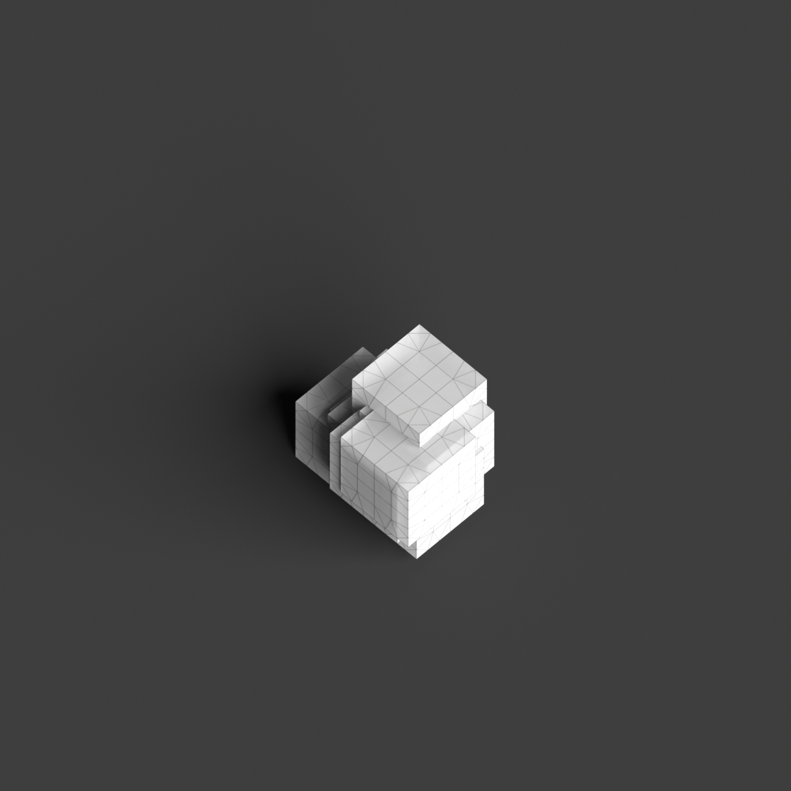
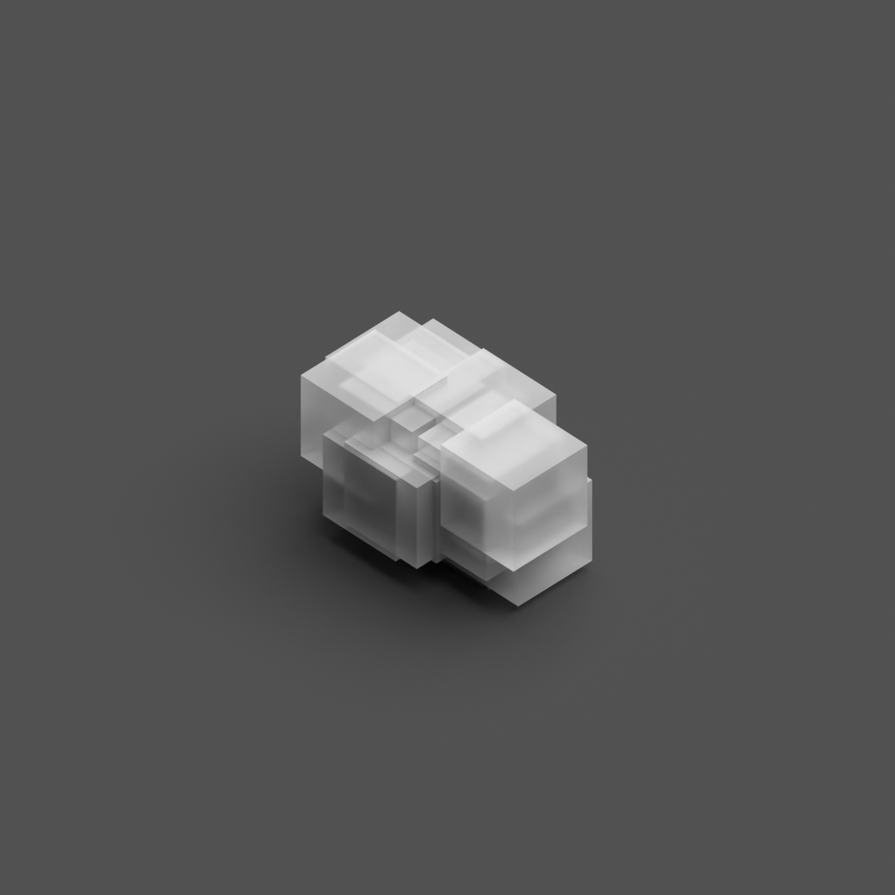
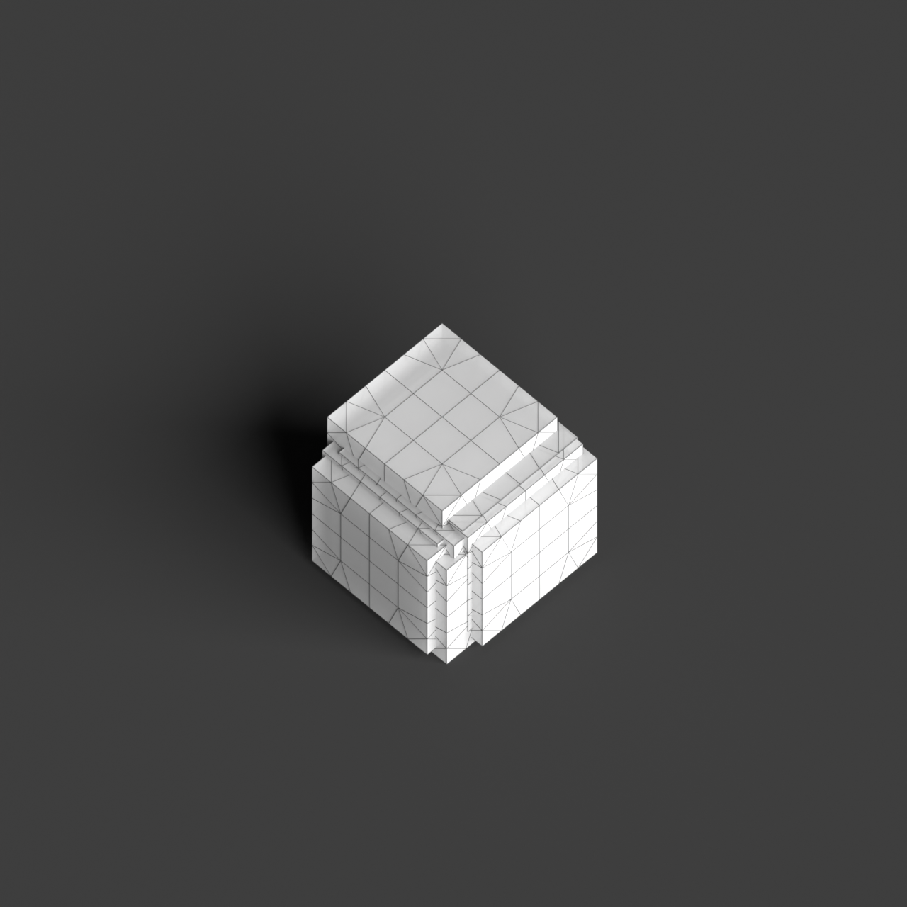
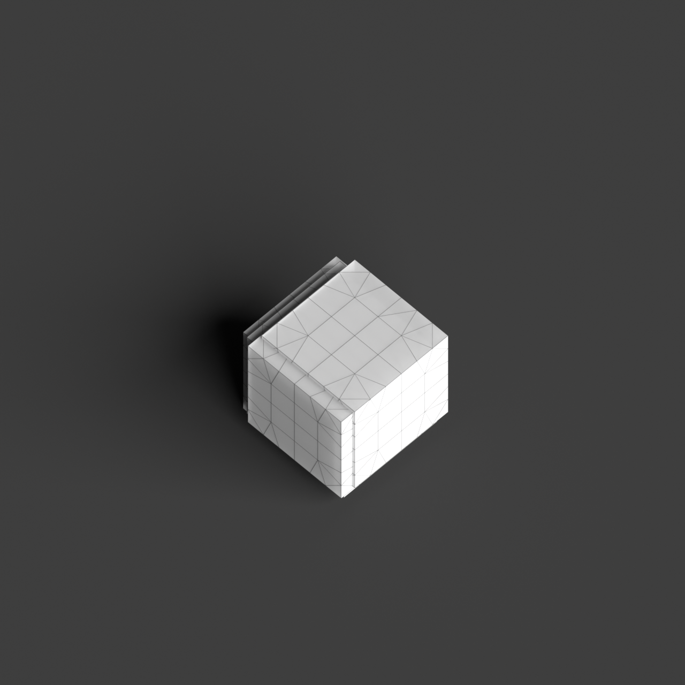
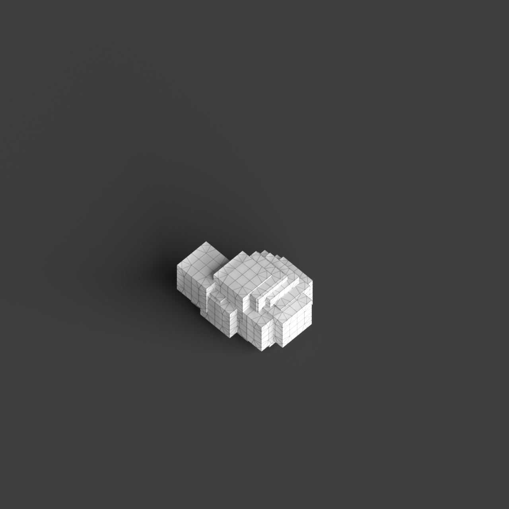

# 0002_0001_0003_cubic_nest  
         
## Interpretation  
  
### Implications_form :  
The &#x27;Cubic nest&#x27; metaphor influences the building&#x27;s form and massing by arranging a series of interlocking and overlapping cubic volumes that create a complex, layered silhouette. Each cube contributes to a sense of shelter and interconnectedness, maintaining its distinct identity while forming a cohesive whole. Spatial relationships are defined by the dynamic interaction of solid and void spaces, encouraging movement and exploration through the structure. The arrangement of these cubes forms a protective shell, with spaces nested within and around each other, creating a diverse spatial experience.  
### Metaphor :  
Cubic nest  
### Key_traits :  
The metaphor &#x27;Cubic nest&#x27; suggests a design that incorporates a series of interlocking or overlapping cubic volumes, creating a layered and protective spatial organization. This could evoke a sense of shelter, complexity, and interconnectedness, where each cubic form contributes to a cohesive whole while maintaining its own distinct identity. The interplay of solid and void within the nest-like structure allows for dynamic spatial experiences, encouraging exploration and discovery within the architectural composition.  
### Design_task :  
Create an Architectural Concept Model using a series of modular cubic volumes that interlock and overlap. Focus on the spatial interplay of solid and void, emphasizing the protective and layered qualities of the &#x27;nest&#x27; metaphor. Use varying scales of cubes to define distinct spaces and pathways, allowing for exploration and discovery. Highlight the interconnectedness of the volumes by experimenting with different orientations and alignments, ensuring each cube maintains its identity while contributing to the overall cohesiveness of the structure. Consider using transparent and opaque materials to further express the dynamic spatial relationships within the model.  
## Agent summary :  
The provided function, `create_cubic_nest`, generates an architectural concept model inspired by the &quot;Cubic nest&quot; metaphor by creating interlocking and overlapping cubic volumes. The function takes parameters to define the base cube size, the number of cubes, and the degree of overlap. It uses random offsets to position each new cube relative to an existing one, fostering a dynamic arrangement that reflects shelter and interconnectedness. The resulting 3D models emphasize the interplay of solid and void, encouraging exploration through varied spatial experiences. This approach maintains distinct identities for cubes while contributing to an overall cohesive structure.