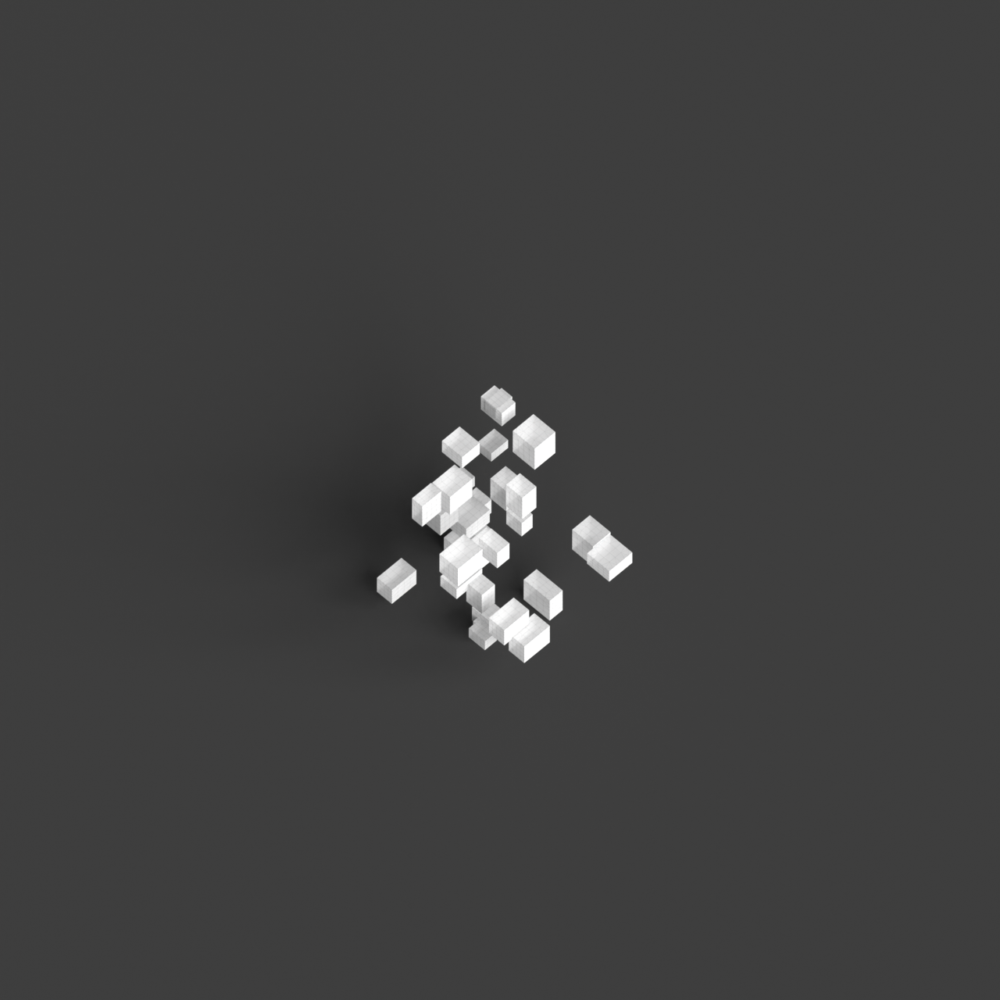
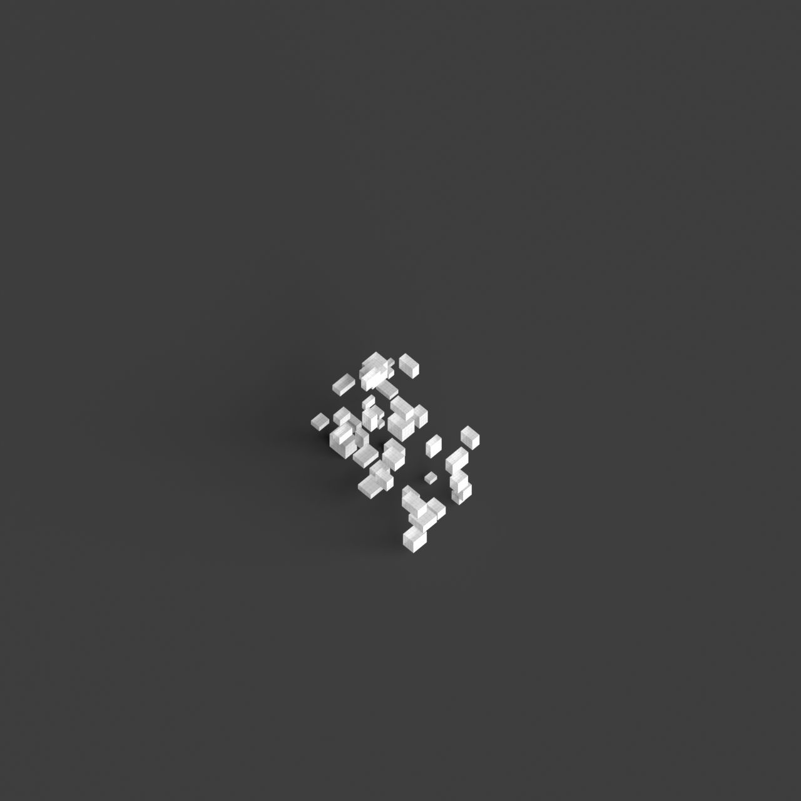
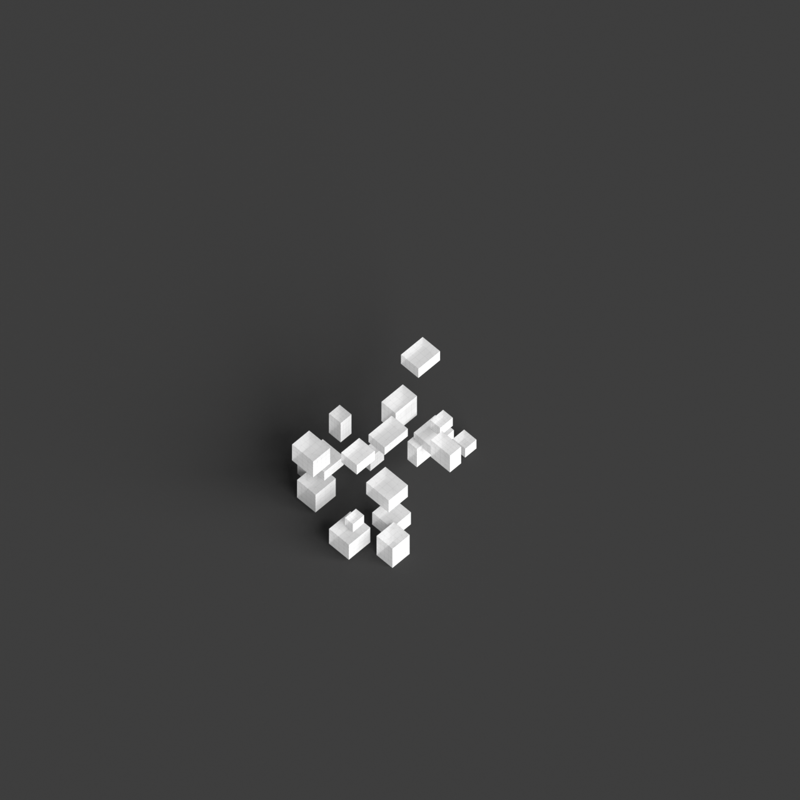
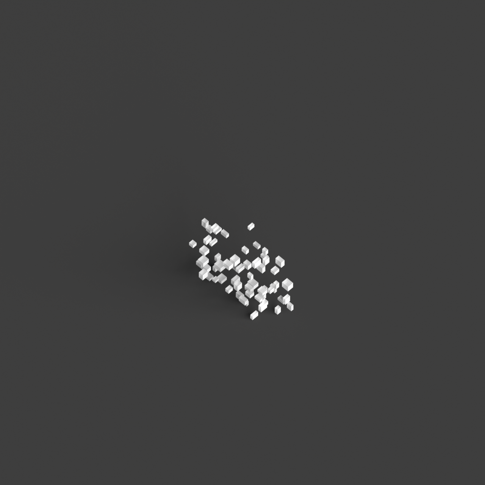

# 0003_0002_0004_a_labyrinth_of_blocks  
         
## Interpretation  
  
### Implications_form :  
The metaphor &#x27;A labyrinth of blocks&#x27; suggests a design with a complex and intricate network of interlocking volumes. The massing is characterized by an array of blocks that differ in scale and orientation, forming a multi-layered silhouette. The spatial configuration is intentionally disorienting, with pathways that crisscross and overlap, creating a maze-like experience. This arrangement encourages exploration and interaction, as users navigate through a series of interconnected spaces that reveal themselves gradually. The design emphasizes a dramatic interplay of light and shadow, with varying block heights and orientations capturing light differently throughout the day, enhancing the sense of mystery and anticipation.  
### Metaphor :  
A labyrinth of blocks  
### Key_traits :  
This metaphor suggests a complex and intricate spatial configuration. It implies a design that challenges navigation and orientation, creating a sense of mystery and exploration. The arrangement of blocks can vary in height, size, and orientation, introducing unexpected pathways and hidden spaces. The design prioritizes the interplay of light and shadow, varying perspectives, and dynamic circulation routes, encouraging discovery and engagement with the architecture.  
### Design_task :  
To embody the metaphor &#x27;A labyrinth of blocks&#x27; in an Architectural Concept Model, construct a three-dimensional puzzle of interlocking blocks that vary in height, width, and orientation. Use an organic pattern rather than a strict grid to allow for more fluid and unexpected spatial relationships. Design the pathways to be non-linear and intersecting, with changes in direction that create pauses and moments of discovery. Incorporate elements of vertical circulation, such as stairs or ramps, that connect different levels of the labyrinth, adding to the complexity. Experiment with light by creating openings and voids within the blocks, allowing natural light to penetrate and create dynamic patterns of illumination and shadow, further enhancing the labyrinthine experience.  
## Agent summary :  
The provided function `create_labyrinth_of_blocks` generates an architectural concept model inspired by the metaphor &quot;A labyrinth of blocks.&quot; It creates a dynamic assembly of interlocking blocks with varied dimensions and random orientations, reflecting the intricate and disorienting nature of a labyrinth. Each block&#x27;s placement and size are randomized, facilitating a complex, non-linear spatial configuration that encourages exploration. The function also promotes verticality, allowing for different levels and circulation paths. By incorporating a variety of block heights and orientations, it enhances the interplay of light and shadow, enriching the user experience with moments of surprise and discovery.