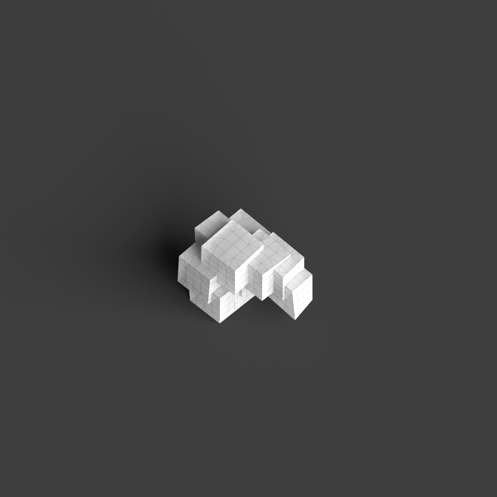
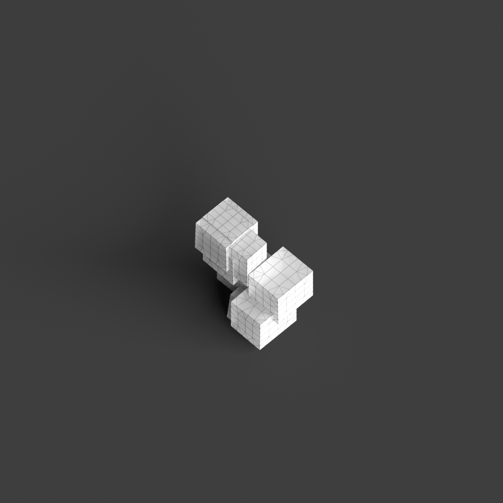
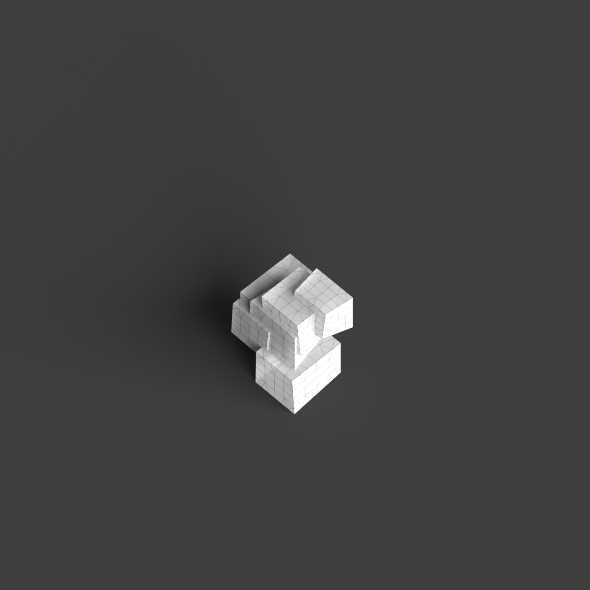
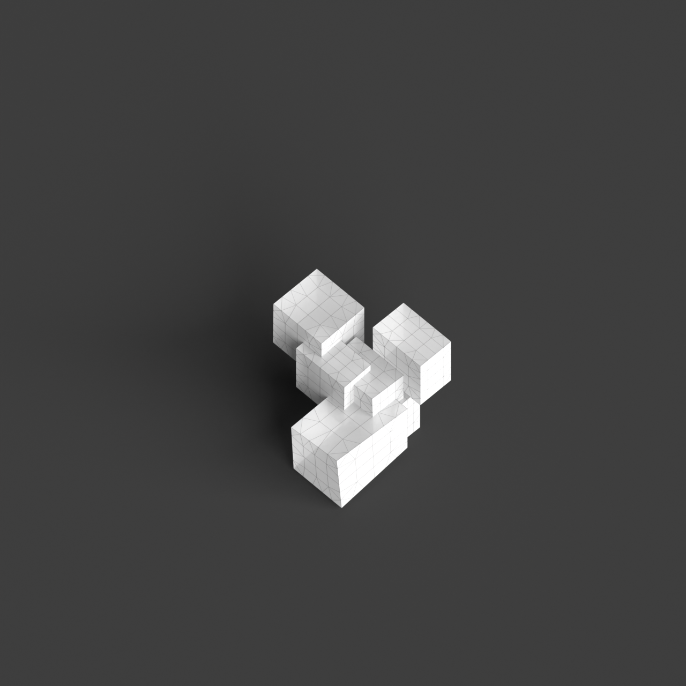
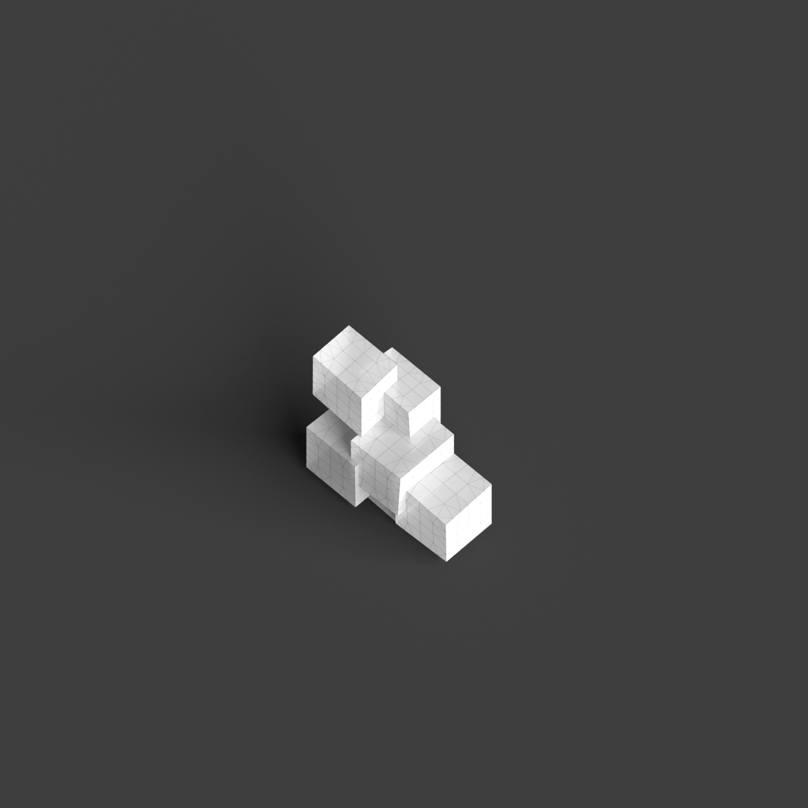

# 0005_0001_0005_distorted_puzzle  
         
## Interpretation  
  
### Implications_form :  
The &#x27;Distorted puzzle&#x27; metaphor suggests a building form characterized by complex, interlocking volumes that appear to be slightly misaligned or skewed, creating a dynamic and visually intriguing silhouette. The massing should reflect an unexpected yet harmonious interplay of geometric forms that suggest movement and tension. Spatially, the design should incorporate irregularly shaped rooms and corridors that fit together like a puzzle, promoting a sense of discovery as occupants navigate through the building. Each space should be part of a larger interconnected system, maintaining overall coherence despite the apparent irregularity.  
### Metaphor :  
Distorted puzzle  
### Key_traits :  
The metaphor &#x27;Distorted puzzle&#x27; implies a design characterized by a complex, interlocking arrangement of forms or spaces that appear to be slightly misaligned or irregularly shaped. This concept suggests a dynamic interplay of parts that fit together in unexpected ways, creating a sense of movement and tension. The distorted aspect brings a sense of unpredictability and visual interest, while the puzzle nature indicates coherence and interconnectedness in the overall structure.  
### Design_task :  
Create an Architectural Concept Model that embodies the &#x27;Distorted puzzle&#x27; metaphor by assembling a series of interlocking geometric volumes with slight misalignments. Use varied shapes and angles to emphasize the distorted aspect, ensuring that each volume connects to others in a coherent yet unexpected manner. Focus on the spatial logic of interlocking and overlapping forms to generate dynamic pathways and spaces that invite exploration. The model should evoke a sense of movement and tension, while maintaining an underlying coherence that reflects the interconnected nature of a puzzle.  
## Agent summary :  
The provided function generates an architectural concept model inspired by the &quot;Distorted puzzle&quot; metaphor by creating a series of interlocking geometric volumes. It defines a base size, height variation, and skew factor to produce varying, slightly misaligned shapes that evoke movement and tension. Each volume is randomly adjusted in height and skew, while translation vectors create a sense of interlocking and exploration. The model comprises unique, irregularly shaped spaces that connect coherently, reflecting the metaphor&#x27;s theme of dynamic, interconnected forms. The final output is a list of 3D geometries that embody the metaphor&#x27;s essence, inviting discovery within the design.